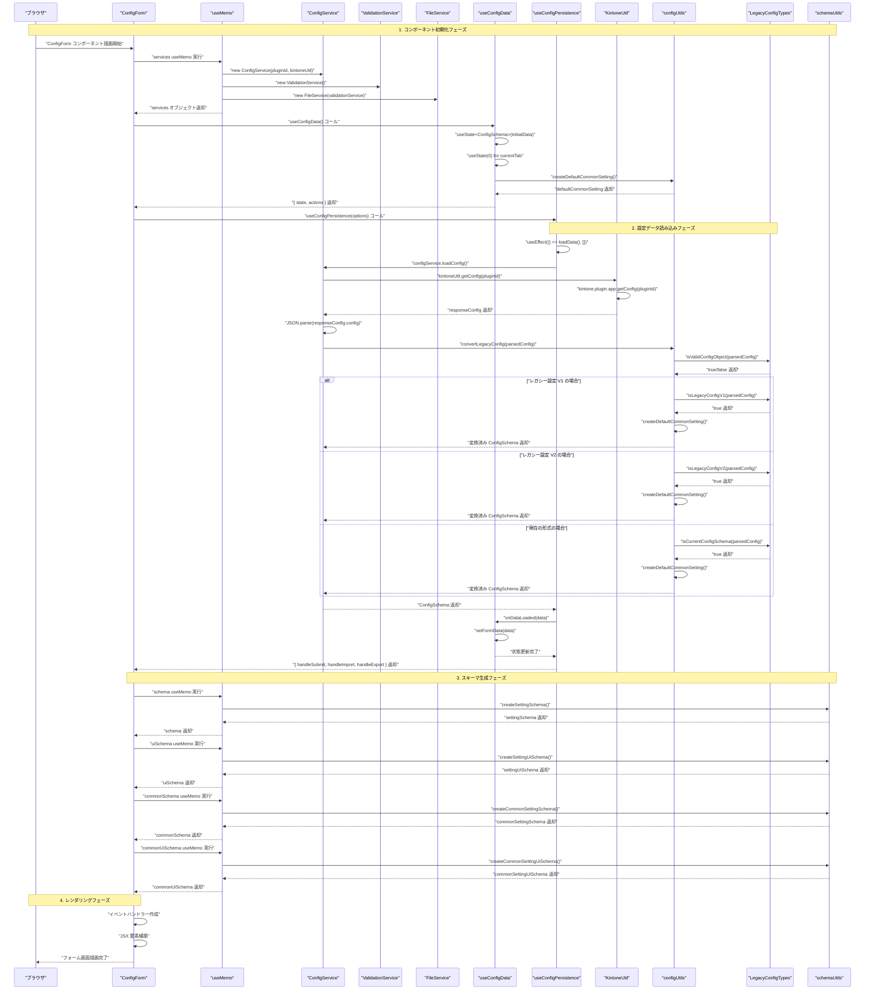
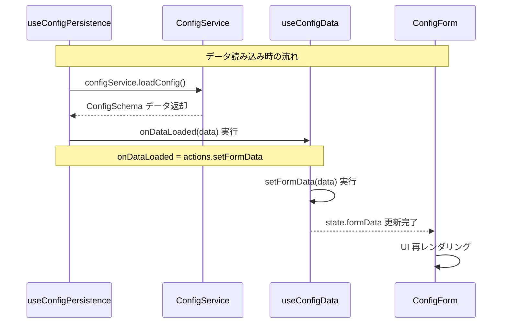

# 設定画面読み込みシーケンス図

## 概要
前回の設定がある状態で、設定画面を開いてからフォーム画面が表示されるまでの関数コール順序を詳細に示したシーケンス図です。

## シーケンス図



## 主要な処理ステップ

### 1. コンポーネント初期化フェーズ
- **ConfigForm**: メインコンポーネントの描画開始
- **Services**: 依存性注入によるサービス初期化
  - ConfigService, ValidationService, FileService のインスタンス作成
- **useConfigData**: 状態管理フックの初期化
  - formData, currentTab の初期状態設定

### 2. 設定データ読み込みフェーズ  
- **useConfigPersistence**: useEffect による自動データ読み込み
- **ConfigService.loadConfig()**: kintone からの設定データ取得
- **KintoneUtil.getConfig()**: kintone API 呼び出し
- **convertLegacyConfig()**: レガシー設定の安全な変換
  - 型ガードによる設定形式判定
  - 適切な形式への変換処理
- **onDataLoaded()**: 読み込んだデータの状態反映

### 3. スキーマ生成フェーズ
- **createSettingSchema()**: 個別設定用スキーマ生成
- **createSettingUiSchema()**: 個別設定用UIスキーマ生成  
- **createCommonSettingSchema()**: 共通設定用スキーマ生成
- **createCommonSettingUiSchema()**: 共通設定用UIスキーマ生成

### 4. レンダリングフェーズ
- **イベントハンドラー作成**: submit, import, export 処理
- **JSX構築**: コンポーネント階層の構築
- **画面描画完了**: ユーザーが操作可能な状態

## 型安全性のポイント

### レガシー設定対応
- **型ガード**: `isLegacyConfigV1`, `isLegacyConfigV2`, `isCurrentConfigSchema`
- **安全な変換**: unknown 型から適切な ConfigSchema への変換
- **後方互換性**: 既存設定データとの互換性維持

### 依存性注入
- **サービス指向**: ConfigService, ValidationService, FileService の分離
- **インターフェース**: IConfigService 等による抽象化
- **テスタビリティ**: モック可能な設計

## パフォーマンス最適化

### useMemo による最適化
- **Services**: pluginId, kintoneUtil 変更時のみ再作成
- **Schemas**: 静的スキーマの1回のみ生成
- **メモリ効率**: 不要な再計算を防止

### 純粋関数による最適化
- **convertLegacyConfig**: 副作用なしの安全な変換
- **createDefaultCommonSetting**: 予測可能な初期値生成
- **Schema生成関数**: キャッシュ可能な静的生成

この設計により、**型安全で高性能な設定読み込み処理**が実現されています。

## Q&A

### Q: useMemoとは何？ここではなぜ使っている？

**A: useMemoはReactの最適化フックで、計算結果をメモ化（キャッシュ）する機能です。**

#### useMemoの基本概念
```typescript
const memoizedValue = useMemo(() => {
  return expensiveCalculation(a, b);
}, [a, b]); // 依存配列：a, b が変わった時のみ再計算
```

#### このプロジェクトでの使用理由

**1. Servicesのメモ化**
```typescript
const services = useMemo(() => {
  const configService = new ConfigService(pluginId, kintoneUtil);
  const validationService = new ValidationService();
  const fileService = new FileService(validationService);
  return { configService, validationService, fileService };
}, [pluginId, kintoneUtil]); // pluginId, kintoneUtil変更時のみ再作成
```

**メリット:**
- **インスタンス生成コストの削減**: サービスクラスの不要な再作成を防止
- **参照の安定性**: 子コンポーネントへのprops変更を最小化
- **メモリ効率**: 同じ依存値なら既存インスタンスを再利用

**2. Schemaのメモ化**
```typescript
const schema = useMemo(() => createSettingSchema(), []); // 依存なし = 1回のみ実行
const uiSchema = useMemo(() => createSettingUiSchema(), []);
```

**メリット:**
- **計算コストの削減**: JSON Schemaの生成は重い処理
- **静的データの1回生成**: 変更されないデータは初回のみ作成
- **レンダリング最適化**: react-jsonschema-formのprops安定化

#### useMemoを使わない場合の問題

```typescript
// ❌ Bad: 毎回新しいインスタンス・オブジェクトを作成
const ConfigForm = ({ pluginId, kintoneUtil }) => {
  // 毎レンダリングで新しいサービスインスタンス作成 → 重い
  const services = {
    configService: new ConfigService(pluginId, kintoneUtil),
    validationService: new ValidationService(),
    fileService: new FileService(validationService),
  };
  
  // 毎レンダリングでスキーマ生成 → 重い
  const schema = createSettingSchema();
  
  return <SomeComponent services={services} schema={schema} />;
};
```

**問題点:**
- 毎回新しいインスタンス作成 → **パフォーマンス悪化**
- propsが常に変わる → **子コンポーネントの不要な再レンダリング**
- メモリ使用量増加 → **メモリリーク の危険性**

#### useMemoの判断基準

**使うべき場面:**
- ✅ **重い計算処理**: 複雑なオブジェクト生成、データ変換
- ✅ **インスタンス作成**: クラスのnew、関数オブジェクト作成
- ✅ **子コンポーネントのprops**: 参照が変わると再レンダリングが発生
- ✅ **静的データ**: 変更されない設定データ、スキーマ定義

**使わなくて良い場面:**
- ❌ **軽い計算**: 単純な四則演算、文字列結合
- ❌ **プリミティブ値**: number, string, boolean
- ❌ **毎回変わる値**: 現在時刻、ランダム値

#### TypeScript開発者向けの補足

**TypeScriptの経験があれば理解しやすい点:**
- **依存配列**: TypeScriptの readonly 配列のような概念
- **型推論**: useMemoの戻り値型は自動で推論される
- **純粋関数**: 副作用のない関数（TypeScriptでも推奨される）

```typescript
// TypeScript的に馴染みやすい書き方
const memoizedServices: {
  configService: ConfigService;
  validationService: ValidationService;
  fileService: FileService;
} = useMemo(() => {
  // 純粋関数的なインスタンス生成
  return createServices(pluginId, kintoneUtil);
}, [pluginId, kintoneUtil]);
```

**Reactの学習ポイント:**
useMemoは「計算の結果をキャッシュする」という、関数型プログラミングの**メモ化**概念をReactで実現したものです。TypeScriptでの経験を活かして、「いつ再計算が必要か」を依存配列で明確に制御できます。

### Q: useMemoとuseEffectの違いはなに？

**A: 根本的に異なる用途のフックです。useMemoは「値の計算」、useEffectは「副作用の実行」に使います。**

#### 基本的な違い

| 項目 | useMemo | useEffect |
|------|---------|-----------|
| **目的** | 値の計算・キャッシュ | 副作用の実行 |
| **戻り値** | 計算結果の値 | undefined（何も返さない） |
| **実行タイミング** | レンダリング中 | レンダリング後 |
| **用途** | パフォーマンス最適化 | API呼び出し、DOM操作、購読など |

#### このプロジェクトでの使い分け

**useMemo の使用例（値の計算）:**
```typescript
// ✅ 値を計算してキャッシュ
const services = useMemo(() => {
  const configService = new ConfigService(pluginId, kintoneUtil);
  const validationService = new ValidationService();
  const fileService = new FileService(validationService);
  return { configService, validationService, fileService }; // 値を返す
}, [pluginId, kintoneUtil]);

const schema = useMemo(() => createSettingSchema(), []); // スキーマオブジェクトを返す
```

**useEffect の使用例（副作用の実行）:**
```typescript
// ✅ 副作用を実行（戻り値なし）
useEffect(() => {
  const loadData = async () => {
    const data = await configService.loadConfig(); // API呼び出し
    onDataLoaded(data); // 状態更新
  };
  loadData(); // 何も返さない
}, [configService, onDataLoaded]);
```

#### 詳細な比較

**1. 実行タイミングの違い**

```typescript
const MyComponent = () => {
  console.log("1. レンダリング開始");
  
  // useMemo: レンダリング中に同期実行
  const memoizedValue = useMemo(() => {
    console.log("2. useMemo 実行（レンダリング中）");
    return expensiveCalculation();
  }, []);
  
  // useEffect: レンダリング後に非同期実行
  useEffect(() => {
    console.log("4. useEffect 実行（レンダリング後）");
    // DOM操作やAPI呼び出しなど
  }, []);
  
  console.log("3. レンダリング中の処理");
  
  return <div>{memoizedValue}</div>;
};

// 実行順序: 1 → 2 → 3 → DOM更新 → 4
```

**2. 戻り値の違い**

```typescript
// useMemo: 計算結果を返す
const calculatedValue = useMemo(() => {
  return complexCalculation(data); // 値を返す
}, [data]);

// useEffect: 何も返さない（cleanup関数は除く）
useEffect(() => {
  fetchData(); // 副作用を実行、戻り値なし
  
  // cleanup関数のみ返せる
  return () => {
    cleanup();
  };
}, []);
```

**3. 使用場面の違い**

**useMemo を使う場面:**
```typescript
// ✅ 重い計算のキャッシュ
const expensiveResult = useMemo(() => {
  return largeArray.filter(item => item.active)
                   .map(item => transform(item))
                   .sort((a, b) => compare(a, b));
}, [largeArray]);

// ✅ オブジェクト・配列の参照安定化
const stableConfig = useMemo(() => ({
  apiUrl: process.env.API_URL,
  timeout: 5000,
}), []); // 依存なし = 常に同じ参照
```

**useEffect を使う場面:**
```typescript
// ✅ データフェッチ
useEffect(() => {
  const fetchUser = async () => {
    const user = await api.getUser(userId);
    setUser(user);
  };
  fetchUser();
}, [userId]);

// ✅ DOM操作
useEffect(() => {
  document.title = `設定 - ${appName}`;
  return () => {
    document.title = "kintone";
  };
}, [appName]);

// ✅ イベントリスナー登録
useEffect(() => {
  const handleResize = () => setWindowWidth(window.innerWidth);
  window.addEventListener("resize", handleResize);
  return () => window.removeEventListener("resize", handleResize);
}, []);
```

#### よくある間違い

**❌ 間違った使い方:**
```typescript
// ❌ useEffectで値を計算してstate更新 → 無限ループの危険
useEffect(() => {
  const result = expensiveCalculation(data);
  setCalculatedValue(result); // これは不適切
}, [data, calculatedValue]); // calculatedValueが依存配列にあると無限ループ

// ✅ 正しい使い方: useMemoで値を計算
const calculatedValue = useMemo(() => {
  return expensiveCalculation(data);
}, [data]);
```

```typescript
// ❌ useMemoで副作用実行 → レンダリングを阻害
const result = useMemo(() => {
  fetchData(); // 副作用はNG
  return someValue;
}, []);

// ✅ 正しい使い方: useEffectで副作用実行
useEffect(() => {
  fetchData(); // 副作用はuseEffectで
}, []);
```

#### TypeScript開発者向けの理解

**関数型プログラミングの観点:**
- **useMemo**: 純粋関数の結果をメモ化 → `f(x) = y` の `y` をキャッシュ
- **useEffect**: 副作用のある処理を実行 → IO操作、状態変更など

**命令型プログラミングとの対比:**
```typescript
// 命令型（従来のプログラミング）
let result;
if (shouldRecalculate) {
  result = expensiveCalculation(data); // 計算
}
fetchData(); // 副作用

// React Hook（宣言型）
const result = useMemo(() => expensiveCalculation(data), [data]); // 計算
useEffect(() => { fetchData(); }, []); // 副作用
```

**記憶法:**
- **useMemo** = "Memo"rize（記憶する）→ 値をキャッシュ
- **useEffect** = "Effect"（効果・副作用）→ 副作用を実行

このプロジェクトでは、useMemoでサービスやスキーマをキャッシュし、useEffectで設定データの読み込みという副作用を実行しています。この使い分けにより、効率的で予測可能なコンポーネントが実現されています。

### Q: useConfigDataなんのためある？

**A: 設定画面の状態管理とビジネスロジックを分離・カプセル化するためのカスタムフックです。**

#### useConfigDataの役割

**1. 状態管理の集約**
```typescript
export const useConfigData = (initialData: ConfigSchema = {...}) => {
  const [formData, setFormData] = useState<ConfigSchema>(initialData); // 設定データ
  const [currentTab, setCurrentTab] = useState(0); // 現在のタブ
  
  return {
    state: { formData, currentTab },    // 状態
    actions: { /* 操作関数群 */ }       // アクション
  };
};
```

**2. ビジネスロジックのカプセル化**
```typescript
const actions = {
  // タブ追加: 複雑なロジックを隠蔽
  handleAddTab: () => {
    const newFormData = addSetting(formData);           // 純粋関数で新しい設定作成
    setFormData(newFormData);                           // 状態更新
    setCurrentTab(calculateNewTabIndex(formData.settings.length)); // タブ位置調整
  },
  
  // タブ削除: エッジケースも考慮
  handleDeleteTab: (index: number) => {
    const newFormData = deleteSetting(formData, index); // 純粋関数で削除
    setFormData(newFormData);                           // 状態更新
    setCurrentTab(adjustCurrentTab(currentTab, newFormData.settings.length)); // タブ位置の安全な調整
  },
};
```

#### useConfigDataが解決する問題

**❌ カスタムフック無しの場合（全てをConfigFormに書く）:**
```typescript
const ConfigForm = () => {
  // 状態がConfigFormに散在
  const [formData, setFormData] = useState<ConfigSchema>({settings: []});
  const [currentTab, setCurrentTab] = useState(0);
  
  // ビジネスロジックがコンポーネントに混在
  const handleAddTab = () => {
    const newSetting = createNewSetting(formData.settings.length);
    const newFormData = { ...formData, settings: [...formData.settings, newSetting] };
    setFormData(newFormData);
    setCurrentTab(formData.settings.length);
  };
  
  const handleDeleteTab = (index: number) => {
    const newSettings = formData.settings.filter((_, i) => i !== index);
    const newFormData = { ...formData, settings: newSettings };
    setFormData(newFormData);
    // タブ位置の調整ロジック
    if (currentTab >= newSettings.length && currentTab > 0) {
      setCurrentTab(currentTab - 1);
    }
  };
  
  // その他多数のハンドラー...
  
  return (
    // UIコンポーネントが複雑なロジックと混在
    <div>
      <TabHeader onAddTab={handleAddTab} onDeleteTab={handleDeleteTab} />
      {/* ... */}
    </div>
  );
};
```

**✅ useConfigDataを使った場合:**
```typescript
const ConfigForm = () => {
  // 状態管理はカスタムフックに委譲
  const { state, actions } = useConfigData();
  const { formData, currentTab } = state;
  
  // ConfigFormは純粋にUI組み立てに集中
  return (
    <div>
      <TabHeader 
        formData={formData}
        currentTab={currentTab}
        onAddTab={actions.handleAddTab}      // 実装詳細を知らない
        onDeleteTab={actions.handleDeleteTab} // 実装詳細を知らない
      />
      {/* ... */}
    </div>
  );
};
```

#### 設計上のメリット

**1. 関心の分離（Separation of Concerns）**
- **ConfigForm**: UI の構築とレイアウトに専念
- **useConfigData**: 状態管理とビジネスロジックに専念

**2. テスタビリティの向上**
```typescript
// useConfigData単体でテスト可能
describe("useConfigData", () => {
  test("タブ追加時に新しい設定が作成される", () => {
    const { result } = renderHook(() => useConfigData());
    
    act(() => {
      result.current.actions.handleAddTab();
    });
    
    expect(result.current.state.formData.settings).toHaveLength(1);
    expect(result.current.state.currentTab).toBe(0);
  });
});
```

**3. 再利用性**
```typescript
// 他のコンポーネントでも同じ状態管理ロジックを使用可能
const AnotherConfigComponent = () => {
  const { state, actions } = useConfigData(); // 同じロジックを再利用
  return <DifferentUI state={state} actions={actions} />;
};
```

**4. 純粋関数との連携**
```typescript
// useConfigDataは純粋関数（configUtils）を組み合わせている
const actions = {
  handleAddTab: () => {
    const newFormData = addSetting(formData);      // 純粋関数
    setFormData(newFormData);                      // 副作用（状態更新）
    setCurrentTab(calculateNewTabIndex(...));      // 純粋関数 + 副作用
  },
};
```

#### TypeScript開発者向けの理解

**デザインパターンとの類似性:**
- **Strategy Pattern**: 異なる操作（追加・削除・更新）をaction として抽象化
- **Facade Pattern**: 複雑な状態操作を簡単なインターフェースで提供
- **Observer Pattern**: state変更時に関連するコンポーネントが自動更新

**関数型プログラミングの活用:**
```typescript
// 純粋関数 + 副作用の分離
const handleUpdateSetting = (index: number, settingData: ConfigSetting) => {
  const newFormData = updateSetting(formData, index, settingData); // 純粋関数
  setFormData(newFormData); // 副作用（状態更新）
};
```

**TypeScriptの型安全性:**
```typescript
// 戻り値の型が厳密に定義されている
const useConfigData = (): {
  state: ConfigFormState;
  actions: ConfigFormActions; // インターフェースで定義
} => {
  // ...
};
```

#### まとめ

useConfigDataは「**状態管理とビジネスロジックをカプセル化**」することで:

1. **ConfigFormをシンプルに保つ** → UI構築に集中
2. **複雑な状態操作を隠蔽** → handleAddTab()一つで全て処理
3. **テストしやすい設計** → フック単体でテスト可能
4. **再利用可能な設計** → 他のコンポーネントでも利用可能
5. **型安全な操作** → TypeScriptの恩恵を最大化

この設計により、「**何をするか**（UI）」と「**どうやるか**（状態管理）」が明確に分離され、保守しやすいコードが実現されています。

### Q: useConfigPersistenceはなんのためある？

**A: 設定データの永続化（保存・読み込み・ファイル操作）を担当する専用フックです。データの「状態管理」と「永続化」を分離しています。**

#### useConfigPersistenceの役割

**1. データの永続化操作**
```typescript
export const useConfigPersistence = ({
  configService,    // kintone API との通信
  validationService, // データ検証
  fileService,      // ファイル操作
  onDataLoaded,     // データ読み込み完了時のコールバック
}) => {
  // 初期データの自動読み込み
  useEffect(() => {
    const loadData = async () => {
      const data = await configService.loadConfig(); // kintone から設定取得
      onDataLoaded(data); // useConfigData に通知
    };
    loadData();
  }, [configService, onDataLoaded]);

  return {
    handleSubmit,  // kintone への保存
    handleImport,  // ファイルからのインポート
    handleExport,  // ファイルへのエクスポート
  };
};
```

**2. 複数サービスの協調制御**
```typescript
const handleSubmit = async (data: ConfigSchema) => {
  // 1. バリデーション
  const validationResult = validationService.validate(data);
  if (!validationResult.isValid) {
    alert("設定にエラーがあります。修正してください。");
    return;
  }
  
  // 2. 保存実行
  try {
    await configService.saveConfig(data);
  } catch (error) {
    alert("設定の保存に失敗しました。");
  }
};
```

#### useConfigPersistenceが解決する問題

**❌ 永続化フック無しの場合（ConfigFormに全て混在）:**
```typescript
const ConfigForm = () => {
  const [formData, setFormData] = useState<ConfigSchema>({settings: []});
  
  // 永続化ロジックがUIコンポーネントに混在
  useEffect(() => {
    const loadConfig = async () => {
      try {
        const responseConfig = kintoneUtil.getConfig(pluginId);
        if (responseConfig.config) {
          const parsedConfig = JSON.parse(responseConfig.config);
          const convertedData = convertLegacyConfig(parsedConfig);
          setFormData(convertedData);
        }
      } catch (error) {
        console.error("Failed to load config:", error);
      }
    };
    loadConfig();
  }, []);
  
  const handleSubmit = async () => {
    // バリデーションロジック
    const schema = createValidationSchema();
    const validate = ajv.compile(schema);
    if (!validate(formData)) {
      alert("バリデーションエラー");
      return;
    }
    
    // 保存ロジック
    try {
      const configSetting = { config: formData };
      kintone.plugin.app.setConfig(
        { config: JSON.stringify(configSetting) },
        () => {
          alert("保存完了");
          window.location.href = "../../flow?app=" + kintoneUtil.getId();
        }
      );
    } catch (error) {
      alert("保存失敗");
    }
  };
  
  // ファイル操作ロジックも混在...
  
  return (
    <div>
      {/* UI コンポーネント */}
      <button onClick={handleSubmit}>保存</button>
    </div>
  );
};
```

**✅ useConfigPersistenceを使った場合:**
```typescript
const ConfigForm = () => {
  // 状態管理は useConfigData に委譲
  const { state, actions } = useConfigData();
  
  // 永続化は useConfigPersistence に委譲
  const { handleSubmit, handleImport, handleExport } = useConfigPersistence({
    ...services,
    onDataLoaded: actions.setFormData, // データ読み込み時の状態更新
  });
  
  // ConfigForm は純粋に UI 構築に集中
  return (
    <div>
      <ActionButtons
        onSubmit={() => handleSubmit(state.formData)} // 実装詳細を知らない
        onImport={(e) => handleImport(e, actions.setFormData)}
        onExport={() => handleExport(state.formData)}
      />
    </div>
  );
};
```

#### 設計上のメリット

**1. 責務の分離（Single Responsibility Principle）**
- **useConfigData**: メモリ内の状態管理（フォームデータ、タブ状態）
- **useConfigPersistence**: 外部システムとの永続化（kintone API、ファイル操作）

**2. 依存性注入の活用**
```typescript
interface UseConfigPersistenceOptions {
  configService: IConfigService;     // kintone API 抽象化
  validationService: IValidationService; // バリデーション抽象化
  fileService: IFileService;         // ファイル操作抽象化
  onDataLoaded: (data: ConfigSchema) => void; // 状態更新の注入
}
```

**メリット:**
- **テスタビリティ**: モックサービスで単体テスト可能
- **交換可能性**: サービス実装を変更可能
- **疎結合**: 具体的な実装に依存しない

**3. エラーハンドリングの集約**
```typescript
const handleSubmit = async (data: ConfigSchema) => {
  // バリデーションエラー
  const validationResult = validationService.validate(data);
  if (!validationResult.isValid) {
    console.error("Validation errors:", validationResult.errors);
    alert("設定にエラーがあります。修正してください。");
    return;
  }
  
  // 保存エラー
  try {
    await configService.saveConfig(data);
  } catch (error) {
    console.error("Failed to save config:", error);
    alert("設定の保存に失敗しました。");
  }
};
```

#### useConfigDataとの分離

**useConfigData（状態管理）vs useConfigPersistence（永続化）**

| 項目 | useConfigData | useConfigPersistence |
|------|--------------|---------------------|
| **責務** | メモリ内状態管理 | 外部システム連携 |
| **操作対象** | React state | kintone API / ファイル |
| **副作用** | 状態更新のみ | API呼び出し、ファイルIO |
| **エラー** | ロジックエラー | 通信エラー、ファイルエラー |
| **テスト** | 同期的テスト | 非同期・モックテスト |

```typescript
// useConfigData: 同期的な状態操作
const actions = {
  handleAddTab: () => {
    const newFormData = addSetting(formData); // 純粋関数
    setFormData(newFormData); // React state更新
  },
};

// useConfigPersistence: 非同期的な永続化操作
const persistence = {
  handleSubmit: async (data) => {
    await configService.saveConfig(data); // 外部API呼び出し
  },
};
```

#### TypeScript開発者向けの理解

**Repository Pattern との類似性:**
```typescript
// useConfigPersistence は Repository パターンの Facade
interface ConfigRepository {
  load(): Promise<ConfigSchema>;      // configService.loadConfig
  save(data: ConfigSchema): Promise<void>; // configService.saveConfig
  import(file: File): Promise<ConfigSchema>; // fileService.importConfig
  export(data: ConfigSchema): void;   // fileService.exportConfig
}
```

**Command Pattern の活用:**
```typescript
// 各操作が Command として抽象化されている
const commands = {
  handleSubmit: (data) => /* 保存コマンド */,
  handleImport: (file, callback) => /* インポートコマンド */,
  handleExport: (data) => /* エクスポートコマンド */,
};
```

**Observer Pattern との連携:**
```typescript
// onDataLoaded コールバックで useConfigData に通知
const loadData = async () => {
  const data = await configService.loadConfig();
  onDataLoaded(data); // Observer パターン: 状態変更を通知
};
```

#### まとめ

useConfigPersistenceは「**データの永続化を専門に担当**」することで:

1. **ConfigFormの単純化** → UI構築のみに集中
2. **責務の明確化** → 状態管理 vs 永続化の分離
3. **エラーハンドリング集約** → 通信・ファイルエラーを一箇所で処理
4. **テスタビリティ向上** → サービス層をモック化して単体テスト
5. **保守性向上** → API変更時の影響を局所化

この設計により、「**状態をどう管理するか**（useConfigData）」と「**データをどう保存するか**（useConfigPersistence）」が明確に分離され、それぞれの関心事に集中できる設計が実現されています。

### Q: `useConfigPersistence`は実際に呼ばれるとき、`onDataLoaded: actions.setFormData`が渡されるが、これはなに？

**A: `actions.setFormData`はuseConfigDataから提供される状態更新関数で、永続化フックが読み込んだデータを状態管理フックに反映するためのコールバック関数です。**

#### 実際のコード例

**ConfigForm.tsx での使用:**
```typescript
const ConfigForm = () => {
  // 状態管理フック
  const { state, actions } = useConfigData();
  
  // 永続化フック
  const { handleSubmit, handleImport, handleExport } = useConfigPersistence({
    ...services,
    onDataLoaded: actions.setFormData, // ←これが今回の質問対象
  });
};
```

**useConfigData の実装:**
```typescript
export const useConfigData = (initialData: ConfigSchema) => {
  const [formData, setFormData] = useState<ConfigSchema>(initialData);
  // ...
  
  const actions = {
    setFormData,  // ←これが actions.setFormData の正体
    // その他のアクション...
  };
  
  return { state, actions };
};
```

#### なぜこの設計なのか？

**1. フック間の連携**
```typescript
// useConfigPersistence 内部
useEffect(() => {
  const loadData = async () => {
    const data = await configService.loadConfig();    // データ読み込み
    onDataLoaded(data);  // ←ここで actions.setFormData が呼ばれる
  };
  loadData();
}, [configService, onDataLoaded]);
```

**実行の流れ:**
1. `useConfigPersistence`がkintoneからデータを読み込み
2. 読み込み完了時に`onDataLoaded(data)`を実行
3. `onDataLoaded`は実際には`actions.setFormData`
4. `actions.setFormData`が`setFormData(data)`を実行
5. useConfigDataの状態が更新される

**2. 責務の分離を保ちながらの連携**

```typescript
// ❌ 責務が混在した悪い例
const useConfigPersistence = () => {
  const [formData, setFormData] = useState(); // 状態管理まで担当してしまう
  
  useEffect(() => {
    const loadData = async () => {
      const data = await configService.loadConfig();
      setFormData(data); // 直接状態更新
    };
  }, []);
};

// ✅ 責務を分離した良い例
const useConfigPersistence = ({ onDataLoaded }) => {
  // 状態管理は持たない
  
  useEffect(() => {
    const loadData = async () => {
      const data = await configService.loadConfig();
      onDataLoaded(data); // 外部に委譲
    };
  }, []);
};
```

#### Dependency Injection パターンの実現

**設計思想:**
```typescript
interface UseConfigPersistenceOptions {
  configService: IConfigService;
  validationService: IValidationService; 
  fileService: IFileService;
  onDataLoaded: (data: ConfigSchema) => void; // ←関数も注入
}
```

**メリット:**
- **疎結合**: useConfigPersistenceは状態更新の具体的な方法を知らない
- **テスタビリティ**: onDataLoadedをモック関数に差し替え可能
- **再利用性**: 異なる状態更新ロジックでも使用可能

#### 実際のデータフロー



#### TypeScript の型安全性

**型定義:**
```typescript
// actions.setFormData の型
type SetFormData = (formData: ConfigSchema) => void;

// onDataLoaded の型 
type OnDataLoaded = (data: ConfigSchema) => void;

// 実際には同じ型シグネチャ
const onDataLoadedCallback: OnDataLoaded = actions.setFormData;
```

**型安全な理由:**
- `ConfigService.loadConfig()`の戻り値: `Promise<ConfigSchema>`
- `actions.setFormData`の引数: `ConfigSchema`
- 型が一致しているため、安全にデータを渡せる

#### 他の使用例

**インポート時の同じパターン:**
```typescript
const onImport = (event: React.ChangeEvent<HTMLInputElement>) =>
  handleImport(event, actions.setFormData); // ←同じコールバック関数を使用
```

**handleImport 内部:**
```typescript
const handleImport = async (event, onSuccess) => {
  const result = await fileService.importConfig(file);
  if (result.success && result.data) {
    onSuccess(result.data); // ←ここでも actions.setFormData が呼ばれる
  }
};
```

#### まとめ

`onDataLoaded: actions.setFormData`は:

1. **フック間連携**: 永続化フック → 状態管理フック のデータ受け渡し
2. **責務分離の維持**: それぞれのフックが自分の役割に集中
3. **Dependency Injection**: 状態更新の具体的方法を外部から注入
4. **型安全性**: TypeScriptの型システムで安全性を保証
5. **再利用性**: 読み込み・インポート両方で同じ仕組みを使用

この設計により、「**データを取得する処理**」と「**状態を更新する処理**」を分離しながら、適切に連携させることができています。

### Q: `setFormData`はどういう処理をするの？どういう実装がされてる？

**A: `setFormData`はReactの`useState`フックが提供するstate setter関数そのものです。ConfigSchemaオブジェクト全体を新しい値で置き換える処理を行います。**

#### 実際の実装

**useConfigData.ts での定義:**
```typescript
export const useConfigData = (initialData: ConfigSchema = {...}) => {
  // useState フックでstate と setter を作成
  const [formData, setFormData] = useState<ConfigSchema>(initialData);
  //        ↑state    ↑setter関数
  
  const actions = {
    setFormData,  // useState の setter をそのまま公開
    // その他のアクション...
  };
  
  return { state: { formData }, actions };
};
```

#### setFormDataの実体

**Reactの`useState`のsetter関数:**
```typescript
// React内部での型定義（概念的な表現）
type SetStateAction<S> = S | ((prevState: S) => S);
type Dispatch<A> = (value: A) => void;

// setFormData の実際の型
const setFormData: Dispatch<SetStateAction<ConfigSchema>> = /* React内部実装 */;
```

**使用パターン:**
```typescript
// 1. 直接値を設定
setFormData(newConfigData);

// 2. 前の状態を使って更新（関数渡し）
setFormData(prevFormData => ({
  ...prevFormData,
  settings: [...prevFormData.settings, newSetting]
}));
```

#### 実際の処理内容

**1. 状態の完全置換**
```typescript
// 呼び出し例
const newData: ConfigSchema = {
  settings: [
    { name: "設定1", appId: "123", targetField: "field1", prefix: "prefix1" },
    { name: "設定2", appId: "456", targetField: "field2", prefix: "prefix2" }
  ],
  commonSetting: { prefix: "共通プレフィックス" }
};

setFormData(newData); // formData 全体がこの新しいオブジェクトに置き換わる
```

**2. Reactの再レンダリングトリガー**
```typescript
// setFormData実行前
console.log(formData); // 古いデータ

setFormData(newData);  // この呼び出しで...

// 1. React内部で状態更新をスケジュール
// 2. コンポーネントの再レンダリングをトリガー
// 3. 次のレンダリングで新しい値が使用される

// 次のレンダリングで
console.log(formData); // 新しいデータ
```

#### 他のアクションとの違い

**setFormData vs 他のアクション:**
```typescript
const actions = {
  // 直接的な状態更新（React のsetter）
  setFormData,        // (newData: ConfigSchema) => void
  
  // ビジネスロジック付きの状態更新
  handleAddTab: () => {
    const newFormData = addSetting(formData);   // ビジネスロジック
    setFormData(newFormData);                   // 最終的にsetFormDataを呼ぶ
  },
  
  handleDeleteTab: (index: number) => {
    const newFormData = deleteSetting(formData, index); // ビジネスロジック
    setFormData(newFormData);                           // 最終的にsetFormDataを呼ぶ
  },
  
  handleUpdateSetting: (index: number, settingData: ConfigSetting) => {
    const newFormData = updateSetting(formData, index, settingData); // ビジネスロジック
    setFormData(newFormData);                                        // 最終的にsetFormDataを呼ぶ
  },
};
```

#### なぜsetFormDataを直接公開するのか？

**1. 永続化フックとの連携**
```typescript
// useConfigPersistence で読み込んだデータをそのまま設定したい
const loadData = async () => {
  const data = await configService.loadConfig();
  onDataLoaded(data); // = setFormData(data) - ビジネスロジック不要
};
```

**2. インポート機能での使用**
```typescript
// ファイルからインポートしたデータをそのまま設定
const handleImport = async (event, onSuccess) => {
  const result = await fileService.importConfig(file);
  if (result.success && result.data) {
    onSuccess(result.data); // = setFormData(result.data) - ビジネスロジック不要
  }
};
```

**3. 外部システムとの統合**
```typescript
// 外部API やファイルから取得したデータは完全なConfigSchemaオブジェクト
// ビジネスロジックを通さずに直接状態を置き換えたい場合に使用
```

#### TypeScriptでの型安全性

**型定義:**
```typescript
// ConfigSchema の完全な型定義
interface ConfigSchema {
  settings: ConfigSetting[];
  commonSetting?: {
    prefix: string;
  };
}

// setFormData は ConfigSchema 全体のみを受け取る
const setFormData: (value: ConfigSchema | ((prev: ConfigSchema) => ConfigSchema)) => void;
```

**型安全な使用例:**
```typescript
// ✅ 正しい使用
setFormData({
  settings: [],
  commonSetting: { prefix: "" }
}); // ConfigSchema に適合

// ❌ コンパイルエラー
setFormData({
  settings: [],
  // commonSetting が不足
}); // TypeScript エラー

// ❌ コンパイルエラー  
setFormData({
  settings: [],
  commonSetting: { prefix: "" },
  invalidProperty: "invalid" // 存在しないプロパティ
}); // TypeScript エラー
```

#### 実際の動作確認

**Console での動作例:**
```typescript
// 初期状態
console.log(formData);
// { settings: [], commonSetting: { prefix: "" } }

// setFormData 実行
setFormData({
  settings: [
    { name: "新設定", appId: "123", targetField: "field1", prefix: "test" }
  ],
  commonSetting: { prefix: "新しいプレフィックス" }
});

// 次のレンダリング後
console.log(formData);
// { 
//   settings: [{ name: "新設定", appId: "123", targetField: "field1", prefix: "test" }],
//   commonSetting: { prefix: "新しいプレフィックス" }
// }
```

#### まとめ

`setFormData`は:

1. **React標準のsetter**: `useState`が提供する標準的な状態更新関数
2. **完全置換**: ConfigSchemaオブジェクト全体を新しい値で置き換え
3. **型安全**: TypeScriptでConfigSchemaの型制約を強制
4. **再レンダリングトリガー**: 状態変更時にコンポーネントを自動で再描画
5. **ビジネスロジック無し**: 純粋な状態更新のみを担当
6. **外部連携用**: 永続化フックやインポート機能での直接的なデータ設定に使用

他のaction（handleAddTab等）が「ビジネスロジック + setFormData」の組み合わせなのに対し、`setFormData`は純粋な状態更新機能を提供しています。

### Q: state setter関数とは？

**A: state setter関数は、Reactの`useState`フックが返す「状態を更新するための関数」です。コンポーネントの状態を変更し、再レンダリングを引き起こします。**

#### 基本的な仕組み

**useState の基本構文:**
```typescript
const [state, setState] = useState(initialValue);
//     ↑状態    ↑setter関数
```

**実際の例:**
```typescript
const [count, setCount] = useState(0);
//     ↑状態値  ↑setter関数

const [name, setName] = useState("");
//     ↑状態値  ↑setter関数

const [user, setUser] = useState<User | null>(null);
//     ↑状態値  ↑setter関数
```

#### setter関数の役割

**1. 状態の更新**
```typescript
const [count, setCount] = useState(0);

// 新しい値を直接設定
setCount(5);     // count が 0 → 5 に変更
setCount(10);    // count が 5 → 10 に変更
```

**2. 再レンダリングのトリガー**
```typescript
const MyComponent = () => {
  const [count, setCount] = useState(0);
  
  const handleClick = () => {
    console.log("Before:", count); // 0
    setCount(count + 1);           // setter関数実行
    console.log("After:", count);  // まだ 0 (非同期更新のため)
  };
  
  console.log("Render:", count);   // 再レンダリング時に新しい値
  
  return <button onClick={handleClick}>{count}</button>;
};

// 実行順序:
// 1. "Render: 0" (初回レンダリング)
// 2. ボタンクリック
// 3. "Before: 0"
// 4. "After: 0" (まだ古い値)
// 5. "Render: 1" (再レンダリングで新しい値)
```

#### setter関数の使用パターン

**1. 直接値を設定**
```typescript
const [name, setName] = useState("");

setName("田中太郎");        // 直接新しい値を設定
setName("suzuki@example.com");
```

**2. 前の状態を使って更新**
```typescript
const [count, setCount] = useState(0);

// 前の状態を使って更新
setCount(prevCount => prevCount + 1);  // 0 → 1
setCount(prevCount => prevCount * 2);  // 1 → 2
```

**3. オブジェクトの更新**
```typescript
const [user, setUser] = useState<User>({
  name: "",
  email: "",
  age: 0
});

// オブジェクト全体を置換
setUser({
  name: "田中太郎",
  email: "tanaka@example.com", 
  age: 30
});

// 一部のプロパティのみ更新
setUser(prevUser => ({
  ...prevUser,        // 既存のプロパティを展開
  name: "新しい名前"   // nameだけ更新
}));
```

#### TypeScript開発者向けの理解

**従来の命令型プログラミングとの比較:**
```typescript
// 従来の命令型プログラミング
let count = 0;
count = count + 1;  // 直接変数を変更
console.log(count); // すぐに新しい値

// React の宣言型プログラミング
const [count, setCount] = useState(0);
setCount(count + 1);     // 更新をスケジュール
console.log(count);      // まだ古い値（非同期更新）
```

**関数型プログラミングとの類似性:**
```typescript
// 純粋関数的な更新
const updateCount = (prevCount: number): number => prevCount + 1;

// setter関数で純粋関数を使用
setCount(updateCount);  // setCount(prevCount => prevCount + 1)
```

#### setter関数の特徴

**1. 非同期更新**
```typescript
const [count, setCount] = useState(0);

const handleClick = () => {
  setCount(1);
  setCount(2);  // 最後の呼び出しが有効
  setCount(3);  // count は 3 になる
  
  console.log(count); // まだ 0（非同期のため）
};
```

**2. バッチング（React 18以降）**
```typescript
const handleClick = () => {
  setCount(count + 1);  // 再レンダリング1回のみ
  setName("新しい名前"); // 複数のsetterが1回にまとめられる
  setEmail("new@email.com");
};
```

**3. 参照の等価性チェック**
```typescript
const [user, setUser] = useState({ name: "太郎" });

// 同じオブジェクトを設定 → 再レンダリングなし
setUser(user);

// 新しいオブジェクト → 再レンダリング発生
setUser({ name: "太郎" }); // 内容は同じでも新しいオブジェクト
```

#### 実際のプロジェクトでの使用例

**ConfigFormでの例:**
```typescript
const useConfigData = (initialData: ConfigSchema) => {
  const [formData, setFormData] = useState<ConfigSchema>(initialData);
  //                ↑setter関数
  
  return {
    state: { formData },
    actions: {
      setFormData,  // setter関数をそのまま公開
      
      handleAddTab: () => {
        const newFormData = addSetting(formData);
        setFormData(newFormData);  // setter関数を内部で使用
      }
    }
  };
};
```

#### よくある間違い

**❌ 直接状態を変更**
```typescript
const [items, setItems] = useState([1, 2, 3]);

// ❌ 元の配列を直接変更
items.push(4);     // Reactは変更を検知できない
setItems(items);   // 再レンダリングされない可能性

// ✅ 新しい配列を作成
setItems([...items, 4]);  // 新しい配列で再レンダリング
```

**❌ 古い状態値を使用**
```typescript
const [count, setCount] = useState(0);

const handleMultipleClicks = () => {
  setCount(count + 1);  // count は 0
  setCount(count + 1);  // count はまだ 0 → 結果は 1
  setCount(count + 1);  // count はまだ 0 → 結果は 1
};

// ✅ 関数を使って前の状態を取得
const handleMultipleClicks = () => {
  setCount(prev => prev + 1);  // 0 → 1
  setCount(prev => prev + 1);  // 1 → 2  
  setCount(prev => prev + 1);  // 2 → 3
};
```

#### まとめ

**state setter関数は:**

1. **状態更新**: コンポーネントの状態を新しい値に変更
2. **再レンダリング**: 状態変更時にコンポーネントを自動再描画
3. **非同期処理**: 更新は非同期でスケジュールされる
4. **型安全**: TypeScriptで型チェックが効く
5. **不変性**: 元の状態を変更せず、新しい状態を作成
6. **純粋関数**: 副作用なしで予測可能な動作

TypeScript開発者にとって、setter関数は「型安全な状態更新メカニズム」として理解でき、従来の変数への代入とは異なる宣言型のアプローチを提供します。