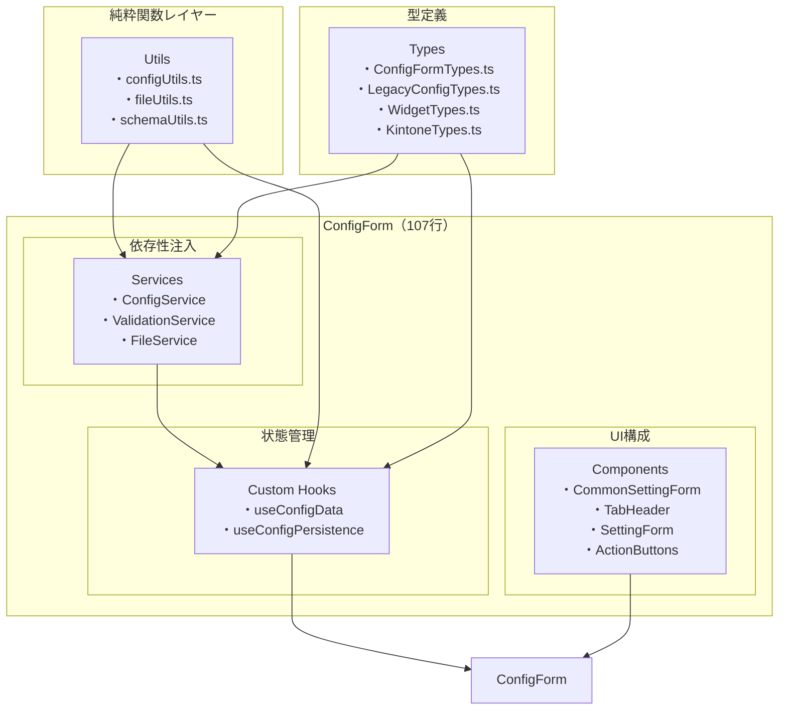
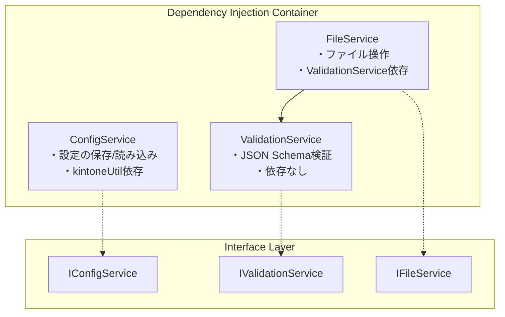
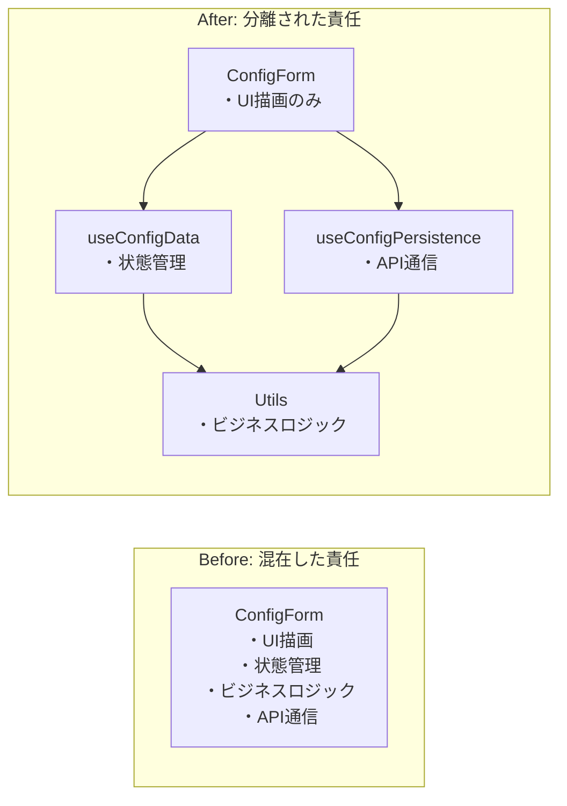
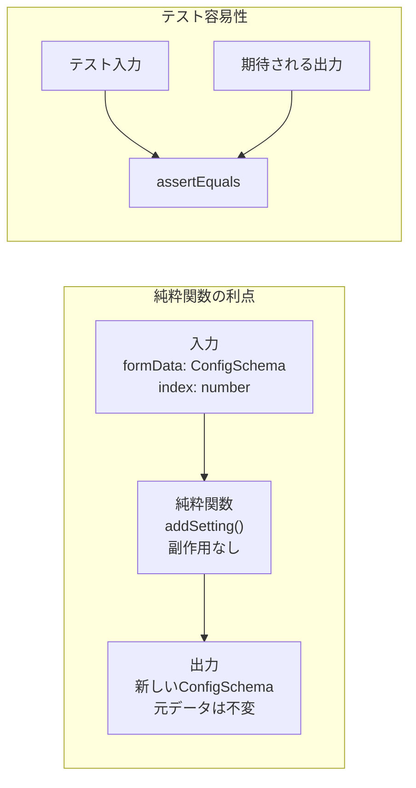
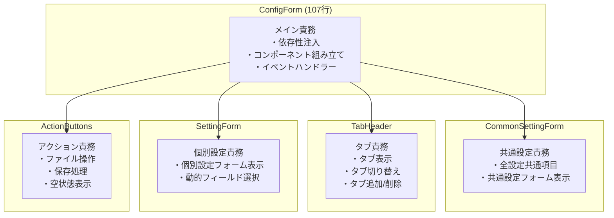
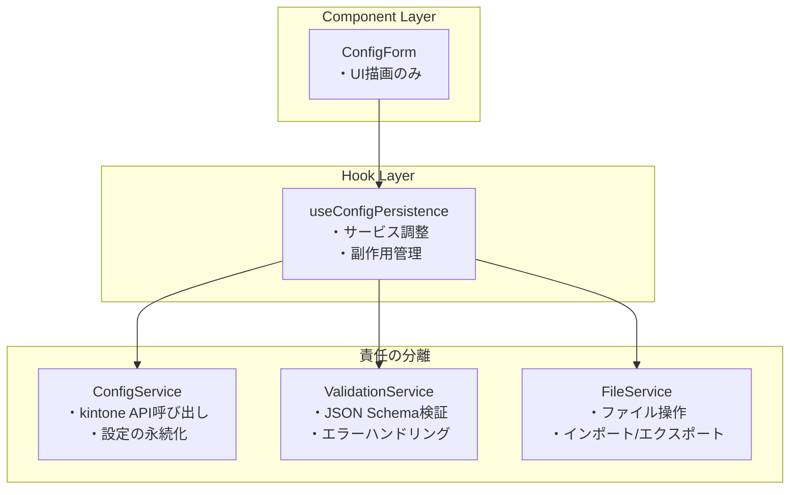
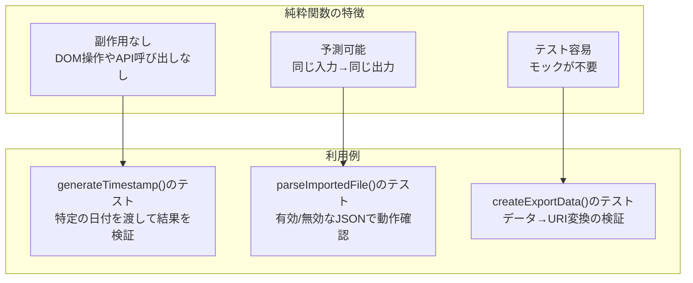
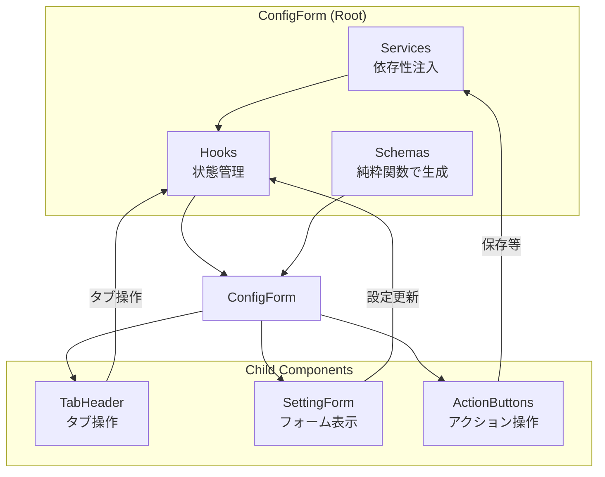
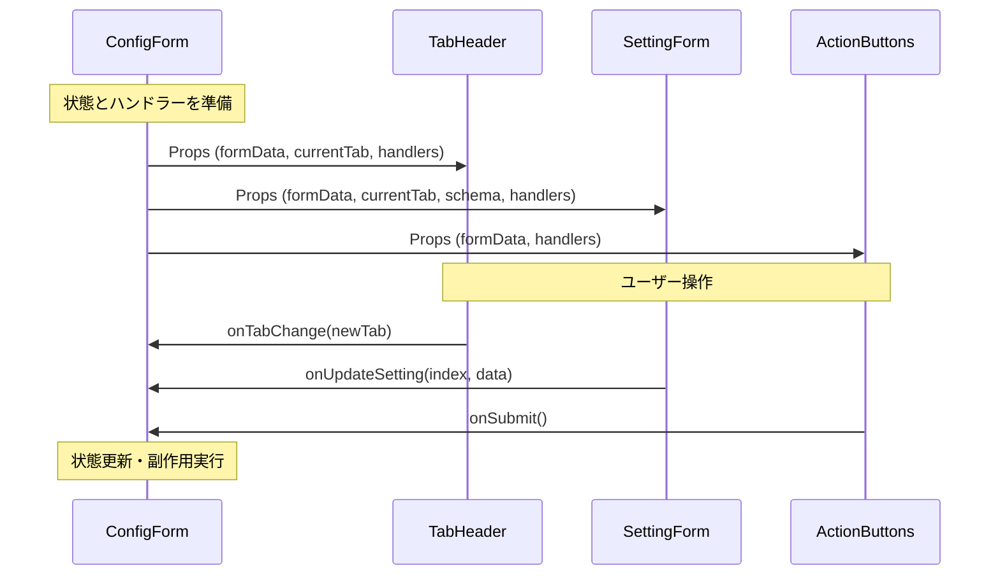
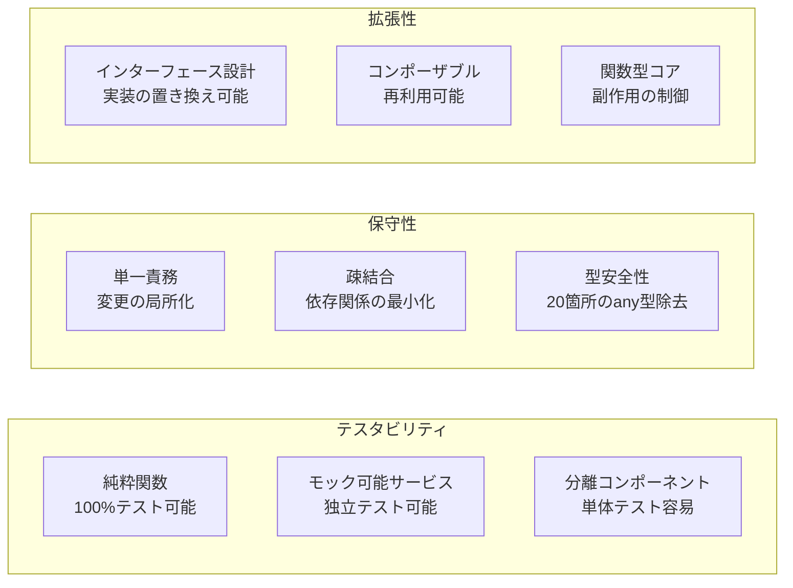

# ConfigForm.tsx 詳細解説（リファクタリング版）

## 概要
ConfigForm.tsxは、kintone-plugin-templateの設定画面のメインコンポーネントです。**純粋関数型**、**依存性注入**、**単一責務**原則に基づいて完全にリファクタリングされ、306行から107行（約65%削減）へと大幅に簡素化されました。さらに**包括的な型安全化**により、20箇所のany型を完全に除去し、レガシー設定対応と共通設定機能を追加しました。

## リファクタリングの核心原則

### 1. 純粋関数型プログラミング
- **副作用の分離**: すべてのデータ変換を純粋関数として抽出
- **不変性**: データの直接変更を禁止し、新しいオブジェクトを生成
- **テスタビリティ**: 各関数が独立してテスト可能

### 2. 依存性注入パターン
- **サービス指向アーキテクチャ**: 外部依存をインターフェース化
- **疎結合設計**: コンポーネント間の依存関係を最小化
- **モック可能性**: テスト時の依存関係置き換えが容易

### 3. 単一責務原則
- **コンポーネント分割**: 各コンポーネントが1つの責任を持つ
- **関心の分離**: UI、ビジネスロジック、データアクセスを分離
- **保守性向上**: 変更の影響範囲を局所化

## 新しいアーキテクチャ全体像



## 1. 新しいインポート構造

```typescript
import React, { useMemo } from "react";

import Box from "@mui/material/Box";
import Paper from "@mui/material/Paper";

import { KintoneSdk } from "../shared/util/kintoneSdk";
import { KintoneUtil } from "../shared/util/KintoneUtil";

// Components - UI責任の分離
import { ActionButtons } from "./components/ActionButtons";
import { CommonSettingForm } from "./components/CommonSettingForm";
import { SettingForm } from "./components/SettingForm";
import { TabHeader } from "./components/TabHeader";

// Hooks - 状態管理とビジネスロジックの分離
import { useConfigData } from "./hooks/useConfigData";
import { useConfigPersistence } from "./hooks/useConfigPersistence";

// Services - 依存性注入による外部依存の抽象化
import { ConfigService } from "./services/ConfigService";
import { FileService } from "./services/FileService";
import { ValidationService } from "./services/ValidationService";

// Utils - 純粋関数による副作用の分離
import {
  createCommonSettingSchema,
  createCommonSettingUiSchema,
  createSettingSchema,
  createSettingUiSchema,
} from "./utils/schemaUtils";

interface AppProps {
  pluginId: string;
  kintoneSdk: KintoneSdk;
  kintoneUtil: typeof KintoneUtil;
}
```

### アーキテクチャの設計原則

1. **レイヤー分離**: UI、ビジネスロジック、データアクセスを明確に分離
2. **依存関係の管理**: 上位レイヤーが下位レイヤーに依存する単方向の依存関係
3. **インターフェース分離**: 実装ではなくインターフェースに依存
4. **型安全性の強化**: any型を完全排除し、厳密な型定義による安全性確保

### 新規追加された型定義

#### LegacyConfigTypes.ts - レガシー設定対応
```typescript
// レガシー設定形式 V1（config プロパティでラップされた形式）
interface LegacyConfigV1 {
  config: {
    settings: ConfigSetting[];
    commonSetting?: CommonSetting;
  };
}

// 型ガードによる安全な判定
export function isLegacyConfigV1(config: unknown): config is LegacyConfigV1 {
  return (
    typeof config === "object" &&
    config !== null &&
    "config" in config &&
    typeof (config as any).config === "object"
  );
}
```

#### WidgetTypes.ts - カスタムウィジェット型定義
```typescript
// kintone アプリ情報の型
export interface KintoneApp {
  appId: string;
  name: string;
}

// フォームコンテキストの型定義
export interface CustomFormContext extends ConfigFormActions {
  formData: ConfigSchema;
  currentIndex?: number;
  currentSetting?: ConfigSchema["settings"][number];
}
```

#### KintoneTypes.ts - 基盤型定義
```typescript
// AJVバリデーションエラーの詳細情報
export interface ValidationError {
  keyword: string;
  instancePath: string;
  schemaPath: string;
  data: unknown;
  message?: string;
  params?: { [key: string]: unknown };
}
```

## 2. 依存性注入によるサービス初期化

```typescript
const ConfigForm: React.FC<AppProps> = ({ pluginId, kintoneUtil }) => {
  // Services initialization with dependency injection
  const services = useMemo(() => {
    const configService = new ConfigService(pluginId, kintoneUtil);
    const validationService = new ValidationService();
    const fileService = new FileService(validationService);

    return { configService, validationService, fileService };
  }, [pluginId, kintoneUtil]);
```

### 依存性注入の実装パターン



### メリット
1. **テスタビリティ**: モックオブジェクトで簡単にテスト可能
2. **拡張性**: インターフェースを維持して実装を変更可能
3. **保守性**: 依存関係が明示的で理解しやすい

## 3. カスタムフックによる状態管理の分離

```typescript
// State management
const { state, actions } = useConfigData();
const { formData, currentTab } = state;

// Persistence operations
const { handleSubmit, handleImport, handleExport } = useConfigPersistence({
  ...services,
  onDataLoaded: actions.setFormData,
});
```

### useConfigData フック

```typescript
export const useConfigData = (
  initialData: ConfigSchema = {
    settings: [],
    commonSetting: createDefaultCommonSetting(),
  },
) => {
  const [formData, setFormData] = useState<ConfigSchema>(initialData);
  const [currentTab, setCurrentTab] = useState(0);

  const actions = {
    setFormData,
    setCurrentTab,
    handleTabChange: (event: React.SyntheticEvent, newValue: number) => {
      setCurrentTab(newValue);
    },
    handleAddTab: () => {
      const newFormData = addSetting(formData);
      setFormData(newFormData);
      setCurrentTab(calculateNewTabIndex(newFormData.settings.length));
    },
    handleDeleteTab: (index: number) => {
      const newFormData = deleteSetting(formData, index);
      setFormData(newFormData);
      const adjustedTab = adjustCurrentTab(currentTab, newFormData.settings.length);
      setCurrentTab(adjustedTab);
    },
    handleUpdateSetting: (index: number, settingData: ConfigSetting) => {
      const newFormData = updateSetting(formData, index, settingData);
      setFormData(newFormData);
    },
    handleUpdateCommonSetting: (commonSettingData: ConfigSchema["commonSetting"]) => {
      setFormData({
        ...formData,
        commonSetting: commonSettingData,
      });
    },
  };

  return { state: { formData, currentTab }, actions };
};
```

### カスタムフックの利点



## 4. 純粋関数による状態操作

### configUtils.ts - データ変換の純粋関数

```typescript
// 新しい設定を作成する純粋関数
export const createNewSetting = (index: number): Setting => ({
  name: `設定 ${index + 1}`,
  appId: "",
  targetField: "",
  prefix: "",
});

// 設定を追加する純粋関数
export const addSetting = (formData: ConfigSchema): ConfigSchema => {
  const newSetting = createNewSetting(formData.settings.length);
  return {
    ...formData,
    settings: [...formData.settings, newSetting],
  };
};

// 設定を削除する純粋関数
export const deleteSetting = (
  formData: ConfigSchema,
  index: number,
): ConfigSchema => ({
  ...formData,
  settings: formData.settings.filter((_, i) => i !== index),
});

// 設定を更新する純粋関数
export const updateSetting = (
  formData: ConfigSchema,
  index: number,
  newSetting: Setting,
): ConfigSchema => ({
  ...formData,
  settings: formData.settings.map((setting, i) =>
    i === index ? newSetting : setting,
  ),
});
```

### 純粋関数の特徴

1. **副作用なし**: 引数以外の外部状態を変更しない
2. **参照透明性**: 同じ入力に対して常に同じ出力
3. **不変性**: 元のデータを変更せず、新しいオブジェクトを返す
4. **テスト容易性**: 入力と出力のみをテストすればよい



## 5. コンポーネント分割による単一責務の実現

### UI コンポーネントの分離

```typescript
// ConfigForm.tsx - メインコンポーネント (93行)
const ConfigForm: React.FC<AppProps> = ({ pluginId, kintoneUtil }) => {
  // Schema generation
  const schema = useMemo(() => createSettingSchema(), []);
  const uiSchema = useMemo(() => createSettingUiSchema(), []);

  // Event handlers
  const onSubmit = () => handleSubmit(formData);
  const onImport = (event: React.ChangeEvent<HTMLInputElement>) =>
    handleImport(event, actions.setFormData);
  const onExport = () => handleExport(formData);

  return (
    <Box>
      <Paper sx={{ mt: 2 }}>
        <TabHeader
          formData={formData}
          currentTab={currentTab}
          onTabChange={actions.handleTabChange}
          onAddTab={actions.handleAddTab}
          onDeleteTab={actions.handleDeleteTab}
        />

        <SettingForm
          formData={formData}
          currentTab={currentTab}
          schema={schema}
          uiSchema={uiSchema}
          onUpdateSetting={actions.handleUpdateSetting}
        />
      </Paper>

      <ActionButtons
        formData={formData}
        onImport={onImport}
        onExport={onExport}
        onSubmit={onSubmit}
        onAddTab={actions.handleAddTab}
      />
    </Box>
  );
};
```

### 各コンポーネントの責務



### CommonSettingForm コンポーネント

```typescript
export const CommonSettingForm: React.FC<CommonSettingFormProps> = ({
  formData,
  schema,
  uiSchema,
  onUpdateCommonSetting,
}) => {
  const handleChange = (
    changeEvent: IChangeEvent<ConfigSchema["commonSetting"]>,
  ) => {
    onUpdateCommonSetting(changeEvent.formData);
  };

  return (
    <Paper sx={{ p: 2, mb: 2 }}>
      <Typography variant="h6" gutterBottom>
        共通設定
      </Typography>
      <Form
        schema={schema}
        uiSchema={uiSchema}
        formData={formData.commonSetting}
        validator={validator}
        onChange={handleChange}
        widgets={customWidgets}
      >
        <div /> {/* Submit button を非表示にするため */}
      </Form>
    </Paper>
  );
};
```

### TabHeader コンポーネント

```typescript
export const TabHeader: React.FC<TabHeaderProps> = ({
  formData,
  currentTab,
  onTabChange,
  onAddTab,
  onDeleteTab,
}) => (
  <Box sx={{ borderBottom: 1, borderColor: "divider", p: 2 }}>
    <Box display="flex" justifyContent="space-between" alignItems="center">
      <Tabs value={currentTab} onChange={(_, newValue) => onTabChange(newValue)}>
        {formData.settings.map((setting, index) => (
          <Tab key={index} label={setting.name || `設定 ${index + 1}`} />
        ))}
      </Tabs>
      
      <Box display="flex" gap={1}>
        <IconButton onClick={onAddTab} size="small" title="設定を追加">
          <AddIcon />
        </IconButton>
        {formData.settings.length > 0 && (
          <IconButton
            onClick={() => onDeleteTab(currentTab)}
            size="small"
            title="現在の設定を削除"
          >
            <DeleteIcon />
          </IconButton>
        )}
      </Box>
    </Box>
  </Box>
);
```

### 単一責務の利点

1. **理解しやすさ**: 各コンポーネントが1つの明確な責任を持つ
2. **テスト容易性**: 独立した機能をそれぞれテスト可能
3. **再利用性**: 他の場所での利用が容易
4. **変更の局所化**: 変更の影響範囲を最小化

## 6. サービス指向による保存処理

### ConfigService クラス

```typescript
export class ConfigService implements IConfigService {
  constructor(
    private pluginId: string,
    private kintoneUtil: typeof KintoneUtil,
  ) {}

  async loadConfig(): Promise<ConfigSchema> {
    try {
      const responseConfig = this.kintoneUtil.getConfig(this.pluginId);
      if (responseConfig.config) {
        const parsedConfig = JSON.parse(responseConfig.config);
        return convertLegacyConfig(parsedConfig);  // 純粋関数で変換
      }
      return { settings: [] };
    } catch (error) {
      console.error("Failed to load config:", error);
      return { settings: [] };
    }
  }

  async saveConfig(data: ConfigSchema): Promise<void> {
    return new Promise((resolve) => {
      const configSetting = createSaveConfig(data);  // 純粋関数で変換
      kintone.plugin.app.setConfig(
        { config: JSON.stringify(configSetting) },
        () => {
          alert("設定が保存されました。");
          window.location.href = "../../flow?app=" + this.kintoneUtil.getId();
          resolve();
        },
      );
    });
  }
}
```

### useConfigPersistence フック

```typescript
export const useConfigPersistence = ({
  configService,
  validationService,
  fileService,
  onDataLoaded,
}: UseConfigPersistenceOptions) => {
  useEffect(() => {
    const loadConfig = async () => {
      const config = await configService.loadConfig();
      onDataLoaded(config);
    };
    loadConfig();
  }, [configService, onDataLoaded]);

  const handleSubmit = async (data: ConfigSchema) => {
    const validationResult = validationService.validate(data);
    if (!validationResult.isValid) {
      console.error("Validation errors:", validationResult.errors);
      alert("設定にエラーがあります。修正してください。");
      return;
    }
    await configService.saveConfig(data);
  };

  // handleImport, handleExport も同様に実装
  
  return { handleSubmit, handleImport, handleExport };
};
```

### サービス指向の利点



## 7. 純粋関数によるファイル操作

### fileUtils.ts - 純粋関数の抽出

```typescript
// タイムスタンプ生成の純粋関数
export const generateTimestamp = (date: Date = new Date()): string =>
  date.toISOString().replace(/[:.]/g, "-").split("T")[0];

// エクスポートデータ作成の純粋関数
export const createExportData = (data: ConfigSchema): string =>
  "data:text/json;charset=utf-8," +
  encodeURIComponent(JSON.stringify(data, null, 2));

// ファイル名生成の純粋関数
export const generateExportFilename = (timestamp?: string): string => {
  const ts = timestamp || generateTimestamp();
  return `kintone-config-${ts}.json`;
};

// インポートファイル解析の純粋関数
export const parseImportedFile = (
  content: string,
  validator: (data: any) => boolean,
): FileOperationResult => {
  try {
    const parsedData = JSON.parse(content) as ConfigSchema;
    const isValid = validator(parsedData);
    
    return {
      success: isValid,
      data: isValid ? parsedData : null,
      error: isValid ? null : "Validation failed",
    };
  } catch (error) {
    return {
      success: false,
      data: null,
      error: `Failed to parse JSON: ${error}`,
    };
  }
};
```

### FileService クラス

```typescript
export class FileService implements IFileService {
  constructor(private validationService: IValidationService) {}

  exportConfig(data: ConfigSchema): void {
    const exportData = createExportData(data);
    const filename = generateExportFilename();
    
    const downloadAnchorNode = document.createElement("a");
    downloadAnchorNode.setAttribute("href", exportData);
    downloadAnchorNode.setAttribute("download", filename);
    document.body.appendChild(downloadAnchorNode);
    downloadAnchorNode.click();
    downloadAnchorNode.remove();
  }

  importConfig(
    file: File,
    onSuccess: (data: ConfigSchema) => void,
    onError: (error: string) => void,
  ): void {
    const reader = new FileReader();
    reader.onload = (e) => {
      const content = e.target?.result as string;
      const result = parseImportedFile(
        content,
        (data) => this.validationService.validate(data).isValid,
      );
      
      if (result.success && result.data) {
        onSuccess(result.data);
      } else {
        onError(result.error || "Unknown error");
      }
    };
    reader.readAsText(file);
  }
}
```

### 純粋関数アプローチの利点



## 8. 新しいレンダリング構造

### コンポーネント構成の簡素化

```typescript
// ConfigForm.tsx - 93行の実装
return (
  <Box>
    <Paper sx={{ mt: 2 }}>
      <TabHeader
        formData={formData}
        currentTab={currentTab}
        onTabChange={actions.handleTabChange}
        onAddTab={actions.handleAddTab}
        onDeleteTab={actions.handleDeleteTab}
      />

      <SettingForm
        formData={formData}
        currentTab={currentTab}
        schema={schema}
        uiSchema={uiSchema}
        onUpdateSetting={actions.handleUpdateSetting}
      />
    </Paper>

    <ActionButtons
      formData={formData}
      onImport={onImport}
      onExport={onExport}
      onSubmit={onSubmit}
      onAddTab={actions.handleAddTab}
    />
  </Box>
);
```

### コンポーネント間のデータフロー



### Props Down, Events Up パターン



## まとめ：アーキテクチャ変革の成果

### 定量的な改善
- **コード行数**: 306行 → 107行（65%削減）
- **ファイル数**: 1ファイル → 18ファイル（責任分散、新規型定義3ファイル含む）
- **any型除去**: 20箇所の完全排除（型安全性向上）
- **循環的複雑度**: 大幅な削減（単一責務による）

### アーキテクチャパターンの採用

#### 1. 純粋関数型プログラミング
```typescript
// Before: 副作用を含む関数
const handleAddTab = () => {
  setFormData({ ...formData, settings: [...formData.settings, newSetting] });
  setCurrentTab(formData.settings.length);
};

// After: 純粋関数 + 副作用の分離
const addSetting = (formData: ConfigSchema): ConfigSchema => ({
  ...formData,
  settings: [...formData.settings, createNewSetting(formData.settings.length)],
});
```

#### 2. 依存性注入
```typescript
// Before: 直接的な依存
kintone.plugin.app.setConfig(...);

// After: インターフェースを通じた依存
class ConfigService implements IConfigService {
  constructor(private kintoneUtil: typeof KintoneUtil) {}
}
```

#### 3. 単一責務原則
```typescript
// Before: 1つのコンポーネントが全責任を持つ
const ConfigForm = () => {
  // 状態管理、UI描画、API通信、ファイル操作、バリデーション...
};

// After: 責任の分離
const ConfigForm = () => {
  // UI描画とコンポーネント組み立てのみ
};
```

#### 4. 包括的な型安全化
```typescript
// Before: any型による不安全な実装
const convertLegacyConfig = (parsedConfig: any): ConfigSchema => {
  if (parsedConfig.config) {
    return parsedConfig.config;
  }
  return { settings: [] };
};

// After: 型ガードによる安全な変換
export const convertLegacyConfig = (parsedConfig: LegacyConfig): ConfigSchema => {
  if (!isValidConfigObject(parsedConfig)) {
    return { settings: [], commonSetting: createDefaultCommonSetting() };
  }
  
  if (isLegacyConfigV1(parsedConfig)) {
    const config = parsedConfig.config;
    return {
      ...config,
      commonSetting: config.commonSetting || createDefaultCommonSetting(),
    };
  }
  
  return {
    ...parsedConfig,
    commonSetting: parsedConfig.commonSetting || createDefaultCommonSetting(),
  };
};
```

### 品質向上の指標



### 開発体験の向上

1. **認知負荷の軽減**: 各ファイルが明確な責任を持つ
2. **デバッグの容易さ**: 問題の発生箇所を特定しやすい
3. **並行開発**: 異なる開発者が独立して作業可能
4. **学習コスト**: 新しいメンバーがコードを理解しやすい

### ベストプラクティスの実現

- ✅ **関心の分離**: UI、ビジネスロジック、データアクセスの分離
- ✅ **SOLID原則**: 特に単一責務と依存性逆転の原則
- ✅ **関数型プログラミング**: 副作用の制御と不変性
- ✅ **Clean Architecture**: レイヤー分割と依存方向の制御
- ✅ **TypeScript活用**: 20箇所のany型完全除去による型安全性確保
- ✅ **レガシー互換性**: 型ガードによる安全な後方互換性維持
- ✅ **動的UI対応**: アプリ選択による動的フィールド更新機能

このリファクタリングにより、**保守しやすく**、**テストしやすく**、**拡張しやすく**、**型安全な**高品質なReactアプリケーションが実現されました。