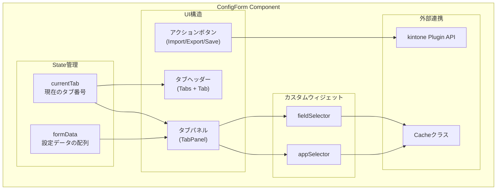
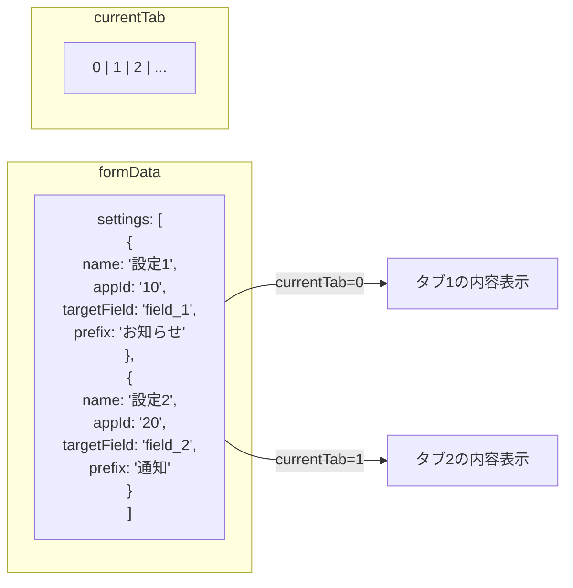
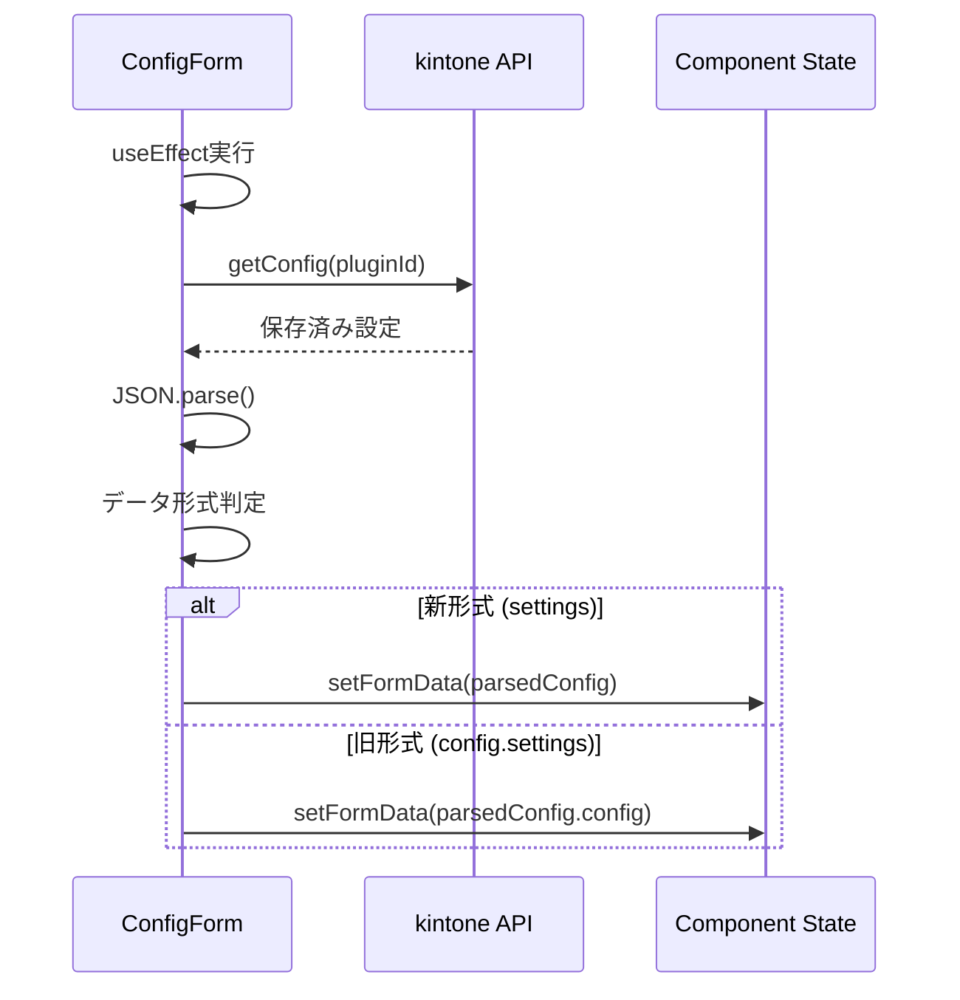
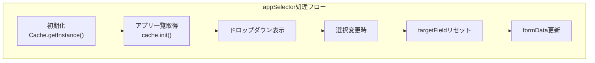
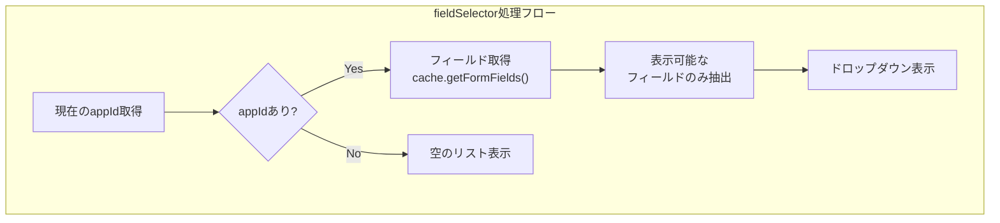
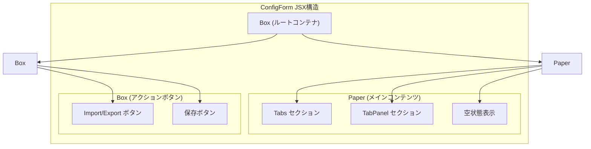

# ConfigForm.tsx 詳細解説

## 概要
ConfigForm.tsxは、kintone-plugin-templateの設定画面のメインコンポーネントです。タブベースのUIで複数の設定を管理し、動的なフィールド選択機能を提供します。

## コンポーネント構造の全体像



## 1. インポートと型定義

```typescript
// Material-UIコンポーネント
import Box from "@mui/material/Box";
import Button from "@mui/material/Button";
import Tabs from "@mui/material/Tabs";
// ... その他のMUI imports

// react-jsonschema-form関連
import Form from "@rjsf/mui";
import validator from "@rjsf/validator-ajv8";
import Ajv from "ajv";

// プロジェクト内部のimports
import configSchema from "../shared/jsonSchema/config.schema.json";
import { KintoneSdk } from "../shared/util/kintoneSdk";
import { KintoneUtil } from "../shared/util/KintoneUtil";
import { Cache } from "../shared/util/cache";

// 型定義
interface AppProps {
  pluginId: string;                    // プラグインID
  kintoneSdk: KintoneSdk;             // SDK インスタンス
  kintoneUtil: typeof KintoneUtil;     // ユーティリティ関数
}
```

## 2. State管理

```typescript
const [formData, setFormData] = useState<ConfigSchema>({ settings: [] });
const [currentTab, setCurrentTab] = useState(0);
```

### State構造の詳細



## 3. 初期化処理（useEffect）

```typescript
useEffect(() => {
  const loadConfig = async () => {
    try {
      const responseConfig = kintoneUtil.getConfig(pluginId);
      if (responseConfig.config) {
        const parsedConfig = JSON.parse(responseConfig.config);
        // 旧形式のデータをサポート
        if (parsedConfig.config) {
          setFormData(parsedConfig.config);
        } else if (parsedConfig.settings) {
          setFormData(parsedConfig);
        }
      }
    } catch (error) {
      console.error("Failed to load config:", error);
    }
  };

  loadConfig();
}, [pluginId, kintoneUtil]);
```

### 処理フロー



## 4. タブ操作関数

### タブ追加 (handleAddTab)

```typescript
const handleAddTab = () => {
  const newSetting = {
    name: `設定 ${formData.settings.length + 1}`,
    appId: '',
    targetField: '',
    prefix: ''
  };
  setFormData({
    ...formData,
    settings: [...formData.settings, newSetting]
  });
  setCurrentTab(formData.settings.length);  // 新しいタブを選択
};
```

### タブ削除 (handleDeleteTab)

```typescript
const handleDeleteTab = (index: number) => {
  const newSettings = formData.settings.filter((_, i) => i !== index);
  setFormData({ settings: newSettings });
  
  // 現在のタブ位置を調整
  if (currentTab >= newSettings.length && currentTab > 0) {
    setCurrentTab(currentTab - 1);
  }
};
```

### 設定更新 (handleUpdateSetting)

```typescript
const handleUpdateSetting = (index: number, settingData: any) => {
  const newSettings = [...formData.settings];
  newSettings[index] = settingData;
  setFormData({ settings: newSettings });
};
```

## 5. カスタムウィジェットの実装

### appSelectorウィジェット



主な特徴：
- Cacheクラスを使用してアプリ一覧を取得
- アプリ変更時に関連するtargetFieldを自動リセット
- formContextを通じて親コンポーネントと連携

### fieldSelectorウィジェット



getCurrentAppId関数の実装：
```typescript
const getCurrentAppId = () => {
  // タブUIの場合はcurrentSettingから取得
  if (formContext?.currentSetting) {
    return formContext.currentSetting.appId;
  }
  // 通常の配列UIの場合（フォールバック）
  const id = idSchema?.$id || '';
  const match = id.match(/settings_(\d+)_targetField/);
  if (match) {
    const index = parseInt(match[1]);
    return formContext?.formData?.settings?.[index]?.appId;
  }
  return null;
};
```

## 6. 保存処理

```typescript
const handleSubmit = (data: IChangeEvent<ConfigSchema>) => {
  // バリデーション
  const valid = validate(data.formData);
  if (!valid) {
    console.error("Validation errors:", validate.errors);
    alert("設定にエラーがあります。修正してください。");
    return;
  }

  // 設定の保存
  const configSetting = { config: data.formData };
  kintone.plugin.app.setConfig(
    { config: JSON.stringify(configSetting) },
    function () {
      alert("設定が保存されました。");
      window.location.href = "../../flow?app=" + kintoneUtil.getId();
    },
  );
};
```

### 保存データの構造

```json
{
  "config": {
    "settings": [
      {
        "name": "設定1",
        "appId": "10",
        "targetField": "field_1",
        "prefix": "お知らせ"
      },
      {
        "name": "設定2",
        "appId": "20",
        "targetField": "field_2",
        "prefix": "通知"
      }
    ]
  }
}
```

## 7. インポート/エクスポート機能

### エクスポート処理

```typescript
const handleExport = () => {
  const dataStr =
    "data:text/json;charset=utf-8," +
    encodeURIComponent(JSON.stringify(formData, null, 2));
  const downloadAnchorNode = document.createElement("a");
  downloadAnchorNode.setAttribute("href", dataStr);
  const timestamp = new Date().toISOString().replace(/[:.]/g, '-').split('T')[0];
  downloadAnchorNode.setAttribute("download", `kintone-config-${timestamp}.json`);
  document.body.appendChild(downloadAnchorNode);
  downloadAnchorNode.click();
  downloadAnchorNode.remove();
};
```

### インポート処理

```typescript
const handleImport = (event: React.ChangeEvent<HTMLInputElement>) => {
  const file = event.target.files?.[0];
  if (file) {
    const reader = new FileReader();
    reader.onload = (e) => {
      try {
        const importedConfig = JSON.parse(e.target?.result as string);
        const valid = validate(importedConfig);
        if (!valid) {
          console.error("Validation errors:", validate.errors);
          alert("インポートした設定にエラーがあります。");
          return;
        }
        setFormData(importedConfig);
        alert("設定がインポートされました。");
      } catch (error) {
        console.error("Failed to import config:", error);
        alert("設定のインポートに失敗しました。");
      }
    };
    reader.readAsText(file);
  }
};
```

## 8. レンダリング構造



## まとめ

ConfigForm.tsxの主な機能：

1. **タブベースの設定管理**: 複数の設定を独立したタブで管理
2. **動的フィールド選択**: アプリ選択に連動したフィールド取得
3. **データ永続化**: kintone Plugin APIを使用した設定の保存
4. **インポート/エクスポート**: 設定のバックアップと復元
5. **バリデーション**: JSON Schemaベースの自動検証
6. **カスタムウィジェット**: 独自のUI部品による拡張性

この実装により、ユーザーフレンドリーで拡張可能な設定画面が実現されています。