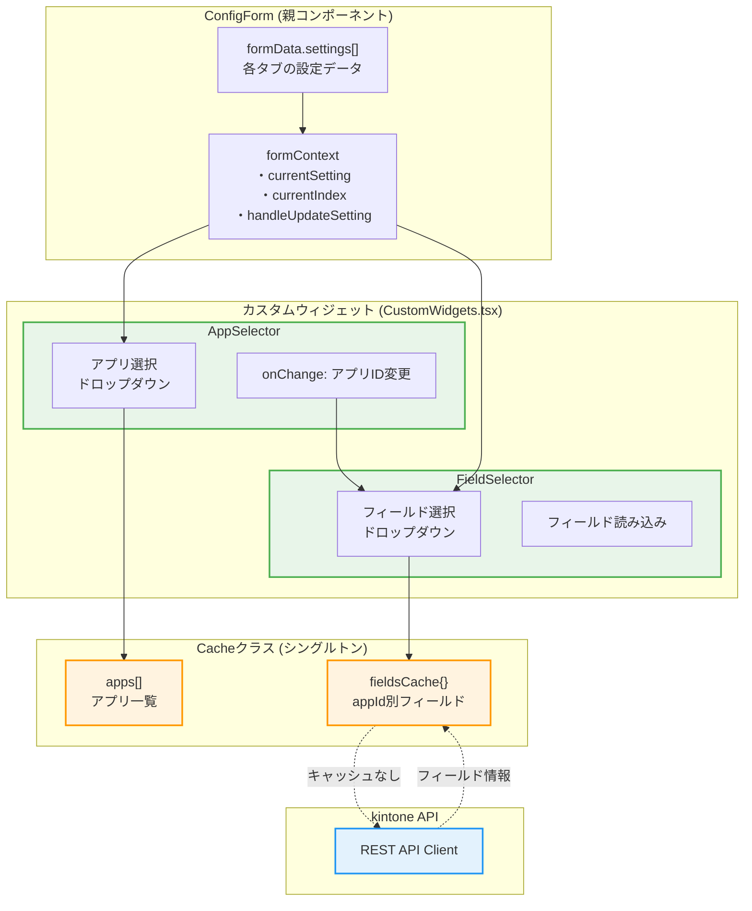
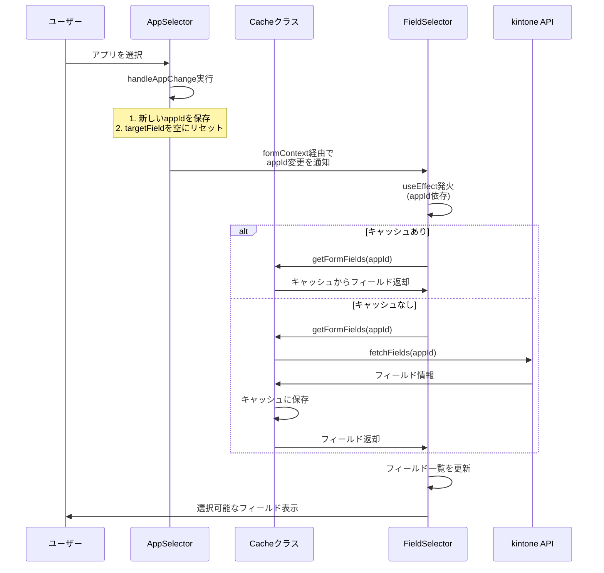
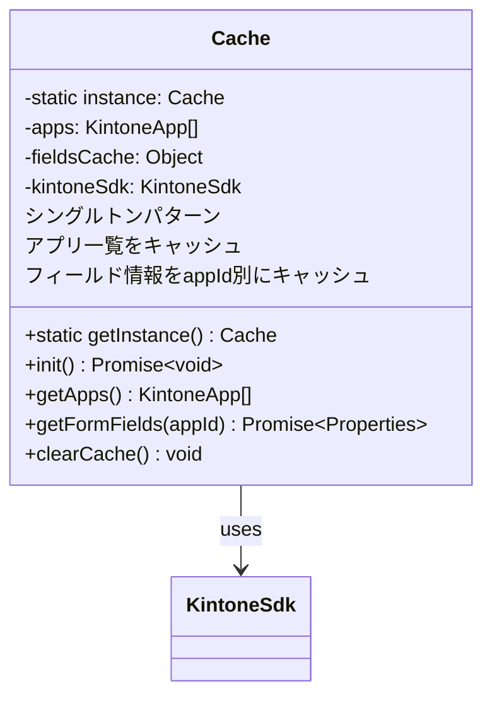
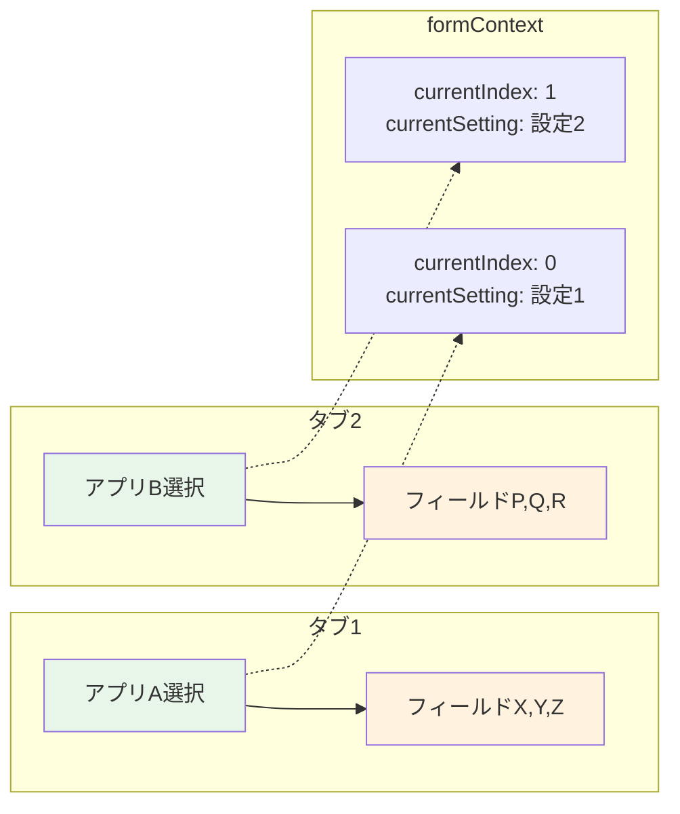

# React初学者向け：動的フィールド選択の実装解説

## 概要
このドキュメントでは、アプリ選択に連動してフィールドのドロップダウンが動的に更新される仕組みを解説します。この実装により、各タブの設定が独立して動作し、他のタブに影響を与えることなくフィールド選択が可能になります。

## アーキテクチャの改善点
カスタムウィジェットを外部ファイル（`CustomWidgets.tsx`）に分離することで、以下の改善を実現：
- **パフォーマンス向上**: コンポーネントの不要な再作成を防止
- **保守性向上**: 各ウィジェットを独立してテスト・修正可能
- **Reactベストプラクティス**: ESLintルールに完全準拠

## 動的フィールド選択の全体構造



## 処理の流れ

### 1. アプリ選択からフィールド更新までの流れ



## 実装の詳細解説

### 0. ファイル構成の改善

カスタムウィジェットを外部ファイル化：

```typescript
// CustomWidgets.tsx
import { RegistryWidgetsType } from "@rjsf/utils";

const AppSelector = (props: any) => {
  // AppSelector実装
};

const FieldSelector = (props: any) => {
  // FieldSelector実装
};

export const customWidgets: RegistryWidgetsType = {
  appSelector: AppSelector,
  fieldSelector: FieldSelector,
};
```

```typescript
// ConfigForm.tsx
import { customWidgets } from "./widgets/CustomWidgets";

// react-jsonschema-formで使用
<Form widgets={customWidgets} />
```

### 1. AppSelectorウィジェット

```typescript
const AppSelector = (props: any) => {
  const { value, onChange, formContext } = props;
  const [apps, setApps] = useState<any[]>([]);
  const [cache] = useState(() => Cache.getInstance());

  // 初回レンダリング時にアプリ一覧を取得
  useEffect(() => {
    const loadApps = async () => {
      await cache.init();
      setApps(cache.getApps());
    };
    loadApps();
  }, [cache]);

  const handleAppChange = (newAppId: string) => {
    onChange(newAppId);  // ① 新しいappIdを保存
    
    // ② targetFieldをリセット
    if (formContext?.currentIndex !== undefined && 
        formContext?.handleUpdateSetting) {
      const currentSetting = formContext.formData.settings[formContext.currentIndex];
      if (currentSetting) {
        formContext.handleUpdateSetting(formContext.currentIndex, {
          ...currentSetting,
          appId: newAppId,
          targetField: ""  // ← ここがポイント！
        });
      }
    }
  };

  return (
    <FormControl fullWidth>
      <InputLabel>対象アプリ</InputLabel>
      <Select
        value={value || ""}
        onChange={(e) => handleAppChange(e.target.value)}
        label="対象アプリ"
      >
        {/* アプリ一覧の表示 */}
      </Select>
    </FormControl>
  );
};
```

**ポイント解説：**
- **外部コンポーネント化**: レンダリング最適化により不要な再作成を防止
- `Cache.getInstance()`: シングルトンパターンでキャッシュインスタンスを取得
- `handleAppChange`: アプリ変更時に2つの処理を実行
  - ① 新しいappIdを保存
  - ② 関連するtargetFieldを空にリセット（重要！）

### 2. FieldSelectorウィジェット

```typescript
const FieldSelector = (props: any) => {
  const { value, onChange, formContext, idSchema } = props;
  const [fields, setFields] = useState<any[]>([]);
  const [loading, setLoading] = useState(false);
  const [cache] = useState(() => Cache.getInstance());

  // 現在のタブのappIdを取得する関数
  const getCurrentAppId = () => {
    // タブUIの場合はcurrentSettingから取得
    if (formContext?.currentSetting) {
      return formContext.currentSetting.appId;
    }
    // 通常の配列UIの場合（フォールバック）
    const id = idSchema?.$id || "";
    const match = id.match(/settings_(\d+)_targetField/);
    if (match) {
      const index = parseInt(match[1], 10); // radixパラメータを明示
      return formContext?.formData?.settings?.[index]?.appId;
    }
    return null;
  };

  const appId = getCurrentAppId();

  // appIdが変更されたらフィールドを再取得
  useEffect(() => {
    const loadFields = async () => {
      if (!appId) {
        setFields([]);
        return;
      }

      setLoading(true);
      try {
        const properties = await cache.getFormFields(appId);
        const fieldOptions = Object.entries(properties)
          .filter(([, field]: [string, any]) => {
            // 表示可能なフィールドタイプのみ選択可能にする
            const allowedTypes = [
              "SINGLE_LINE_TEXT",
              "MULTI_LINE_TEXT",
              "NUMBER",
              "CALC",
              "RADIO_BUTTON",
              "DROP_DOWN",
              "DATE",
              "TIME",
              "DATETIME",
              "LINK",
              "RICH_TEXT",
            ];
            return allowedTypes.includes(field.type);
          })
          .map(([code, field]: [string, any]) => ({
            code,
            label: field.label || code,
          }));
        setFields(fieldOptions);
      } catch (error) {
        console.error("Failed to load fields:", error);
        setFields([]);
      } finally {
        setLoading(false);
      }
    };

    loadFields();
  }, [appId, cache]);  // ← appIdの変更を監視

  return (
    <FormControl fullWidth disabled={!appId || loading}>
      {/* フィールド選択UI */}
    </FormControl>
  );
};
```

### 3. Cacheクラスの実装



```typescript
export class Cache {
  private static instance: Cache | null = null;
  private apps: KintoneApp[] = [];
  private fieldsCache: { [appId: string]: Properties } = {};
  private kintoneSdk: KintoneSdk;

  // シングルトンパターンの実装
  static getInstance(): Cache {
    if (!Cache.instance) {
      Cache.instance = new Cache();
    }
    return Cache.instance;
  }

  // フィールド取得（キャッシュ優先）
  async getFormFields(appId: string | number): Promise<Properties> {
    const appIdStr = String(appId);
    
    // キャッシュがあればそれを返す
    if (this.fieldsCache[appIdStr]) {
      return this.fieldsCache[appIdStr];
    }

    // キャッシュがなければAPIから取得
    try {
      const response = await this.kintoneSdk.fetchFields(Number(appId));
      this.fieldsCache[appIdStr] = response;  // キャッシュに保存
      return response;
    } catch (error) {
      console.error(`Failed to fetch fields for app ${appId}:`, error);
      return {};
    }
  }
}
```

## 重要な実装ポイント

### 1. 独立性の確保

各タブの設定が独立して動作する仕組み：



### 2. useEffectによる副作用の管理

```typescript
useEffect(() => {
  // 非同期処理でフィールドを取得
  const loadFields = async () => {
    // 処理...
  };
  
  loadFields();
}, [appId, cache]);  // 依存配列：appIdが変わったら再実行
```

**React初学者へのポイント：**
- `useEffect`は副作用（API呼び出しなど）を扱うためのフック
- 第2引数の依存配列により、特定の値が変更されたときのみ実行
- 非同期処理は内部で関数を定義して呼び出す

### 3. 状態管理のベストプラクティス

1. **ローディング状態の管理**
   ```typescript
   const [loading, setLoading] = useState(false);
   ```

2. **エラーハンドリング**
   ```typescript
   try {
     // API呼び出し
   } catch (error) {
     console.error('Failed to load fields:', error);
     setFields([]);  // エラー時は空配列
   }
   ```

3. **条件付き無効化**
   ```typescript
   <FormControl fullWidth disabled={!appId || loading}>
   ```

## まとめ

動的フィールド選択の実装における重要な要素：

1. **外部ファイル化**: CustomWidgets.tsxによるパフォーマンス最適化
2. **カスタムウィジェット**: react-jsonschema-formのウィジェットシステムを活用
3. **formContext**: 親子コンポーネント間のデータ共有
4. **キャッシュ機構**: API呼び出しの最適化
5. **useEffect**: appId変更の監視と非同期処理
6. **独立性**: 各タブが他のタブに影響を与えない設計
7. **型安全性**: TypeScript厳格モードでの品質保証

## 改善による効果

### パフォーマンス向上
- カスタムウィジェットの外部化により、不要な再レンダリングを削減
- メモリ使用量の最適化

### 保守性向上
- 各ウィジェットを独立してテスト・修正可能
- ESLint/TypeScriptルールへの完全準拠

### 開発体験の向上
- コンポーネントの責任が明確化
- デバッグとトラブルシューティングが容易

この実装により、Reactのベストプラクティスに従った、ユーザーフレンドリーで効率的かつ高品質な設定画面が実現されています。