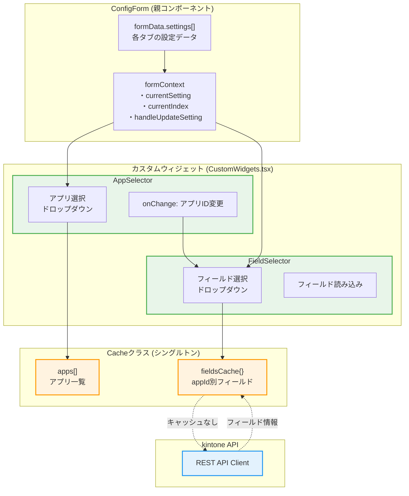
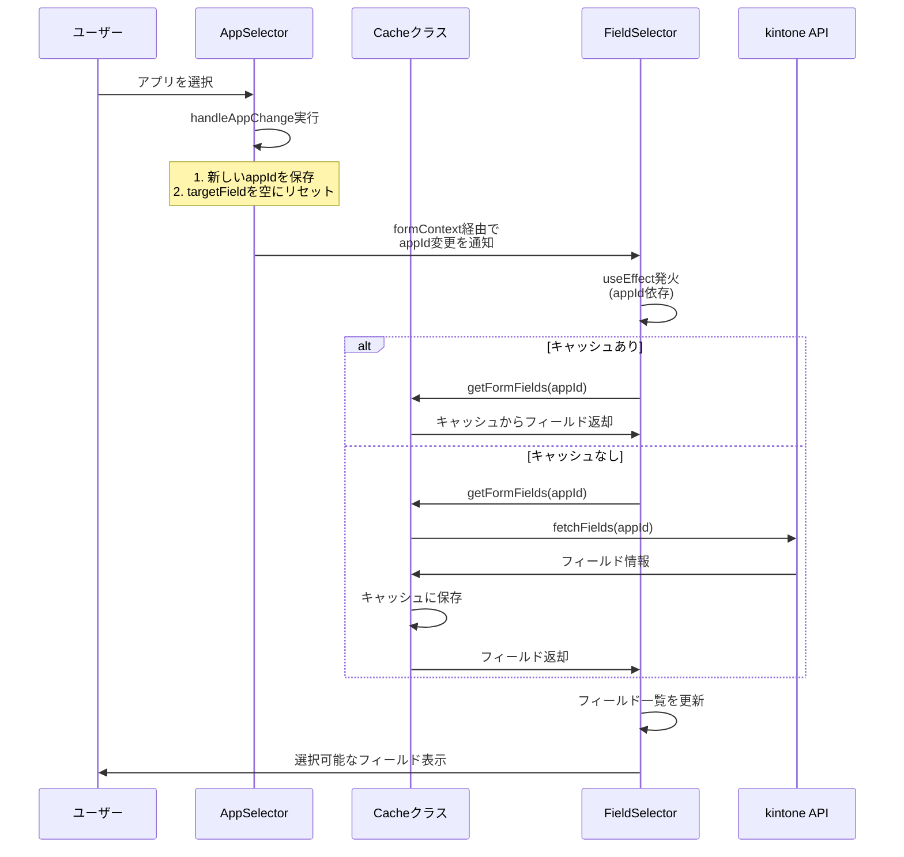
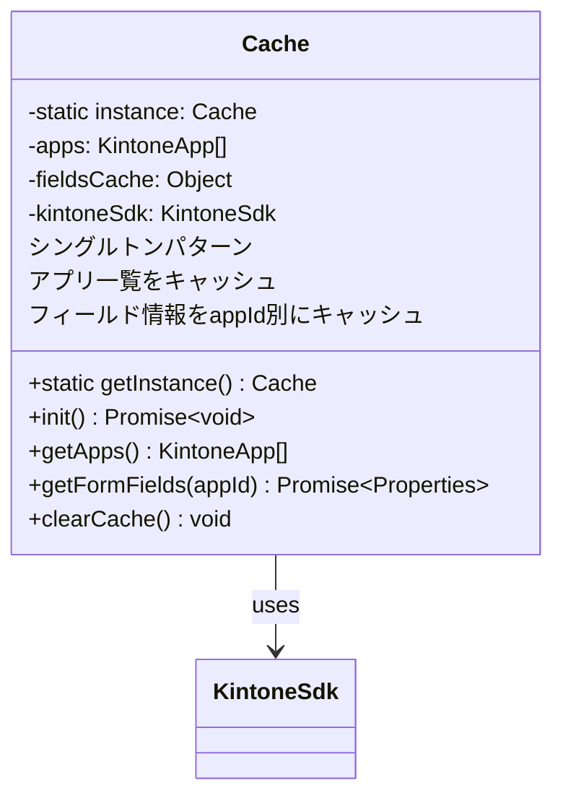
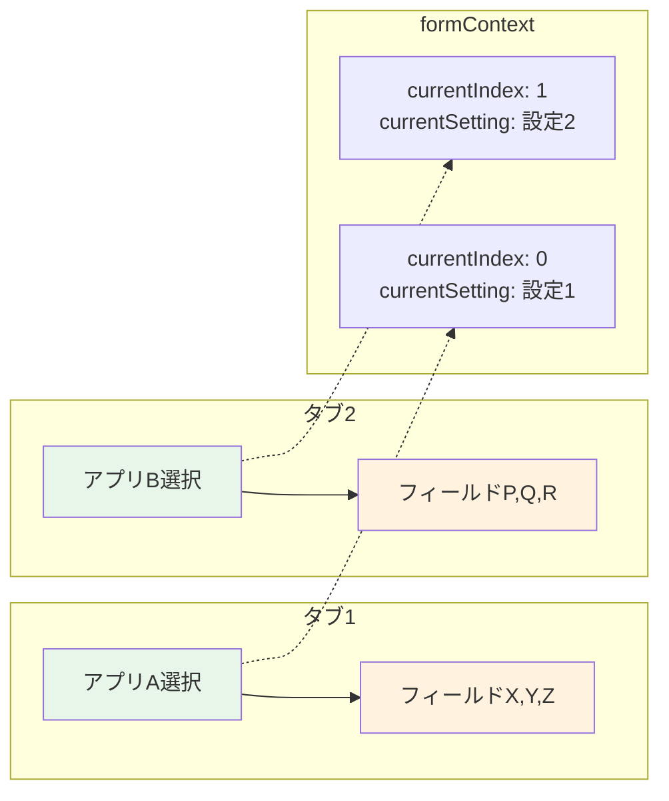
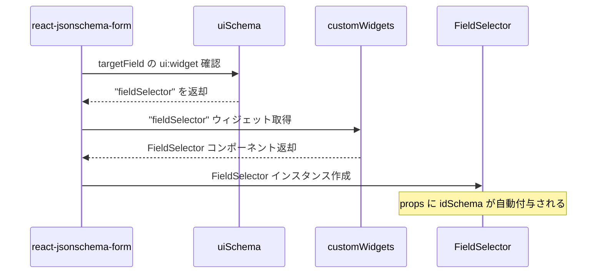
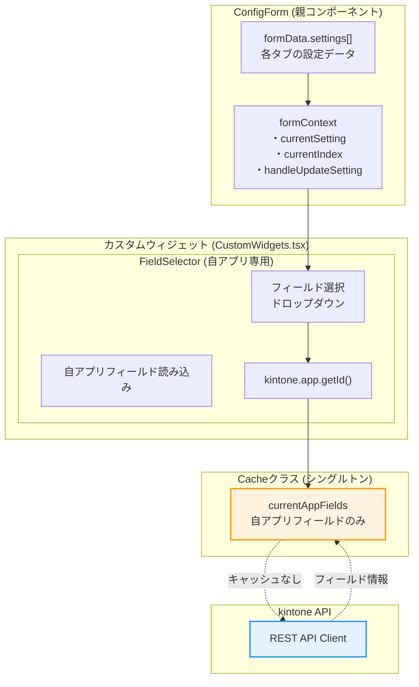

# React初学者向け：動的フィールド選択の実装解説

## 概要
このドキュメントでは、アプリ選択に連動してフィールドのドロップダウンが動的に更新される仕組みを解説します。この実装により、各タブの設定が独立して動作し、他のタブに影響を与えることなくフィールド選択が可能になります。

## アーキテクチャの改善点
カスタムウィジェットを外部ファイル（`CustomWidgets.tsx`）に分離することで、以下の改善を実現：
- **パフォーマンス向上**: コンポーネントの不要な再作成を防止
- **保守性向上**: 各ウィジェットを独立してテスト・修正可能
- **Reactベストプラクティス**: ESLintルールに完全準拠

## 動的フィールド選択の全体構造



## 処理の流れ

### 1. アプリ選択からフィールド更新までの流れ



## 実装の詳細解説

### 0. ファイル構成の改善

カスタムウィジェットを外部ファイル化：

```typescript
// CustomWidgets.tsx
import { RegistryWidgetsType } from "@rjsf/utils";

const AppSelector = (props: any) => {
  // AppSelector実装
};

const FieldSelector = (props: any) => {
  // FieldSelector実装
};

export const customWidgets: RegistryWidgetsType = {
  appSelector: AppSelector,
  fieldSelector: FieldSelector,
};
```

```typescript
// ConfigForm.tsx
import { customWidgets } from "./widgets/CustomWidgets";

// react-jsonschema-formで使用
<Form widgets={customWidgets} />
```

### 1. AppSelectorウィジェット

```typescript
const AppSelector = (props: any) => {
  const { value, onChange, formContext } = props;
  const [apps, setApps] = useState<any[]>([]);
  const [cache] = useState(() => Cache.getInstance());

  // 初回レンダリング時にアプリ一覧を取得
  useEffect(() => {
    const loadApps = async () => {
      await cache.init();
      setApps(cache.getApps());
    };
    loadApps();
  }, [cache]);

  const handleAppChange = (newAppId: string) => {
    onChange(newAppId);  // ① 新しいappIdを保存
    
    // ② targetFieldをリセット
    if (formContext?.currentIndex !== undefined && 
        formContext?.handleUpdateSetting) {
      const currentSetting = formContext.formData.settings[formContext.currentIndex];
      if (currentSetting) {
        formContext.handleUpdateSetting(formContext.currentIndex, {
          ...currentSetting,
          appId: newAppId,
          targetField: ""  // ← ここがポイント！
        });
      }
    }
  };

  return (
    <FormControl fullWidth>
      <InputLabel>対象アプリ</InputLabel>
      <Select
        value={value || ""}
        onChange={(e) => handleAppChange(e.target.value)}
        label="対象アプリ"
      >
        {/* アプリ一覧の表示 */}
      </Select>
    </FormControl>
  );
};
```

**ポイント解説：**
- **外部コンポーネント化**: レンダリング最適化により不要な再作成を防止
- `Cache.getInstance()`: シングルトンパターンでキャッシュインスタンスを取得
- `handleAppChange`: アプリ変更時に2つの処理を実行
  - ① 新しいappIdを保存
  - ② 関連するtargetFieldを空にリセット（重要！）

### 2. FieldSelectorウィジェット

```typescript
const FieldSelector = (props: any) => {
  const { value, onChange, formContext, idSchema } = props;
  const [fields, setFields] = useState<any[]>([]);
  const [loading, setLoading] = useState(false);
  const [cache] = useState(() => Cache.getInstance());

  // 現在のタブのappIdを取得する関数
  const getCurrentAppId = () => {
    // タブUIの場合はcurrentSettingから取得
    if (formContext?.currentSetting) {
      return formContext.currentSetting.appId;
    }
    // 通常の配列UIの場合（フォールバック）
    const id = idSchema?.$id || "";
    const match = id.match(/settings_(\d+)_targetField/);
    if (match) {
      const index = parseInt(match[1], 10); // radixパラメータを明示
      return formContext?.formData?.settings?.[index]?.appId;
    }
    return null;
  };

  const appId = getCurrentAppId();

  // appIdが変更されたらフィールドを再取得
  useEffect(() => {
    const loadFields = async () => {
      if (!appId) {
        setFields([]);
        return;
      }

      setLoading(true);
      try {
        const properties = await cache.getFormFields(appId);
        const fieldOptions = Object.entries(properties)
          .filter(([, field]: [string, any]) => {
            // 表示可能なフィールドタイプのみ選択可能にする
            const allowedTypes = [
              "SINGLE_LINE_TEXT",
              "MULTI_LINE_TEXT",
              "NUMBER",
              "CALC",
              "RADIO_BUTTON",
              "DROP_DOWN",
              "DATE",
              "TIME",
              "DATETIME",
              "LINK",
              "RICH_TEXT",
            ];
            return allowedTypes.includes(field.type);
          })
          .map(([code, field]: [string, any]) => ({
            code,
            label: field.label || code,
          }));
        setFields(fieldOptions);
      } catch (error) {
        console.error("Failed to load fields:", error);
        setFields([]);
      } finally {
        setLoading(false);
      }
    };

    loadFields();
  }, [appId, cache]);  // ← appIdの変更を監視

  return (
    <FormControl fullWidth disabled={!appId || loading}>
      {/* フィールド選択UI */}
    </FormControl>
  );
};
```

### 3. Cacheクラスの実装



```typescript
export class Cache {
  private static instance: Cache | null = null;
  private apps: KintoneApp[] = [];
  private fieldsCache: { [appId: string]: Properties } = {};
  private kintoneSdk: KintoneSdk;

  // シングルトンパターンの実装
  static getInstance(): Cache {
    if (!Cache.instance) {
      Cache.instance = new Cache();
    }
    return Cache.instance;
  }

  // フィールド取得（キャッシュ優先）
  async getFormFields(appId: string | number): Promise<Properties> {
    const appIdStr = String(appId);
    
    // キャッシュがあればそれを返す
    if (this.fieldsCache[appIdStr]) {
      return this.fieldsCache[appIdStr];
    }

    // キャッシュがなければAPIから取得
    try {
      const response = await this.kintoneSdk.fetchFields(Number(appId));
      this.fieldsCache[appIdStr] = response;  // キャッシュに保存
      return response;
    } catch (error) {
      console.error(`Failed to fetch fields for app ${appId}:`, error);
      return {};
    }
  }
}
```

## 重要な実装ポイント

### 1. 独立性の確保

各タブの設定が独立して動作する仕組み：



### 2. useEffectによる副作用の管理

```typescript
useEffect(() => {
  // 非同期処理でフィールドを取得
  const loadFields = async () => {
    // 処理...
  };
  
  loadFields();
}, [appId, cache]);  // 依存配列：appIdが変わったら再実行
```

**React初学者へのポイント：**
- `useEffect`は副作用（API呼び出しなど）を扱うためのフック
- 第2引数の依存配列により、特定の値が変更されたときのみ実行
- 非同期処理は内部で関数を定義して呼び出す

### 3. 状態管理のベストプラクティス

1. **ローディング状態の管理**
   ```typescript
   const [loading, setLoading] = useState(false);
   ```

2. **エラーハンドリング**
   ```typescript
   try {
     // API呼び出し
   } catch (error) {
     console.error('Failed to load fields:', error);
     setFields([]);  // エラー時は空配列
   }
   ```

3. **条件付き無効化**
   ```typescript
   <FormControl fullWidth disabled={!appId || loading}>
   ```

## まとめ

動的フィールド選択の実装における重要な要素：

1. **外部ファイル化**: CustomWidgets.tsxによるパフォーマンス最適化
2. **カスタムウィジェット**: react-jsonschema-formのウィジェットシステムを活用
3. **formContext**: 親子コンポーネント間のデータ共有
4. **キャッシュ機構**: API呼び出しの最適化
5. **useEffect**: appId変更の監視と非同期処理
6. **独立性**: 各タブが他のタブに影響を与えない設計
7. **型安全性**: TypeScript厳格モードでの品質保証

## 改善による効果

### パフォーマンス向上
- カスタムウィジェットの外部化により、不要な再レンダリングを削減
- メモリ使用量の最適化

### 保守性向上
- 各ウィジェットを独立してテスト・修正可能
- ESLint/TypeScriptルールへの完全準拠

### 開発体験の向上
- コンポーネントの責任が明確化
- デバッグとトラブルシューティングが容易

## Q&A

### Q: `FieldSelector`の`props: AppSelectorProps & { idSchema?: { $id?: string } },`はどういう意味？`FieldSelector`はどこで呼ばれている？

**A: `AppSelectorProps & { idSchema?: { $id?: string } }`は交差型（Intersection Types）で、2つの型を組み合わせた型定義です。`FieldSelector`はreact-jsonschema-formによって自動的に呼び出されます。**

#### 交差型の詳細解説

**1. 基本的な型構成:**
```typescript
// AppSelectorProps の基本定義
export interface AppSelectorProps extends CustomWidgetBaseProps {
  value: string;
}

// CustomWidgetBaseProps の継承元
export interface CustomWidgetBaseProps extends WidgetProps {
  value: string;
  onChange: (value: string) => void;
  formContext?: CustomFormContext;
}

// FieldSelector の最終的な型
props: AppSelectorProps & { idSchema?: { $id?: string } }
```

**2. 交差型 (&) の意味:**
```typescript
// & は交差型（Intersection Types）
// 両方の型のプロパティを全て持つ新しい型を作成

type FieldSelectorPropsType = AppSelectorProps & { idSchema?: { $id?: string } };

// これは以下と同等:
interface FieldSelectorPropsType {
  // AppSelectorProps から継承される全プロパティ
  value: string;
  onChange: (value: string) => void;  
  formContext?: CustomFormContext;
  // ... その他のWidgetPropsプロパティ
  
  // 追加されるプロパティ
  idSchema?: { $id?: string };
}
```

#### idSchemaプロパティの役割

**1. react-jsonschema-formが自動付与:**
```typescript
// react-jsonschema-form が内部的に生成するプロパティ
idSchema: {
  $id: "root_settings_0_targetField"  // フィールドの一意ID
}
```

**2. 実際の使用例（FieldSelector内部）:**
```typescript
const getCurrentAppId = () => {
  // タブUIの場合はcurrentSettingから取得
  if (formContext?.currentSetting) {
    return formContext.currentSetting.appId;
  }
  
  // 通常の配列UIの場合（フォールバック）
  const id = idSchema?.$id || "";
  const match = id.match(/settings_(\d+)_targetField/);
  //                     ↑ 正規表現で配列インデックスを抽出
  if (match) {
    const index = parseInt(match[1], 10);
    return formContext?.formData?.settings?.[index]?.appId;
  }
  return null;
};
```

**3. なぜidSchemaが必要？:**
```typescript
// タブUI: currentSetting で簡単に取得可能
if (formContext?.currentSetting) {
  return formContext.currentSetting.appId;
}

// 通常の配列UI: idSchema から配列インデックスを推定
// 例: "root_settings_2_targetField" → インデックス2の設定
const match = id.match(/settings_(\d+)_targetField/);
```

#### FieldSelectorが呼ばれる仕組み

**1. UI Schema での指定:**
```typescript
// src/config/utils/schemaUtils.ts
export const createSettingUiSchema = () => ({
  appId: {
    "ui:widget": "appSelector",    // AppSelector を使用
  },
  targetField: {
    "ui:widget": "fieldSelector",  // FieldSelector を使用 ← ここで指定
  },
  prefix: {
    "ui:widget": "textarea",
  },
});
```

**2. カスタムウィジェットの登録:**
```typescript
// src/config/widgets/CustomWidgets.tsx
export const customWidgets: RegistryWidgetsType = {
  appSelector: AppSelector,
  fieldSelector: FieldSelector,  // ← ここで登録
};
```

**3. react-jsonschema-formでの使用:**
```typescript
// src/config/components/SettingForm.tsx
<Form
  schema={schema}                    // JSON Schema
  uiSchema={uiSchema}               // UI Schema (ウィジェット指定)
  widgets={customWidgets}           // カスタムウィジェット定義
  formData={currentSetting}
  onChange={(e) => onUpdateSetting(index, e.formData)}
/>
```

#### 実際の呼び出しフロー

**1. フォーム初期化時:**


**2. props として渡される内容:**
```typescript
// react-jsonschema-form が FieldSelector に渡すprops
{
  // 基本プロパティ
  value: "field_code_123",           // 現在選択されているフィールドコード
  onChange: (newValue) => {...},     // 値変更時のコールバック
  
  // フォームコンテキスト
  formContext: {
    formData: {...},                 // 全フォームデータ
    currentSetting: {...},           // 現在のタブの設定
    currentIndex: 0,                 // 現在のタブインデックス
    handleUpdateSetting: (idx, data) => {...}
  },
  
  // react-jsonschema-form が自動生成
  idSchema: {
    $id: "root_settings_0_targetField"  // フィールドの一意識別子
  },
  
  // その他の WidgetProps プロパティ
  schema: {...},                     // フィールドのスキーマ定義
  // ...
}
```

#### TypeScript開発者向けの理解

**交差型のメリット:**
```typescript
// ❌ インターフェースの継承
interface FieldSelectorProps extends AppSelectorProps {
  idSchema?: { $id?: string };
}

// ✅ 交差型（より柔軟）
type FieldSelectorProps = AppSelectorProps & { idSchema?: { $id?: string } };
```

**型安全性の確保:**
```typescript
const FieldSelector = (
  props: AppSelectorProps & { idSchema?: { $id?: string } }
) => {
  // TypeScript が全プロパティの型を正確に推論
  const { value, onChange, formContext, idSchema } = props;
  //      ↑string ↑function   ↑optional    ↑optional
};
```

#### まとめ

`props: AppSelectorProps & { idSchema?: { $id?: string } }`は:

1. **交差型**: AppSelectorPropsの全プロパティ + idSchemaプロパティ
2. **idSchemaの役割**: react-jsonschema-formが生成するフィールド識別子
3. **呼び出し元**: react-jsonschema-formが uiSchema の "fieldSelector" 指定に基づき自動呼び出し
4. **用途**: タブUI以外での配列インデックス推定に使用（フォールバック機能）
5. **型安全性**: TypeScriptによる全プロパティの型推論とエラー検出

現在の実装では主にタブUIを使用しているため、idSchemaはフォールバック用途として用意されています。

### Q: `FieldSelector`がappIdに依存しない、つまりappIdは自アプリに限定されている前提の場合の実装はどうなる？

**A: 自アプリのフィールドのみを選択する場合、AppSelectorを削除し、FieldSelectorを大幅に簡素化できます。現在のアプリIDを取得するためにkintone.app.getId()を使用します。**

#### 簡素化されたアーキテクチャ

**変更後の構造:**


#### 1. JSON Schemaの変更

**設定項目からappIdを削除:**
```typescript
// src/shared/jsonSchema/config.schema.json (変更後)
{
  "type": "object",
  "properties": {
    "settings": {
      "type": "array",
      "items": {
        "type": "object",
        "properties": {
          "name": { "type": "string", "title": "設定名" },
          // "appId": { ... },  ← 削除
          "targetField": { "type": "string", "title": "対象フィールド" },
          "prefix": { "type": "string", "title": "通知メッセージのプレフィックス" }
        },
        "required": ["name", "targetField", "prefix"],
        "additionalProperties": false
      }
    }
  }
}
```

**UI Schemaも簡素化:**
```typescript
// src/config/utils/schemaUtils.ts (変更後)
export const createSettingUiSchema = () => ({
  // appId: { "ui:widget": "appSelector" },  ← 削除
  targetField: { "ui:widget": "fieldSelector" },
  prefix: { "ui:widget": "textarea" },
});
```

#### 2. 型定義の変更

**ConfigSettingからappIdを削除:**
```typescript
// src/shared/types/Config.ts (変更後)
export interface ConfigSetting {
  name: string;
  // appId: string;  ← 削除
  targetField: string;
  prefix: string;
}
```

#### 3. 簡素化されたFieldSelector

**自アプリ専用のFieldSelector実装:**
```typescript
// src/config/widgets/CustomWidgets.tsx (変更後)
const FieldSelector = (props: FieldSelectorProps) => {
  const { value, onChange } = props;
  const [fields, setFields] = useState<KintoneField[]>([]);
  const [loading, setLoading] = useState(false);
  const [cache] = useState(() => Cache.getInstance());

  // 現在のアプリIDを取得（kintone標準API使用）
  const getCurrentAppId = () => {
    try {
      return kintone.app.getId();  // 現在のアプリIDを直接取得
    } catch (error) {
      console.error("Failed to get current app ID:", error);
      return null;
    }
  };

  // コンポーネント初期化時に自アプリのフィールドを取得
  useEffect(() => {
    const loadCurrentAppFields = async () => {
      const currentAppId = getCurrentAppId();
      if (!currentAppId) {
        console.error("Cannot get current app ID");
        setFields([]);
        return;
      }

      setLoading(true);
      try {
        const properties = await cache.getCurrentAppFields(currentAppId);
        const fieldOptions = Object.entries(properties)
          .filter(([, field]: [string, unknown]) => {
            const typedField = field as { type: string };
            const allowedTypes = [
              "SINGLE_LINE_TEXT",
              "MULTI_LINE_TEXT", 
              "NUMBER",
              "CALC",
              "RADIO_BUTTON",
              "DROP_DOWN",
              "DATE",
              "TIME",
              "DATETIME",
              "LINK",
              "RICH_TEXT",
            ];
            return allowedTypes.includes(typedField.type);
          })
          .map(([code, field]: [string, unknown]): KintoneField => {
            const typedField = field as { label?: string; type: string };
            return {
              code,
              label: typedField.label || code,
              type: typedField.type,
            };
          });
        setFields(fieldOptions);
      } catch (error) {
        console.error("Failed to load current app fields:", error);
        setFields([]);
      } finally {
        setLoading(false);
      }
    };

    loadCurrentAppFields();
  }, [cache]); // appIdの依存は不要

  return (
    <FormControl fullWidth disabled={loading}>
      <InputLabel>対象フィールド</InputLabel>
      <Select
        value={value || ""}
        onChange={(e) => onChange(e.target.value)}
        label="対象フィールド"
      >
        <MenuItem value="">
          <em>選択してください</em>
        </MenuItem>
        {fields.map((field) => (
          <MenuItem key={field.code} value={field.code}>
            {field.label} ({field.type})
          </MenuItem>
        ))}
      </Select>
      {loading && <div>フィールドを読み込み中...</div>}
    </FormControl>
  );
};

// AppSelectorは削除
export const customWidgets: RegistryWidgetsType = {
  // appSelector: AppSelector,  ← 削除
  fieldSelector: FieldSelector,
};
```

#### 4. Cacheクラスの最適化

**自アプリ専用メソッドの追加:**
```typescript
// src/shared/util/cache.ts (変更後)
export class Cache {
  private static instance: Cache | null = null;
  // private apps: KintoneApp[] = [];  ← 不要なため削除可能
  private currentAppFields: Properties | null = null;  // 自アプリ用キャッシュ
  private kintoneSdk: KintoneSdk;

  static getInstance(): Cache {
    if (!Cache.instance) {
      Cache.instance = new Cache();
    }
    return Cache.instance;
  }

  // 自アプリのフィールド取得（キャッシュ優先）
  async getCurrentAppFields(appId: string | number): Promise<Properties> {
    // キャッシュがあればそれを返す
    if (this.currentAppFields) {
      return this.currentAppFields;
    }

    // キャッシュがなければAPIから取得
    try {
      const response = await this.kintoneSdk.fetchFields(Number(appId));
      this.currentAppFields = response;  // キャッシュに保存
      return response;
    } catch (error) {
      console.error(`Failed to fetch fields for current app:`, error);
      return {};
    }
  }

  // キャッシュクリア（必要に応じて）
  clearCurrentAppFieldsCache(): void {
    this.currentAppFields = null;
  }
}
```

#### 5. 設定データ操作の変更

**appId関連の処理を削除:**
```typescript
// src/config/utils/configUtils.ts (変更後)
export const createNewSetting = (index: number): ConfigSetting => ({
  name: `設定 ${index + 1}`,
  // appId: "",  ← 削除
  targetField: "",
  prefix: "",
});

// AppSelector関連のイベントハンドラーも削除
// handleAppChange などは不要
```

#### 実装上のメリット

**1. コードの簡素化:**
```typescript
// Before: AppSelector + FieldSelector の複雑な連携
const handleAppChange = (newAppId: string) => {
  onChange(newAppId);
  // 複雑なフィールドリセット処理...
};

// After: FieldSelector のみのシンプルな実装
useEffect(() => {
  loadCurrentAppFields();  // 自アプリのフィールドのみ
}, [cache]);
```

**2. パフォーマンス向上:**
- API呼び出し回数の削減（アプリ一覧取得が不要）
- 状態管理の複雑性軽減
- レンダリング最適化

**3. エラーハンドリングの簡素化:**
```typescript
// Before: 複数アプリ対応のエラーハンドリング
if (!appId) {
  setFields([]);
  return;
}

// After: 自アプリのみの単純なエラーハンドリング
const currentAppId = getCurrentAppId();
if (!currentAppId) {
  console.error("Cannot get current app ID");
  return;
}
```

#### UI/UXの変化

**変更前:**
```
[設定名] [          ]
[対象アプリ] [選択してください ▼]
[対象フィールド] [選択してください ▼] ← アプリ選択後に有効化
[プレフィックス] [          ]
```

**変更後:**
```
[設定名] [          ]
[対象フィールド] [選択してください ▼] ← 初期表示から選択可能
[プレフィックス] [          ]
```

#### 使用ケース

**この実装が適している場面:**
1. **プラグインが特定アプリ専用**: 他のアプリでは使用しない
2. **シンプルなフィールド選択**: アプリ間連携が不要
3. **パフォーマンス重視**: API呼び出しを最小限に抑えたい
4. **保守性重視**: コードの複雑さを削減したい

**注意点:**
- 他のアプリのフィールドは選択できなくなる
- アプリ間でのデータ連携が必要な場合は不適切
- プラグインを複数アプリで使い回す場合は制限がある

#### まとめ

自アプリ限定の場合の実装変更点:

1. **AppSelector削除**: アプリ選択UIを完全に除去
2. **FieldSelector簡素化**: `kintone.app.getId()`で現在アプリを取得
3. **型定義更新**: ConfigSettingからappIdプロパティを削除
4. **キャッシュ最適化**: 自アプリ専用のキャッシュメソッド追加
5. **UI簡素化**: 設定項目の削減とUX向上

この実装により、コードが大幅に簡素化され、パフォーマンスも向上します。ただし、複数アプリ対応の柔軟性は失われるため、要件に応じて選択する必要があります。
