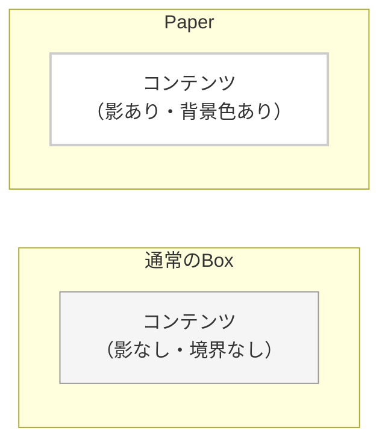
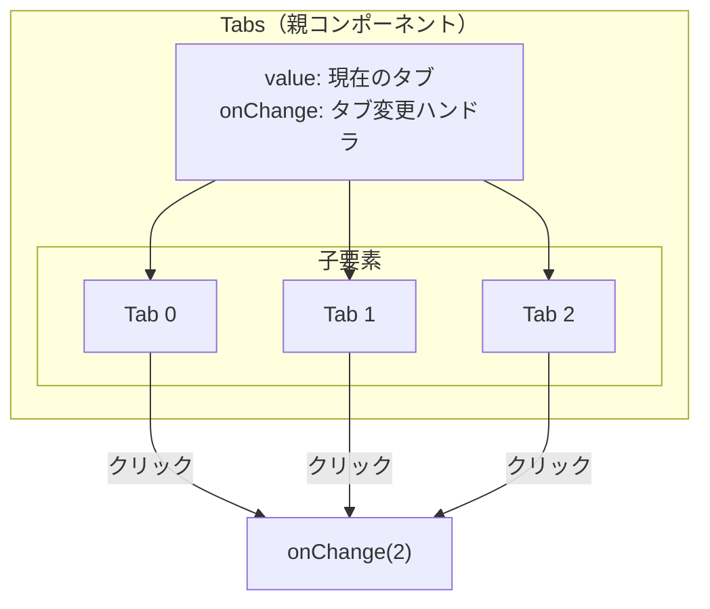
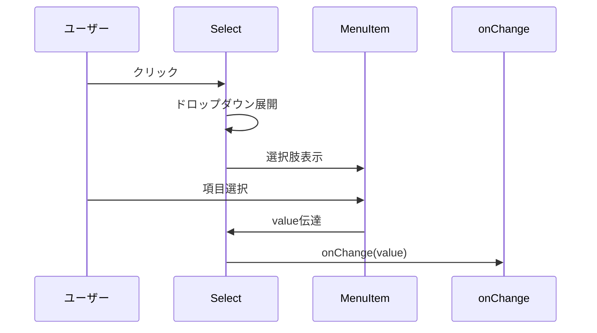
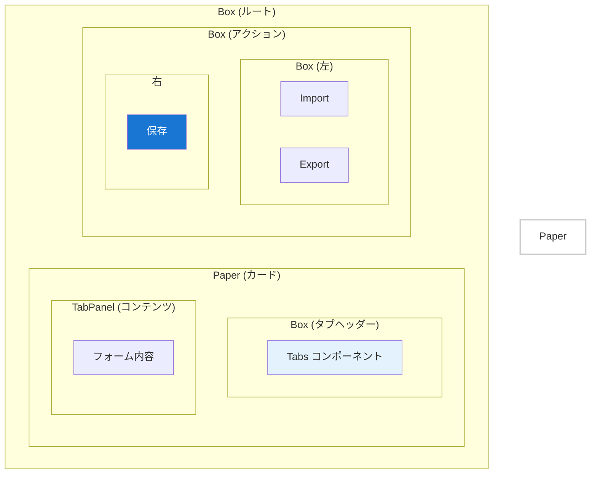

# Material-UI コンポーネント解説

## 概要
ConfigForm.tsxで使用されているMaterial-UI（MUI）コンポーネントについて、React初学者向けに解説します。Material-UIは、Googleのマテリアルデザインに基づいたReact UIライブラリです。

## 主要コンポーネントの役割と使い方

### 1. Box - 汎用コンテナコンポーネント

```typescript
<Box sx={{ mt: 2 }}>
  {/* 子要素 */}
</Box>
```

**Boxとは？**
- HTMLの`<div>`をラップした汎用的なコンテナ
- `sx`プロパティでスタイルを直接指定できる
- レイアウトやスペーシングの調整に使用

**よく使うsxプロパティ：**
```typescript
<Box 
  sx={{ 
    mt: 2,              // margin-top: theme.spacing(2)
    p: 3,               // padding: theme.spacing(3)
    display: 'flex',    // display: flex
    gap: 2,             // gap: theme.spacing(2)
    justifyContent: 'space-between',
    alignItems: 'center',
    borderBottom: 1,
    borderColor: 'divider'
  }}
>
```

### 2. Paper - 立体的なカードコンポーネント

```typescript
<Paper sx={{ mt: 2 }}>
  {/* コンテンツ */}
</Paper>
```

**Paperとは？**
- 影（elevation）を持つカード状のコンテナ
- コンテンツをグループ化して視覚的に区別
- デフォルトで背景色と影が設定される



### 3. Tabs & Tab - タブナビゲーション

```typescript
<Tabs value={currentTab} onChange={handleTabChange}>
  <Tab label="設定1" />
  <Tab label="設定2" />
  <Tab label="設定3" />
</Tabs>
```

**Tabsコンポーネントの構造：**


### 4. FormControl - フォーム要素のラッパー

```typescript
<FormControl fullWidth disabled={!appId || loading}>
  <InputLabel>対象フィールド</InputLabel>
  <Select value={value} onChange={onChange}>
    {/* options */}
  </Select>
</FormControl>
```

**FormControlの役割：**
- フォーム要素（Select、TextField等）をラップ
- ラベル、ヘルパーテキスト、エラー状態を統一管理
- `fullWidth`: 親要素の幅いっぱいに広がる
- `disabled`: 無効化状態の制御

### 5. Select & MenuItem - ドロップダウン選択

```typescript
<Select value={value || ''} onChange={(e) => onChange(e.target.value)}>
  <MenuItem value="">
    <em>選択してください</em>
  </MenuItem>
  {items.map((item) => (
    <MenuItem key={item.id} value={item.id}>
      {item.label}
    </MenuItem>
  ))}
</Select>
```

**動作の仕組み：**


### 6. Button - ボタンコンポーネント

```typescript
// 基本的なボタン
<Button variant="contained" color="primary" onClick={handleClick}>
  保存
</Button>

// アイコン付きボタン
<Button variant="outlined" startIcon={<AddIcon />}>
  追加
</Button>

// アイコンのみのボタン
<IconButton onClick={handleDelete}>
  <DeleteIcon />
</IconButton>
```

**variantの種類：**
- `contained`: 塗りつぶし（メインアクション用）
- `outlined`: 枠線のみ（セカンダリアクション用）
- `text`: テキストのみ（最小限のスタイル）

## ConfigForm.tsxでの実装例

### レイアウト構造

```typescript
return (
  <Box>  {/* ルートコンテナ */}
    <Paper sx={{ mt: 2 }}>  {/* メインコンテンツを囲むカード */}
      <Box sx={{ borderBottom: 1, borderColor: 'divider' }}>  {/* タブヘッダー部分 */}
        <Tabs value={currentTab} onChange={handleTabChange}>
          {/* タブ項目 */}
        </Tabs>
      </Box>
      
      {/* タブコンテンツ部分 */}
      {formData.settings.map((setting, index) => (
        <TabPanel value={currentTab} index={index}>
          {/* 各タブの内容 */}
        </TabPanel>
      ))}
    </Paper>
    
    <Box mt={3} display="flex" justifyContent="space-between">  {/* アクションボタン部分 */}
      <Box display="flex" gap={2}>  {/* 左側のボタングループ */}
        <Button variant="outlined">インポート</Button>
        <Button variant="outlined">エクスポート</Button>
      </Box>
      <Button variant="contained" color="primary">  {/* 右側の保存ボタン */}
        保存
      </Button>
    </Box>
  </Box>
);
```

### レイアウトの視覚的表現



## スタイリングのベストプラクティス

### 1. theme.spacingの使用

```typescript
// 良い例
<Box sx={{ mt: 2, p: 3 }}>  // theme.spacing(2), theme.spacing(3)

// 避けるべき例
<Box sx={{ marginTop: '16px', padding: '24px' }}>  // ハードコーディング
```

### 2. レスポンシブデザイン

```typescript
<Box 
  sx={{
    display: 'flex',
    flexDirection: { xs: 'column', sm: 'row' },  // 画面サイズで切り替え
    gap: 2
  }}
>
```

### 3. 条件付きスタイル

```typescript
<Button 
  disabled={formData.settings.length === 0}
  sx={{
    opacity: formData.settings.length === 0 ? 0.5 : 1
  }}
>
  保存
</Button>
```

## まとめ

Material-UIコンポーネントの利点：
1. **一貫性**: マテリアルデザインに基づく統一されたUI
2. **カスタマイズ性**: sxプロパティで柔軟にスタイル調整
3. **アクセシビリティ**: キーボード操作やスクリーンリーダー対応
4. **レスポンシブ**: 画面サイズに応じた自動調整

これらのコンポーネントを組み合わせることで、プロフェッショナルなUIを効率的に構築できます。