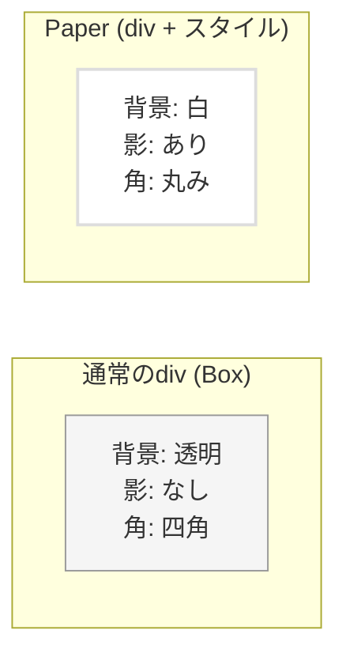
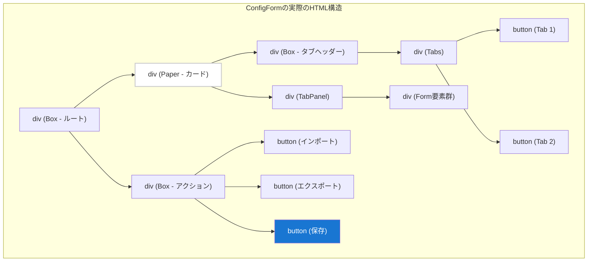

# HTML初学者向け：Material-UIコンポーネントと実際のHTML要素

## 概要
Material-UIのコンポーネントは、実際には通常のHTML要素をラップして、スタイルや機能を追加したものです。このドキュメントでは、ConfigForm.tsxで使用されているMUIコンポーネントが、どのようなHTML要素に変換されるかを解説します。

## MUIコンポーネント → HTML要素の対応表

### 1. Box → `<div>`

**MUIコンポーネント：**
```tsx
<Box sx={{ mt: 2, display: 'flex', gap: 2 }}>
  コンテンツ
</Box>
```

**実際のHTML：**
```html
<div class="MuiBox-root css-1h9z7r5">
  コンテンツ
</div>
```

**解説：**
- Boxは最も基本的なコンテナで、`<div>`要素として出力されます
- `sx`プロパティで指定したスタイルは、CSSクラスに変換されます
- `mt: 2` → `margin-top: 16px`
- `display: 'flex'` → `display: flex`

### 2. Paper → `<div>` (影付き)

**MUIコンポーネント：**
```tsx
<Paper sx={{ mt: 2 }}>
  カードコンテンツ
</Paper>
```

**実際のHTML：**
```html
<div class="MuiPaper-root MuiPaper-elevation1 MuiPaper-rounded css-1ps6pg7">
  カードコンテンツ
</div>
```

**視覚的な違い：**


### 3. Button → `<button>`

**MUIコンポーネント：**
```tsx
<Button variant="contained" color="primary" onClick={handleClick}>
  保存
</Button>
```

**実際のHTML：**
```html
<button 
  class="MuiButton-root MuiButton-contained MuiButton-containedPrimary" 
  type="button"
  onclick="handleClick()"
>
  <span class="MuiButton-label">保存</span>
</button>
```

**バリエーションによる見た目の違い：**
```html
<!-- contained (塗りつぶし) -->
<button style="background: #1976d2; color: white;">保存</button>

<!-- outlined (枠線のみ) -->
<button style="border: 1px solid #1976d2; background: transparent;">保存</button>

<!-- text (テキストのみ) -->
<button style="background: transparent; border: none;">保存</button>
```

### 4. IconButton → `<button>`

**MUIコンポーネント：**
```tsx
<IconButton onClick={handleDelete}>
  <DeleteIcon />
</IconButton>
```

**実際のHTML：**
```html
<button 
  class="MuiIconButton-root" 
  type="button"
  onclick="handleDelete()"
>
  <svg class="MuiSvgIcon-root">
    <!-- SVGアイコンの内容 -->
  </svg>
</button>
```

### 5. Tabs → `<div>` + ロール属性

**MUIコンポーネント：**
```tsx
<Tabs value={currentTab} onChange={handleTabChange}>
  <Tab label="設定1" />
  <Tab label="設定2" />
</Tabs>
```

**実際のHTML：**
```html
<div class="MuiTabs-root">
  <div class="MuiTabs-scroller">
    <div class="MuiTabs-flexContainer" role="tablist">
      <button class="MuiTab-root" role="tab" aria-selected="true">
        設定1
      </button>
      <button class="MuiTab-root" role="tab" aria-selected="false">
        設定2
      </button>
    </div>
  </div>
</div>
```

**アクセシビリティ属性の説明：**
- `role="tablist"`: タブのリストであることを示す
- `role="tab"`: 個々のタブであることを示す
- `aria-selected`: 選択状態を示す

### 6. TabPanel → `<div>` + ロール属性

**MUIコンポーネント：**
```tsx
<TabPanel value={currentTab} index={0}>
  コンテンツ
</TabPanel>
```

**実際のHTML：**
```html
<div 
  role="tabpanel"
  hidden={false}
  id="tabpanel-0"
  aria-labelledby="tab-0"
>
  <div class="MuiBox-root">
    コンテンツ
  </div>
</div>
```

### 7. FormControl → `<div>`

**MUIコンポーネント：**
```tsx
<FormControl fullWidth>
  <InputLabel>対象アプリ</InputLabel>
  <Select value={value}>
    {/* options */}
  </Select>
</FormControl>
```

**実際のHTML：**
```html
<div class="MuiFormControl-root MuiFormControl-fullWidth">
  <label class="MuiInputLabel-root">対象アプリ</label>
  <div class="MuiInputBase-root MuiSelect-root">
    <!-- Select要素の内容 -->
  </div>
</div>
```

### 8. Select → `<div>` + `<input>` + `<svg>`

**MUIコンポーネント：**
```tsx
<Select value={appId} onChange={handleChange}>
  <MenuItem value="10">アプリ1</MenuItem>
  <MenuItem value="20">アプリ2</MenuItem>
</Select>
```

**実際のHTML（簡略版）：**
```html
<!-- 閉じた状態 -->
<div class="MuiSelect-root">
  <div class="MuiSelect-select">アプリ1</div>
  <input type="hidden" value="10" />
  <svg class="MuiSelect-icon"><!-- 下矢印アイコン --></svg>
</div>

<!-- 開いた状態（ポップアップ） -->
<div class="MuiPopover-root">
  <ul class="MuiMenu-list">
    <li class="MuiMenuItem-root" data-value="10">アプリ1</li>
    <li class="MuiMenuItem-root" data-value="20">アプリ2</li>
  </ul>
</div>
```

## HTML構造の階層図



## なぜMaterial-UIを使うのか？

### 1. 通常のHTMLでボタンを作る場合

```html
<!-- 素のHTML -->
<button onclick="save()">保存</button>
```

**問題点：**
- デザインがブラウザ依存
- スタイルを自分で書く必要がある
- アクセシビリティ対応が不完全

### 2. Material-UIのButtonを使う場合

```tsx
<Button variant="contained" color="primary" onClick={handleSave}>
  保存
</Button>
```

**利点：**
- 統一されたデザイン
- ホバー効果、クリック効果が自動
- キーボード操作対応
- フォーカス管理
- アクセシビリティ属性の自動付与

## セマンティックHTML

Material-UIは適切なHTML要素とARIA属性を使用します：

```html
<!-- ナビゲーション -->
<nav><!-- Tabsの場合 --></nav>

<!-- メイン領域 -->
<main><!-- メインコンテンツ --></main>

<!-- セクション -->
<section><!-- Paperで囲まれた領域 --></section>

<!-- フォーム -->
<form><!-- フォーム要素群 --></form>

<!-- ボタン -->
<button type="button"><!-- クリック可能な要素 --></button>
```

## まとめ

Material-UIコンポーネントの利点：

1. **開発効率**: 複雑なHTML/CSSを書かずに済む
2. **一貫性**: すべてのコンポーネントが統一されたデザイン
3. **アクセシビリティ**: スクリーンリーダー対応が自動
4. **レスポンシブ**: モバイル対応が組み込まれている
5. **保守性**: コンポーネント単位で管理しやすい

HTML初学者は、Material-UIを使うことで、セマンティックで適切なHTML構造を自然に学ぶことができます。