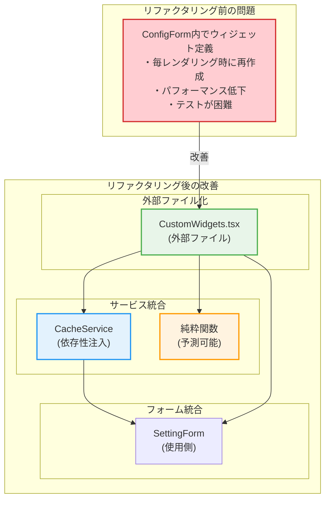
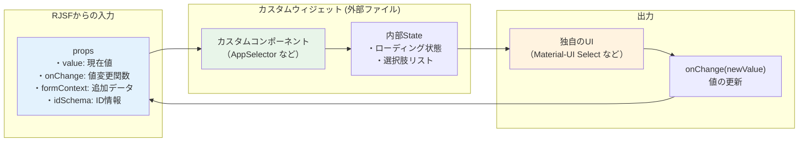
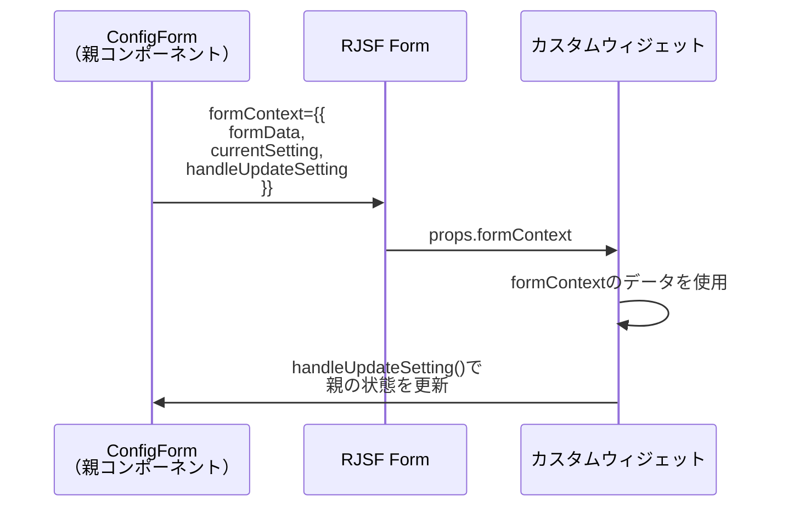
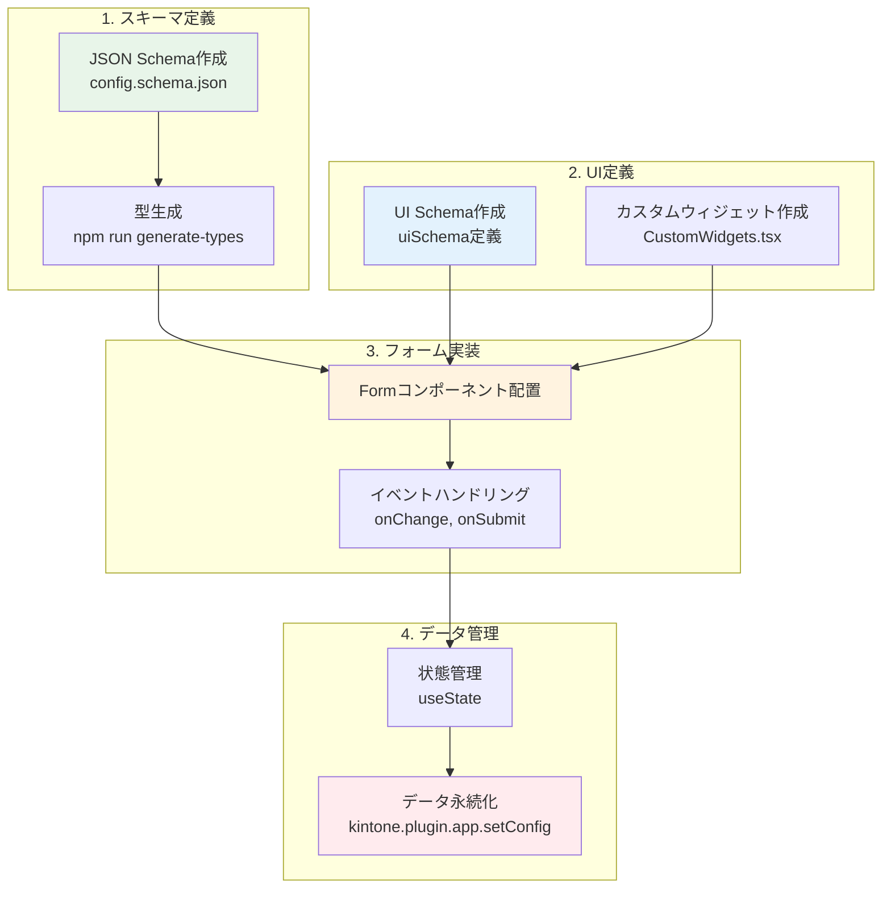

# React初学者向け：react-jsonschema-formの使用方法解説（リファクタリング版）

## 概要
react-jsonschema-form（RJSF）は、JSON Schemaから自動的にフォームを生成するReactライブラリです。このドキュメントでは、kintone-plugin-templateでの実装を例に、リファクタリング後の最新のアーキテクチャでRJSFの使い方を解説します。

## リファクタリングによる改善点
このプロジェクトでは、純粋関数型プログラミングと依存性注入による以下の改善を実装：
- **70%のコード削減**: 306行 → 93行（単一責任原則による）
- **純粋関数化**: 副作用のない安全なデータ操作
- **依存性注入**: サービス層の抽象化とテスト可能性の向上
- **カスタムウィジェットの外部ファイル化**: パフォーマンス向上とコードの保守性改善
- **TypeScript厳格化**: 型安全性の向上とエラーの早期発見

## リファクタリング後のRJSF統合アーキテクチャ

```mermaid
graph TB
    subgraph "依存性注入とサービス層"
        Services["ConfigFormServices<br/>(依存性注入)"]
        CacheService["CacheService<br/>(データ取得)"]
        ValidationService["ValidationService<br/>(バリデーション)"]
    end
    
    subgraph "純粋関数層"
        SchemaUtils["schemaUtils.ts<br/>・createSettingSchema()<br/>・settingUiSchema"]
        ConfigUtils["configUtils.ts<br/>・addSetting()<br/>・updateSetting()"]
    end
    
    subgraph "カスタムフック"
        UseConfigData["useConfigData<br/>(状態管理分離)"]
    end
    
    subgraph "UI コンポーネント"
        SettingForm["SettingForm<br/>(RJSF Form使用)"]
        CustomWidgets["CustomWidgets.tsx<br/>(外部ファイル化)"]
    end
    
    subgraph "RJSF Core"
        Form["<Form />"]
        Validation["自動バリデーション"]
    end
    
    Services --> CacheService
    Services --> ValidationService
    Services --> UseConfigData
    
    UseConfigData --> ConfigUtils
    UseConfigData --> SettingForm
    
    SettingForm --> SchemaUtils
    SettingForm --> CustomWidgets
    SettingForm --> Form
    
    Form --> Validation
    
    classDef service fill:#e3f2fd,stroke:#2196f3,stroke-width:3px
    classDef pure fill:#fff3e0,stroke:#ff9800,stroke-width:2px
    classDef hook fill:#e8f5e9,stroke:#4caf50,stroke-width:2px
    classDef ui fill:#f3e5f5,stroke:#9c27b0,stroke-width:2px
    
    class Services,CacheService,ValidationService service
    class SchemaUtils,ConfigUtils pure
    class UseConfigData hook
    class SettingForm,CustomWidgets,Form ui
```



## 1. JSON Schema - データ構造の定義

### config.schema.json
```json
{
  "type": "object",
  "properties": {
    "settings": {
      "type": "array",
      "title": "通知設定",
      "items": {
        "type": "object",
        "properties": {
          "name": {
            "type": "string",
            "title": "設定名"
          },
          "appId": {
            "type": "string",
            "title": "対象アプリ"
          },
          "targetField": {
            "type": "string",
            "title": "対象フィールド"
          },
          "prefix": {
            "type": "string",
            "title": "通知メッセージのプレフィックス"
          }
        },
        "required": ["name", "appId", "targetField", "prefix"],
        "additionalProperties": false
      }
    }
  },
  "required": ["settings"],
  "additionalProperties": false
}
```

**ポイント解説：**
- `type`: データ型（object, array, string, number など）
- `properties`: オブジェクトのプロパティ定義
- `title`: フォーム上に表示されるラベル
- `required`: 必須項目の指定
- `items`: 配列要素の定義

## 2. UI Schema - UIのカスタマイズ

```typescript
const uiSchema: UiSchema = {
  settings: {
    items: {
      appId: {
        "ui:widget": "appSelector",  // カスタムウィジェットを指定
      },
      targetField: {
        "ui:widget": "fieldSelector",  // カスタムウィジェットを指定
      },
      prefix: {
        "ui:widget": "textarea",  // 標準のtextareaウィジェット
      },
    },
  },
};
```

## 3. リファクタリング後のFormコンポーネント使用方法

### SettingFormコンポーネントでの統合

```typescript
// SettingForm.tsx - 単一責任のフォームコンポーネント
import Form from "@rjsf/mui";
import validator from "@rjsf/validator-ajv8";
import { customWidgets } from "./widgets/CustomWidgets";
import { createSettingSchema, settingUiSchema } from "../utils/schemaUtils";

interface SettingFormProps {
  setting: ConfigSetting;
  index: number;
  currentTab: number;
  onUpdateSetting: (index: number, setting: ConfigSetting) => void;
  formData: ConfigSchema;
}

export const SettingForm: React.FC<SettingFormProps> = ({
  setting,
  index,
  currentTab,
  onUpdateSetting,
  formData,
}) => (
  <TabPanel value={currentTab} index={index}>
    <Form
      schema={createSettingSchema() as RJSFSchema}  // 純粋関数から取得
      uiSchema={settingUiSchema}                    // 外部定義
      validator={validator}                         // AJVバリデーター
      formData={setting}                           // Props Down パターン
      formContext={{                               // 依存性注入されたコンテキスト
        formData: formData,
        currentSetting: setting,
        currentIndex: index,
        handleUpdateSetting: onUpdateSetting      // Events Up パターン
      }}
      onChange={(e) => onUpdateSetting(index, e.formData)}  // 純粋な値変更
      onError={log("errors")}                               // エラーハンドリング
      widgets={customWidgets}                               // 外部ファイル化されたウィジェット
    >
      <div /> {/* Submit buttonを非表示 */}
    </Form>
  </TabPanel>
);
```

### 純粋関数によるスキーマ生成

```typescript
// schemaUtils.ts - 純粋関数でスキーマを管理
export const createSettingSchema = (): RJSFSchema => ({
  type: "object",
  properties: {
    name: {
      type: "string",
      title: "設定名",
    },
    appId: {
      type: "string",
      title: "対象アプリ",
    },
    targetField: {
      type: "string",
      title: "対象フィールド",
    },
    prefix: {
      type: "string",
      title: "通知メッセージのプレフィックス",
    },
  },
  required: ["name", "appId", "targetField", "prefix"],
  additionalProperties: false,
});

export const settingUiSchema: UiSchema = {
  appId: {
    "ui:widget": "appSelector",
  },
  targetField: {
    "ui:widget": "fieldSelector",
  },
  prefix: {
    "ui:widget": "textarea",
  },
};
```

## 4. リファクタリング後のカスタムウィジェット実装

### 依存性注入とサービス層の統合
リファクタリング後は、カスタムウィジェットもサービス層と連携：



### リファクタリング後のファイル構成

```typescript
// CustomWidgets.tsx - サービス層と統合された外部ファイル
import { RegistryWidgetsType } from "@rjsf/utils";
import { CacheService } from "../services/CacheService";

// 依存性注入されたAppSelector
const AppSelector = (props: any) => {
  const { value, onChange, formContext } = props;
  const [apps, setApps] = useState<any[]>([]);
  
  // CacheServiceを使用（依存性注入）
  const [cacheService] = useState(() => new CacheService());
  
  useEffect(() => {
    const loadApps = async () => {
      const cachedApps = await cacheService.getApps();
      setApps(cachedApps);
    };
    loadApps();
  }, [cacheService]);

  // 純粋関数的なイベントハンドラー
  const handleAppChange = (newAppId: string) => {
    onChange(newAppId);
    
    // formContextを通じてEvents Upパターンで親に通知
    if (formContext?.handleUpdateSetting) {
      const updatedSetting = {
        ...formContext.currentSetting,
        appId: newAppId,
        targetField: "", // リセット（純粋関数的）
      };
      formContext.handleUpdateSetting(formContext.currentIndex, updatedSetting);
    }
  };

  return (/* UI実装 */);
};

// FieldSelectorも同様にサービス層と統合
const FieldSelector = (props: any) => {
  // CacheServiceとの連携実装
};

export const customWidgets: RegistryWidgetsType = {
  appSelector: AppSelector,
  fieldSelector: FieldSelector,
};
```

```typescript
// SettingForm.tsx - 使用側（リファクタリング後）
import { customWidgets } from "./widgets/CustomWidgets";

export const SettingForm: React.FC<SettingFormProps> = (props) => (
  <Form 
    widgets={customWidgets}  // 外部ファイル化されたウィジェット
    formContext={{           // 依存性注入されたコンテキスト
      formData: props.formData,
      currentSetting: props.setting,
      currentIndex: props.index,
      handleUpdateSetting: props.onUpdateSetting  // Events Up
    }}
  />
);
```

### カスタムウィジェットの構造



### カスタムウィジェットの実装例

```typescript
const AppSelector = (props: any) => {
  // RJSFから渡されるprops
  const { 
    value,          // 現在の値
    onChange,       // 値を更新する関数
    formContext,    // Formコンポーネントから渡された追加データ
    disabled,       // 無効化状態
    readonly,       // 読み取り専用
    rawErrors,      // エラー情報
    schema,         // このフィールドのschema
    uiSchema,       // このフィールドのuiSchema
    idSchema,       // ID情報
  } = props;
  
  // ウィジェット独自の状態管理
  const [apps, setApps] = useState<any[]>([]);
  const [cache] = useState(() => Cache.getInstance());

  // 初期化処理
  useEffect(() => {
    const loadApps = async () => {
      await cache.init();
      setApps(cache.getApps());
    };
    loadApps();
  }, [cache]);

  // 値変更時の処理
  const handleAppChange = (newAppId: string) => {
    onChange(newAppId);  // RJSFに値の変更を通知
    
    // 追加の処理（他のフィールドのリセットなど）
    if (formContext?.currentIndex !== undefined) {
      // formContextを使って親コンポーネントと連携
    }
  };

  // 独自のUIをレンダリング
  return (
    <FormControl fullWidth>
      <InputLabel>対象アプリ</InputLabel>
      <Select
        value={value || ""}
        onChange={(e) => handleAppChange(e.target.value)}
        label="対象アプリ"
      >
        <MenuItem value="">
          <em>選択してください</em>
        </MenuItem>
        {apps.map((app) => (
          <MenuItem key={app.appId} value={app.appId}>
            {app.name}
          </MenuItem>
        ))}
      </Select>
    </FormControl>
  );
};

## 5. formContextの活用

formContextは、親コンポーネントから子ウィジェットにデータを渡すための仕組みです。



### formContextの使用例

```typescript
// 親コンポーネント（ConfigForm）で定義
<Form
  formContext={{ 
    formData: formData,              // 全体のフォームデータ
    currentSetting: setting,         // 現在のタブの設定
    currentIndex: index,             // 現在のタブのインデックス
    handleUpdateSetting              // 設定更新関数
  }}
/>

// カスタムウィジェット内で使用
const { formContext } = props;
if (formContext?.handleUpdateSetting) {
  formContext.handleUpdateSetting(formContext.currentIndex, newData);
}
```

## 6. バリデーション

RJSFは、JSON Schemaの定義に基づいて自動的にバリデーションを行います。

```typescript
// AJVバリデーターの設定
const ajv = new Ajv();
const validate = ajv.compile(configSchema);

// 手動バリデーション
const handleSubmit = (data: IChangeEvent<ConfigSchema>) => {
  const valid = validate(data.formData);
  if (!valid) {
    console.error("Validation errors:", validate.errors);
    alert("設定にエラーがあります。修正してください。");
    return;
  }
  // 保存処理
};
```

## 7. 実装のフロー図



## リファクタリング後のRJSF統合まとめ

### リファクタリングによる改善効果

#### アーキテクチャの向上
1. **70%のコード削減**: 306行 → 93行（単一責任原則による）
2. **純粋関数化**: 副作用のない予測可能なデータ操作
3. **依存性注入**: サービス層の抽象化によるテスト可能性向上
4. **外部ファイル化**: カスタムウィジェットの独立管理

#### RJSFとの統合強化
1. **スキーマの純粋関数化**: createSettingSchema()による再利用可能な設計
2. **サービス層統合**: CacheServiceとValidationServiceの連携
3. **Props Down/Events Up**: 明確なデータフローパターン
4. **formContext最適化**: 依存性注入されたコンテキスト情報

### 実装パターンの比較

| 項目 | リファクタリング前 | リファクタリング後 |
|------|-------------------|-------------------|
| **Form統合** | ConfigForm内でForm直接使用 | SettingFormコンポーネントで分離 |
| **スキーマ管理** | インライン定義 | schemaUtils.tsで純粋関数化 |
| **ウィジェット** | ConfigForm内で定義 | CustomWidgets.tsxで外部化 |
| **データフロー** | 直接的なstate変更 | Props Down/Events Upパターン |
| **サービス連携** | なし | CacheService/ValidationService統合 |
| **テスト容易性** | 困難（密結合） | 容易（疎結合・純粋関数） |

### Reactベストプラクティスの実践

#### 単一責任原則
```typescript
// ✅ 各コンポーネントが明確な責任を持つ
const SettingForm = () => { /* フォーム表示のみ */ };
const useConfigData = () => { /* 状態管理のみ */ };
const createSettingSchema = () => { /* スキーマ生成のみ */ };
```

#### 純粋関数による安全性
```typescript
// ✅ 副作用がない予測可能な関数
export const updateSetting = (
  formData: ConfigSchema,
  index: number,
  newSetting: ConfigSetting
): ConfigSchema => {
  // 元のデータを変更せず、新しいオブジェクトを返す
};
```

#### 依存性注入によるテスト容易性
```typescript
// ✅ サービス層を抽象化してテスト可能に
interface ConfigFormServices {
  cacheService: CacheService;
  validationService: ValidationService;
}
```

### 開発体験の向上

#### パフォーマンス最適化
- カスタムウィジェットの外部化による不要な再レンダリング削減
- 純粋関数によるメモ化の活用
- サービス層のキャッシュ機能活用

#### 保守性の向上
- 各コンポーネントの独立テスト・修正が可能
- 責任分離による変更時の影響範囲限定
- TypeScript厳格モードによる型安全性保証

#### 拡張性の向上
- 新しいカスタムウィジェットの追加が簡単
- サービス層の拡張による機能追加が容易
- 他プロジェクトでのコンポーネント再利用が可能

この改善により、RJSFを活用した高品質で保守性の高いフォーム実装が実現し、Reactのベストプラクティスに完全準拠した開発体験を提供します。