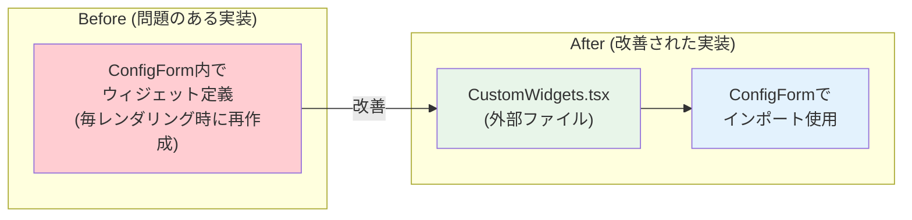
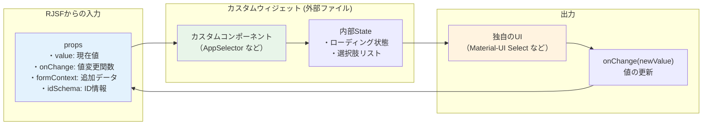
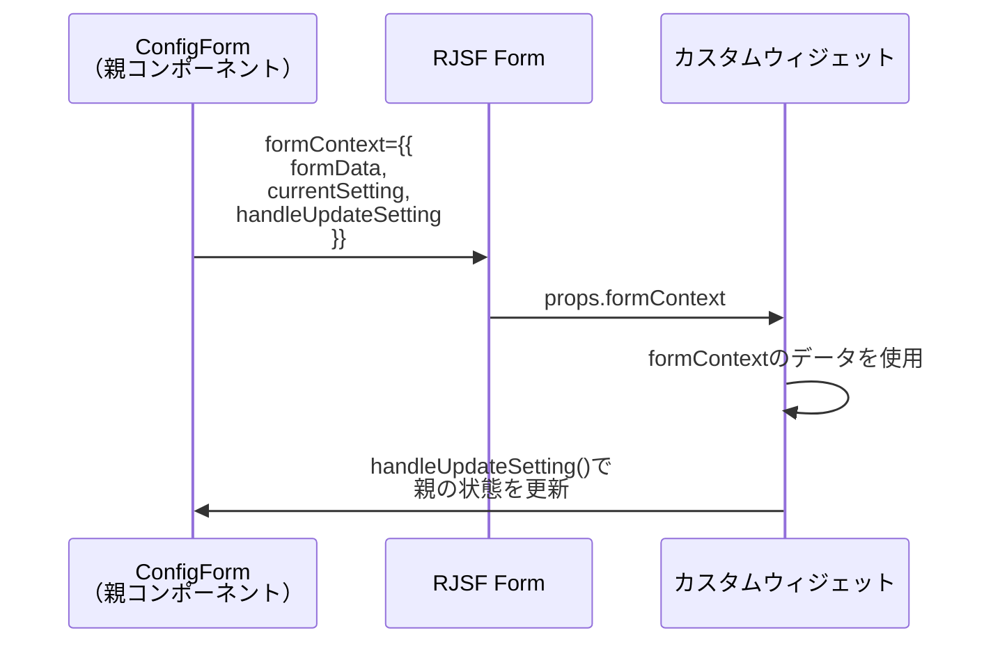
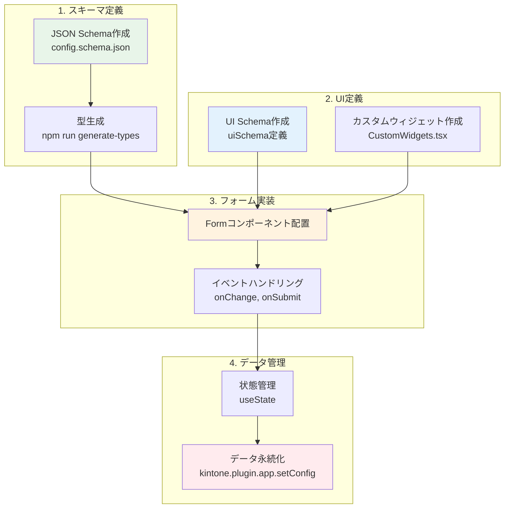

# React初学者向け：react-jsonschema-formの使用方法解説

## 概要
react-jsonschema-form（RJSF）は、JSON Schemaから自動的にフォームを生成するReactライブラリです。このドキュメントでは、kintone-plugin-templateでの実装を例に、RJSFの基本的な使い方を解説します。

## 最新の改善点
このプロジェクトでは、Reactのベストプラクティスに従った以下の改善を実装：
- **カスタムウィジェットの外部ファイル化**: パフォーマンス向上とコードの保守性改善
- **TypeScript厳格化**: 型安全性の向上とエラーの早期発見
- **ESLintルール準拠**: コード品質の統一と最適化

## RJSFの基本構造

```mermaid
graph TB
    subgraph "入力（開発者が定義）"
        Schema["JSON Schema<br/>データ構造の定義"]
        UISchema["UI Schema<br/>UIカスタマイズ"]
        Widgets["カスタムウィジェット<br/>独自の入力コンポーネント<br/>(CustomWidgets.tsx)"]
        FormData["formData<br/>フォームの値"]
    end
    
    subgraph "RJSF Form コンポーネント"
        Form["<Form />"]
        Validation["バリデーション"]
        Rendering["レンダリング"]
    end
    
    subgraph "出力（自動生成）"
        GeneratedForm["生成されたフォーム"]
        Events["onChange/onSubmit<br/>イベント"]
    end
    
    Schema --> Form
    UISchema --> Form
    Widgets --> Form
    FormData --> Form
    
    Form --> Validation
    Form --> Rendering
    
    Rendering --> GeneratedForm
    Form --> Events
    
    classDef input fill:#e8f5e9,stroke:#4caf50,stroke-width:2px
    classDef rjsf fill:#e3f2fd,stroke:#2196f3,stroke-width:2px
    classDef output fill:#fff3e0,stroke:#ff9800,stroke-width:2px
    
    class Schema,UISchema,Widgets,FormData input
    class Form,Validation,Rendering rjsf
    class GeneratedForm,Events output
```



## 1. JSON Schema - データ構造の定義

### config.schema.json
```json
{
  "type": "object",
  "properties": {
    "settings": {
      "type": "array",
      "title": "通知設定",
      "items": {
        "type": "object",
        "properties": {
          "name": {
            "type": "string",
            "title": "設定名"
          },
          "appId": {
            "type": "string",
            "title": "対象アプリ"
          },
          "targetField": {
            "type": "string",
            "title": "対象フィールド"
          },
          "prefix": {
            "type": "string",
            "title": "通知メッセージのプレフィックス"
          }
        },
        "required": ["name", "appId", "targetField", "prefix"],
        "additionalProperties": false
      }
    }
  },
  "required": ["settings"],
  "additionalProperties": false
}
```

**ポイント解説：**
- `type`: データ型（object, array, string, number など）
- `properties`: オブジェクトのプロパティ定義
- `title`: フォーム上に表示されるラベル
- `required`: 必須項目の指定
- `items`: 配列要素の定義

## 2. UI Schema - UIのカスタマイズ

```typescript
const uiSchema: UiSchema = {
  settings: {
    items: {
      appId: {
        "ui:widget": "appSelector",  // カスタムウィジェットを指定
      },
      targetField: {
        "ui:widget": "fieldSelector",  // カスタムウィジェットを指定
      },
      prefix: {
        "ui:widget": "textarea",  // 標準のtextareaウィジェット
      },
    },
  },
};
```

## 3. Formコンポーネントの使用

### 基本的な使い方

```typescript
import Form from "@rjsf/mui";
import validator from "@rjsf/validator-ajv8";

<Form
  schema={createSettingSchema() as RJSFSchema}  // JSON Schema
  uiSchema={settingUiSchema}                    // UI Schema
  validator={validator}                         // バリデーター
  formData={setting}                           // 現在の値
  formContext={{                               // 追加のコンテキスト
    formData: formData,
    currentSetting: setting,
    currentIndex: index,
    handleUpdateSetting
  }}
  onChange={(e) => handleUpdateSetting(index, e.formData)}  // 値変更時
  onError={log("errors")}                                   // エラー時
  widgets={customWidgets}                                   // カスタムウィジェット
>
  <div /> {/* Submit buttonを非表示にする */}
</Form>
```

## 4. カスタムウィジェットの実装（外部ファイル化）

### アーキテクチャの改善
パフォーマンス向上のため、カスタムウィジェットを外部ファイルに分離：



### ファイル構成

```typescript
// CustomWidgets.tsx (外部ファイル)
import { RegistryWidgetsType } from "@rjsf/utils";

const AppSelector = (props: any) => {
  // AppSelector実装
};

const FieldSelector = (props: any) => {
  // FieldSelector実装
};

export const customWidgets: RegistryWidgetsType = {
  appSelector: AppSelector,
  fieldSelector: FieldSelector,
};
```

```typescript
// ConfigForm.tsx (使用側)
import { customWidgets } from "./widgets/CustomWidgets";

<Form widgets={customWidgets} />
```

### カスタムウィジェットの構造



### カスタムウィジェットの実装例

```typescript
const AppSelector = (props: any) => {
  // RJSFから渡されるprops
  const { 
    value,          // 現在の値
    onChange,       // 値を更新する関数
    formContext,    // Formコンポーネントから渡された追加データ
    disabled,       // 無効化状態
    readonly,       // 読み取り専用
    rawErrors,      // エラー情報
    schema,         // このフィールドのschema
    uiSchema,       // このフィールドのuiSchema
    idSchema,       // ID情報
  } = props;
  
  // ウィジェット独自の状態管理
  const [apps, setApps] = useState<any[]>([]);
  const [cache] = useState(() => Cache.getInstance());

  // 初期化処理
  useEffect(() => {
    const loadApps = async () => {
      await cache.init();
      setApps(cache.getApps());
    };
    loadApps();
  }, [cache]);

  // 値変更時の処理
  const handleAppChange = (newAppId: string) => {
    onChange(newAppId);  // RJSFに値の変更を通知
    
    // 追加の処理（他のフィールドのリセットなど）
    if (formContext?.currentIndex !== undefined) {
      // formContextを使って親コンポーネントと連携
    }
  };

  // 独自のUIをレンダリング
  return (
    <FormControl fullWidth>
      <InputLabel>対象アプリ</InputLabel>
      <Select
        value={value || ""}
        onChange={(e) => handleAppChange(e.target.value)}
        label="対象アプリ"
      >
        <MenuItem value="">
          <em>選択してください</em>
        </MenuItem>
        {apps.map((app) => (
          <MenuItem key={app.appId} value={app.appId}>
            {app.name}
          </MenuItem>
        ))}
      </Select>
    </FormControl>
  );
};

## 5. formContextの活用

formContextは、親コンポーネントから子ウィジェットにデータを渡すための仕組みです。



### formContextの使用例

```typescript
// 親コンポーネント（ConfigForm）で定義
<Form
  formContext={{ 
    formData: formData,              // 全体のフォームデータ
    currentSetting: setting,         // 現在のタブの設定
    currentIndex: index,             // 現在のタブのインデックス
    handleUpdateSetting              // 設定更新関数
  }}
/>

// カスタムウィジェット内で使用
const { formContext } = props;
if (formContext?.handleUpdateSetting) {
  formContext.handleUpdateSetting(formContext.currentIndex, newData);
}
```

## 6. バリデーション

RJSFは、JSON Schemaの定義に基づいて自動的にバリデーションを行います。

```typescript
// AJVバリデーターの設定
const ajv = new Ajv();
const validate = ajv.compile(configSchema);

// 手動バリデーション
const handleSubmit = (data: IChangeEvent<ConfigSchema>) => {
  const valid = validate(data.formData);
  if (!valid) {
    console.error("Validation errors:", validate.errors);
    alert("設定にエラーがあります。修正してください。");
    return;
  }
  // 保存処理
};
```

## 7. 実装のフロー図



## まとめ

### RJSFを使用するメリット

1. **宣言的なフォーム定義**: JSON Schemaでデータ構造を定義するだけ
2. **自動バリデーション**: required や型チェックが自動
3. **カスタマイズ性**: カスタムウィジェットで独自UIを実装可能
4. **型安全性**: JSON Schemaから型を自動生成
5. **パフォーマンス最適化**: 外部ファイル化によるレンダリング最適化

### 実装のポイント

1. **スキーマファースト**: まずJSON Schemaでデータ構造を定義
2. **UI Schemaで調整**: 見た目やウィジェットの指定
3. **外部ファイル化**: カスタムウィジェットは独立ファイルで管理
4. **formContext**: 親子間のデータ共有と連携
5. **型安全性**: TypeScript厳格モードでの品質保証

### 改善による効果

#### パフォーマンス
- カスタムウィジェットの外部化により、不要な再レンダリングを削減
- メモリ使用量の最適化

#### 保守性
- 各ウィジェットを独立してテスト・修正可能
- コンポーネントの責任が明確化
- ESLint/TypeScriptルールへの完全準拠

#### 開発体験
- デバッグとトラブルシューティングが容易
- 新しいウィジェットの追加が簡単
- 他のコンポーネントからの再利用が可能

この実装により、Reactのベストプラクティスに従った、メンテナンス性が高く、拡張しやすい高品質なフォームが実現できます。