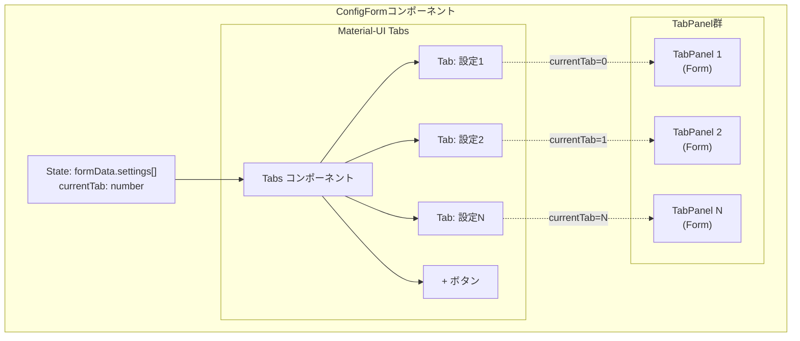
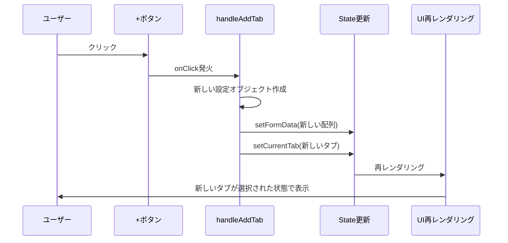
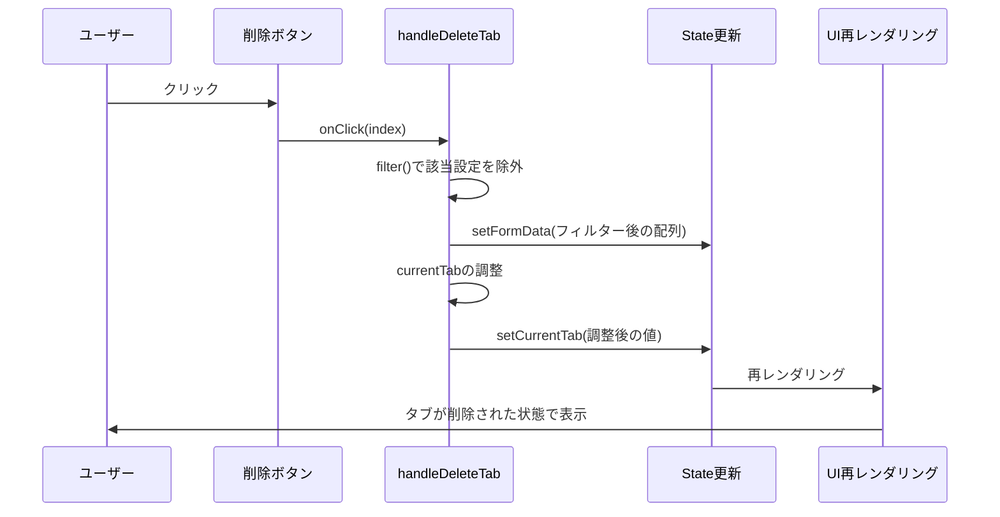

# React初学者向け：タブUIの実装解説

## 概要
このドキュメントでは、kintone-plugin-templateの設定画面で実装されているタブUIの仕組みを、React初学者向けに解説します。Material-UIのTabsコンポーネントを使用して、複数の設定を独立したタブで管理する方法を学びます。

## タブUIの全体構造



## 主要な概念

### 1. Stateによるタブ管理

```typescript
// 現在表示中のタブのインデックスを管理
const [currentTab, setCurrentTab] = useState(0);

// 複数の設定データを配列で管理
const [formData, setFormData] = useState<ConfigSchema>({ 
  settings: [] 
});
```

### 2. TabPanelコンポーネント

TabPanelは条件付きレンダリングを使用して、選択されたタブのコンテンツのみを表示します：

```typescript
function TabPanel(props: TabPanelProps) {
  const { children, value, index, ...other } = props;

  return (
    <div
      role="tabpanel"
      hidden={value !== index}  // ← ここがポイント！
      id={`tabpanel-${index}`}
      aria-labelledby={`tab-${index}`}
      {...other}
    >
      {value === index && <Box sx={{ p: 3 }}>{children}</Box>}
    </div>
  );
}
```

## タブ操作のフロー

### タブ追加の流れ



### タブ削除の流れ



## 実装の詳細解説

### 1. タブヘッダー部分

```tsx
<Tabs value={currentTab} onChange={handleTabChange}>
  {formData.settings.map((setting, index) => (
    <Tab
      key={index}
      label={
        <Box sx={{ display: 'flex', alignItems: 'center', gap: 1 }}>
          <span>{setting.name || `設定 ${index + 1}`}</span>
          {formData.settings.length > 1 && (
            <IconButton
              size="small"
              onClick={(e) => {
                e.stopPropagation(); // ← タブ切り替えを防ぐ
                handleDeleteTab(index);
              }}
            >
              <DeleteIcon fontSize="small" />
            </IconButton>
          )}
        </Box>
      }
    />
  ))}
  <IconButton onClick={handleAddTab} sx={{ ml: 1 }}>
    <AddIcon />
  </IconButton>
</Tabs>
```

**ポイント解説：**
- `value={currentTab}`: 現在選択されているタブのインデックス
- `onChange={handleTabChange}`: タブがクリックされたときの処理
- `e.stopPropagation()`: 削除ボタンクリック時にタブ切り替えを防ぐ

### 2. タブコンテンツ部分

```tsx
{formData.settings.map((setting, index) => (
  <TabPanel key={index} value={currentTab} index={index}>
    <Form
      schema={createSettingSchema() as RJSFSchema}
      uiSchema={settingUiSchema}
      validator={validator}
      formData={setting}  // ← 各タブに対応する設定データ
      formContext={{ 
        formData: formData, 
        currentSetting: setting, 
        currentIndex: index, 
        handleUpdateSetting 
      }}
      onChange={(e) => handleUpdateSetting(index, e.formData)}
      onError={log("errors")}
      widgets={customWidgets}
    >
      <div /> {/* Submit buttonを非表示にする */}
    </Form>
  </TabPanel>
))}
```

### 3. イベントハンドラー

#### タブ追加処理
```typescript
const handleAddTab = () => {
  const newSetting = {
    name: `設定 ${formData.settings.length + 1}`,
    appId: '',
    targetField: '',
    prefix: ''
  };
  setFormData({
    ...formData,
    settings: [...formData.settings, newSetting]  // 配列に追加
  });
  setCurrentTab(formData.settings.length);  // 新しいタブを選択
};
```

#### タブ削除処理
```typescript
const handleDeleteTab = (index: number) => {
  const newSettings = formData.settings.filter((_, i) => i !== index);
  setFormData({ settings: newSettings });
  
  // 削除後のタブ位置を調整
  if (currentTab >= newSettings.length && currentTab > 0) {
    setCurrentTab(currentTab - 1);
  }
};
```

## Reactの重要な概念

### 1. 条件付きレンダリング
TabPanelでは、`hidden={value !== index}` と `{value === index && ...}` の2つの方法で条件付きレンダリングを実現しています。

### 2. イベントの伝播制御
削除ボタンの `e.stopPropagation()` により、親要素（Tab）へのイベント伝播を防いでいます。

### 3. 配列の不変性
`filter()` や スプレッド構文 `[...array]` を使用して、元の配列を変更せずに新しい配列を作成しています。

## まとめ

このタブ実装の特徴：
- **独立性**: 各タブが独自のフォームデータを持つ
- **動的管理**: タブの追加・削除が動的に可能
- **状態の一元管理**: `formData.settings` 配列で全ての設定を管理
- **UIの分離**: TabsとTabPanelを分離して実装

React初学者が押さえるべきポイント：
1. `useState`によるコンポーネントの状態管理
2. 配列のmap()を使った動的なUI生成
3. 条件付きレンダリングによる表示制御
4. イベントハンドリングと伝播の制御