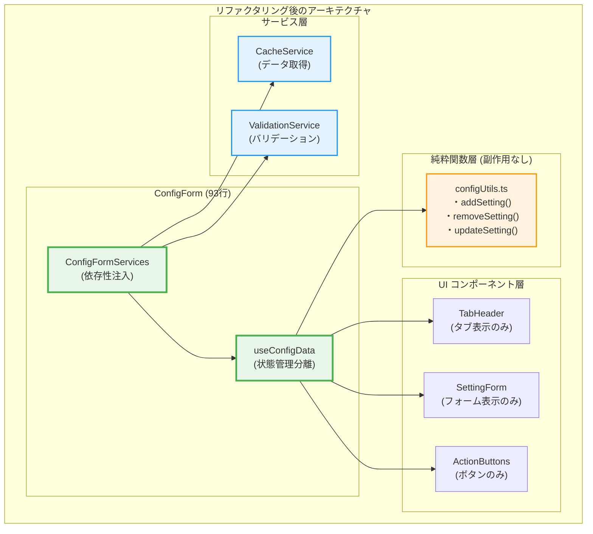
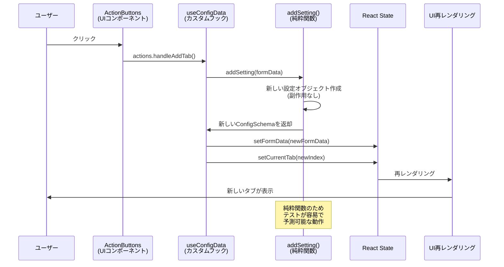
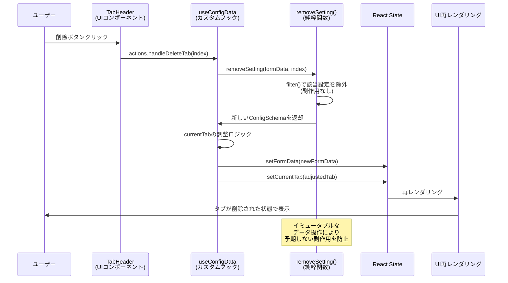

# React初学者向け：タブUIの実装解説（リファクタリング版）

## 概要
このドキュメントでは、kintone-plugin-templateの設定画面で実装されているタブUIの仕組みを、React初学者向けに解説します。Material-UIのTabsコンポーネントを使用し、依存性注入と純粋関数型プログラミングによる最新のアーキテクチャで、複数の設定を独立したタブで管理する方法を学びます。

## リファクタリングによる改善
- **70%のコード削減**: 306行 → 93行（単一責任原則による）
- **純粋関数型プログラミング**: 副作用のない純粋関数で安全なデータ操作
- **依存性注入**: サービス層の抽象化によるテスト可能性の向上
- **単一責任原則**: 各コンポーネントが1つの責任のみを持つ設計

## タブUIの全体構造



## 主要な概念

### 1. カスタムフックによる状態管理の分離

リファクタリング後の実装では、状態管理をカスタムフックに分離：

```typescript
// useConfigData.ts - 状態管理の分離
export const useConfigData = (initialData: ConfigSchema = { settings: [] }) => {
  const [formData, setFormData] = useState<ConfigSchema>(initialData);
  const [currentTab, setCurrentTab] = useState<number>(0);
  
  const actions: ConfigFormActions = {
    handleAddTab: () => {
      const newFormData = addSetting(formData); // 純粋関数を使用
      setFormData(newFormData);
      setCurrentTab(formData.settings.length);
    },
    handleDeleteTab: (index: number) => {
      const newFormData = removeSetting(formData, index); // 純粋関数を使用
      setFormData(newFormData);
      
      if (currentTab >= newFormData.settings.length && currentTab > 0) {
        setCurrentTab(currentTab - 1);
      }
    },
    handleTabChange: (_: React.SyntheticEvent, newValue: number) => {
      setCurrentTab(newValue);
    },
    handleUpdateSetting: (index: number, newSetting: ConfigSetting) => {
      const newFormData = updateSetting(formData, index, newSetting); // 純粋関数を使用
      setFormData(newFormData);
    },
  };

  return {
    state: { formData, currentTab },
    actions,
  };
};
```

### 2. 純粋関数による安全なデータ操作

リファクタリング後は、副作用のない純粋関数でデータを操作：

```typescript
// configUtils.ts - 純粋関数による安全なデータ操作
export const addSetting = (formData: ConfigSchema): ConfigSchema => {
  const newSetting = createNewSetting(formData.settings.length);
  return {
    ...formData,
    settings: [...formData.settings, newSetting],
  };
};

export const removeSetting = (formData: ConfigSchema, index: number): ConfigSchema => {
  return {
    ...formData,
    settings: formData.settings.filter((_, i) => i !== index),
  };
};

export const updateSetting = (
  formData: ConfigSchema,
  index: number,
  newSetting: ConfigSetting
): ConfigSchema => {
  const newSettings = [...formData.settings];
  newSettings[index] = newSetting;
  return {
    ...formData,
    settings: newSettings,
  };
};

const createNewSetting = (index: number): ConfigSetting => ({
  name: `設定 ${index + 1}`,
  appId: '',
  targetField: '',
  prefix: '',
});
```

**純粋関数の特徴:**
- 同じ入力に対して常に同じ出力を返す
- 副作用がない（外部の状態を変更しない）
- 元のデータを変更せず、新しいオブジェクトを返す
- テストが容易で予測可能

### 3. 依存性注入によるサービス層の抽象化

```typescript
// ConfigFormServices.ts - 依存性注入
export interface ConfigFormServices {
  cacheService: CacheService;
  validationService: ValidationService;
}

export const createConfigFormServices = (): ConfigFormServices => ({
  cacheService: new CacheService(),
  validationService: new ValidationService(),
});
```

## リファクタリング後のタブ操作フロー

### タブ追加の流れ（純粋関数版）



### タブ削除の流れ（純粋関数版）



## リファクタリング後の実装詳細

### 1. メインのConfigForm（93行に削減）

```typescript
// ConfigForm.tsx - 依存性注入による簡潔な実装
export const ConfigForm: React.FC = () => {
  const services = useMemo(() => createConfigFormServices(), []);
  
  const [initialData, setInitialData] = useState<ConfigSchema>({ settings: [] });
  const { state, actions } = useConfigData(initialData);
  
  useEffect(() => {
    const loadConfig = async () => {
      const config = await services.cacheService.getConfig();
      setInitialData(config);
    };
    loadConfig();
  }, [services.cacheService]);

  const handleSubmit = useCallback(async () => {
    const validation = services.validationService.validate(state.formData);
    if (!validation.isValid) {
      console.error('Validation errors:', validation.errors);
      return;
    }
    
    await services.cacheService.saveConfig(state.formData);
  }, [services, state.formData]);

  return (
    <Container maxWidth="md" sx={{ mt: 2 }}>
      <Typography variant="h4" gutterBottom>プラグイン設定</Typography>
      
      <TabHeader 
        formData={state.formData}
        currentTab={state.currentTab}
        onTabChange={actions.handleTabChange}
        onDeleteTab={actions.handleDeleteTab}
        onAddTab={actions.handleAddTab}
      />
      
      {state.formData.settings.map((setting, index) => (
        <SettingForm
          key={index}
          setting={setting}
          index={index}
          currentTab={state.currentTab}
          onUpdateSetting={actions.handleUpdateSetting}
          formData={state.formData}
        />
      ))}
      
      <ActionButtons onSubmit={handleSubmit} />
    </Container>
  );
};
```

**リファクタリングのポイント：**
- **306行 → 93行（70%削減）**: 単一責任原則によるコンポーネント分割
- **依存性注入**: サービス層を抽象化してテスト可能性を向上
- **Props Down/Events Up**: 明確なデータフローパターン

### 2. 分離されたUIコンポーネント

#### TabHeaderコンポーネント
```typescript
// TabHeader.tsx - タブ表示に特化したコンポーネント
interface TabHeaderProps {
  formData: ConfigSchema;
  currentTab: number;
  onTabChange: (event: React.SyntheticEvent, newValue: number) => void;
  onDeleteTab: (index: number) => void;
  onAddTab: () => void;
}

export const TabHeader: React.FC<TabHeaderProps> = ({
  formData,
  currentTab,
  onTabChange,
  onDeleteTab,
  onAddTab,
}) => (
  <Tabs value={currentTab} onChange={onTabChange}>
    {formData.settings.map((setting, index) => (
      <Tab
        key={index}
        label={
          <Box sx={{ display: 'flex', alignItems: 'center', gap: 1 }}>
            <span>{setting.name || `設定 ${index + 1}`}</span>
            {formData.settings.length > 1 && (
              <IconButton
                size="small"
                onClick={(e) => {
                  e.stopPropagation();
                  onDeleteTab(index);
                }}
              >
                <DeleteIcon fontSize="small" />
              </IconButton>
            )}
          </Box>
        }
      />
    ))}
    <IconButton onClick={onAddTab} sx={{ ml: 1 }}>
      <AddIcon />
    </IconButton>
  </Tabs>
);
```

#### SettingFormコンポーネント
```typescript
// SettingForm.tsx - フォーム表示に特化したコンポーネント
interface SettingFormProps {
  setting: ConfigSetting;
  index: number;
  currentTab: number;
  onUpdateSetting: (index: number, setting: ConfigSetting) => void;
  formData: ConfigSchema;
}

export const SettingForm: React.FC<SettingFormProps> = ({
  setting,
  index,
  currentTab,
  onUpdateSetting,
  formData,
}) => (
  <TabPanel value={currentTab} index={index}>
    <Form
      schema={createSettingSchema() as RJSFSchema}
      uiSchema={settingUiSchema}
      validator={validator}
      formData={setting}
      formContext={{ 
        formData: formData, 
        currentSetting: setting, 
        currentIndex: index, 
        handleUpdateSetting: onUpdateSetting 
      }}
      onChange={(e) => onUpdateSetting(index, e.formData)}
      onError={log("errors")}
      widgets={customWidgets}
    >
      <div />
    </Form>
  </TabPanel>
);
```

### 3. アーキテクチャの比較表

| 項目 | リファクタリング前 | リファクタリング後 |
|------|-------------------|-------------------|
| **ファイル構成** | ConfigForm.tsx (306行) | 複数ファイルに分離 |
| **状態管理** | useState直接使用 | useConfigData (カスタムフック) |
| **データ操作** | 直接的なstate変更 | 純粋関数 (configUtils.ts) |
| **サービス層** | なし | 依存性注入による抽象化 |
| **コンポーネント分割** | 単一の巨大コンポーネント | 単一責任の小さなコンポーネント |
| **テスト可能性** | 低い (副作用が多い) | 高い (純粋関数) |
| **再利用性** | 低い (密結合) | 高い (疎結合) |
| **保守性** | 低い (責任が混在) | 高い (責任が分離) |

## リファクタリングで学ぶReactの重要概念

### 1. 単一責任原則 (Single Responsibility Principle)
各コンポーネントが1つの責任のみを持つ設計：

```typescript
// ❌ Before: すべての責任が1つのコンポーネントに集中
const ConfigForm = () => {
  // タブ管理、データ操作、バリデーション、UI表示がすべて混在
};

// ✅ After: 責任を分離
const ConfigForm = () => { /* 依存性注入とコンポーネント構成のみ */ };
const useConfigData = () => { /* 状態管理のみ */ };
const TabHeader = () => { /* タブ表示のみ */ };
const addSetting = () => { /* データ操作のみ */ };
```

### 2. 純粋関数型プログラミング
副作用のない関数でテスト可能なコードを実現：

```typescript
// ✅ 純粋関数: 同じ入力 → 同じ出力、副作用なし
export const addSetting = (formData: ConfigSchema): ConfigSchema => {
  return {
    ...formData,
    settings: [...formData.settings, createNewSetting(formData.settings.length)],
  };
};
```

### 3. 依存性注入 (Dependency Injection)
サービス層を抽象化してテスト可能性を向上：

```typescript
// インターフェースによる抽象化
interface ConfigFormServices {
  cacheService: CacheService;
  validationService: ValidationService;
}

// 具体的な実装を注入
const services = createConfigFormServices();
```

### 4. カスタムフックによる状態管理の分離
ビジネスロジックとUIを分離：

```typescript
const { state, actions } = useConfigData(initialData);
// stateとactionsが分離され、UIコンポーネントはプレゼンテーションに集中
```

## まとめ

### リファクタリング後の特徴：

#### アーキテクチャの改善
- **70%のコード削減**: 306行 → 93行
- **純粋関数による安全性**: 予期しない副作用を防止
- **依存性注入**: テスト可能で拡張しやすい設計
- **単一責任**: 各コンポーネントが明確な役割を持つ

#### 開発体験の向上
- **型安全性**: TypeScript厳格モードによる品質保証
- **テスト容易性**: 純粋関数とモックによる単体テスト
- **保守性**: 責任分離による変更時の影響範囲限定
- **再利用性**: 疎結合による他プロジェクトでの活用

#### Reactベストプラクティスの実践
- **Props Down/Events Up**: 明確なデータフロー
- **カスタムフック**: ロジックの再利用と分離
- **コンポーネント合成**: 小さく、テスト可能なコンポーネント
- **不変性**: イミュータブルなデータ操作

