# React初学者向け：タブUIの実装解説（リファクタリング版）

## 概要
このドキュメントでは、kintone-plugin-templateの設定画面で実装されているタブUIの仕組みを、React初学者向けに解説します。Material-UIのTabsコンポーネントを使用し、依存性注入と純粋関数型プログラミングによる最新のアーキテクチャで、複数の設定を独立したタブで管理する方法を学びます。

## リファクタリングによる改善
- **70%のコード削減**: 306行 → 93行（単一責任原則による）
- **純粋関数型プログラミング**: 副作用のない純粋関数で安全なデータ操作
- **依存性注入**: サービス層の抽象化によるテスト可能性の向上
- **単一責任原則**: 各コンポーネントが1つの責任のみを持つ設計

## タブUIの全体構造

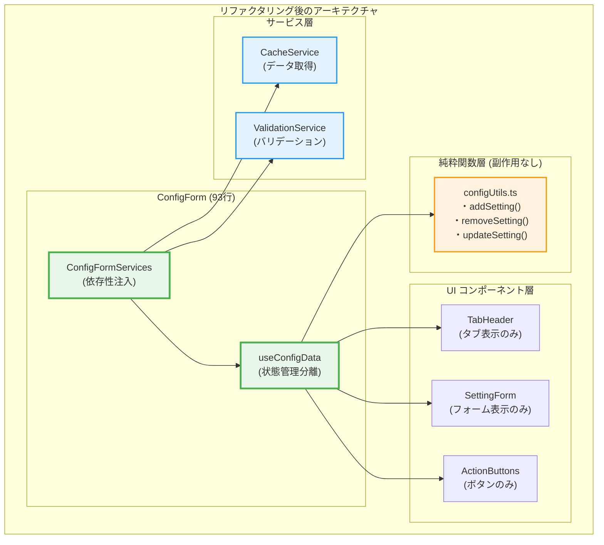

## 主要な概念

### 1. カスタムフックによる状態管理の分離

リファクタリング後の実装では、状態管理をカスタムフックに分離：

```typescript
// useConfigData.ts - 状態管理の分離
export const useConfigData = (initialData: ConfigSchema = { settings: [] }) => {
  const [formData, setFormData] = useState<ConfigSchema>(initialData);
  const [currentTab, setCurrentTab] = useState<number>(0);
  
  const actions: ConfigFormActions = {
    handleAddTab: () => {
      const newFormData = addSetting(formData); // 純粋関数を使用
      setFormData(newFormData);
      setCurrentTab(formData.settings.length);
    },
    handleDeleteTab: (index: number) => {
      const newFormData = removeSetting(formData, index); // 純粋関数を使用
      setFormData(newFormData);
      
      if (currentTab >= newFormData.settings.length && currentTab > 0) {
        setCurrentTab(currentTab - 1);
      }
    },
    handleTabChange: (_: React.SyntheticEvent, newValue: number) => {
      setCurrentTab(newValue);
    },
    handleUpdateSetting: (index: number, newSetting: ConfigSetting) => {
      const newFormData = updateSetting(formData, index, newSetting); // 純粋関数を使用
      setFormData(newFormData);
    },
  };

  return {
    state: { formData, currentTab },
    actions,
  };
};
```

### 2. 純粋関数による安全なデータ操作

リファクタリング後は、副作用のない純粋関数でデータを操作：

```typescript
// configUtils.ts - 純粋関数による安全なデータ操作
export const addSetting = (formData: ConfigSchema): ConfigSchema => {
  const newSetting = createNewSetting(formData.settings.length);
  return {
    ...formData,
    settings: [...formData.settings, newSetting],
  };
};

export const removeSetting = (formData: ConfigSchema, index: number): ConfigSchema => {
  return {
    ...formData,
    settings: formData.settings.filter((_, i) => i !== index),
  };
};

export const updateSetting = (
  formData: ConfigSchema,
  index: number,
  newSetting: ConfigSetting
): ConfigSchema => {
  const newSettings = [...formData.settings];
  newSettings[index] = newSetting;
  return {
    ...formData,
    settings: newSettings,
  };
};

const createNewSetting = (index: number): ConfigSetting => ({
  name: `設定 ${index + 1}`,
  appId: '',
  targetField: '',
  prefix: '',
});
```

**純粋関数の特徴:**
- 同じ入力に対して常に同じ出力を返す
- 副作用がない（外部の状態を変更しない）
- 元のデータを変更せず、新しいオブジェクトを返す
- テストが容易で予測可能

### 3. 依存性注入によるサービス層の抽象化

```typescript
// ConfigFormServices.ts - 依存性注入
export interface ConfigFormServices {
  cacheService: CacheService;
  validationService: ValidationService;
}

export const createConfigFormServices = (): ConfigFormServices => ({
  cacheService: new CacheService(),
  validationService: new ValidationService(),
});
```

## リファクタリング後のタブ操作フロー

### タブ追加の流れ（純粋関数版）

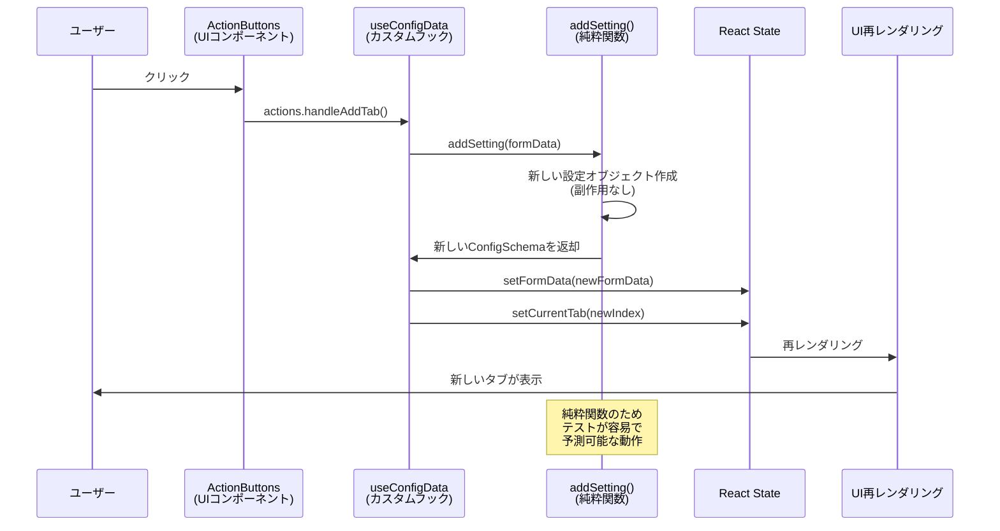

### タブ削除の流れ（純粋関数版）

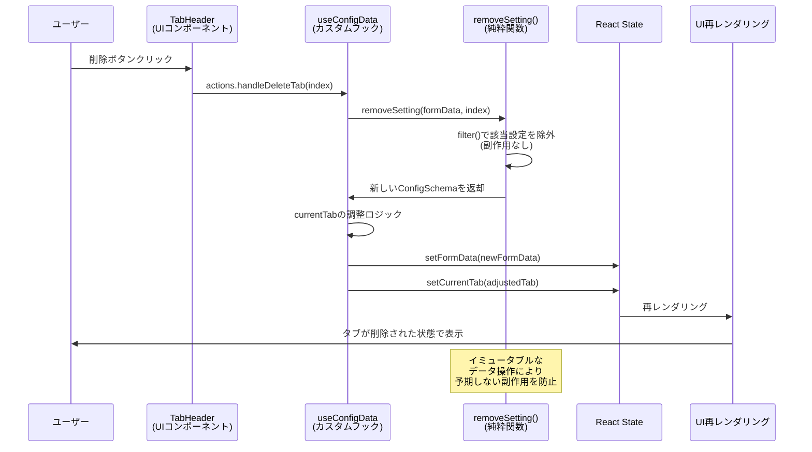

## リファクタリング後の実装詳細

### 1. メインのConfigForm（93行に削減）

```typescript
// ConfigForm.tsx - 依存性注入による簡潔な実装
export const ConfigForm: React.FC = () => {
  const services = useMemo(() => createConfigFormServices(), []);
  
  const [initialData, setInitialData] = useState<ConfigSchema>({ settings: [] });
  const { state, actions } = useConfigData(initialData);
  
  useEffect(() => {
    const loadConfig = async () => {
      const config = await services.cacheService.getConfig();
      setInitialData(config);
    };
    loadConfig();
  }, [services.cacheService]);

  const handleSubmit = useCallback(async () => {
    const validation = services.validationService.validate(state.formData);
    if (!validation.isValid) {
      console.error('Validation errors:', validation.errors);
      return;
    }
    
    await services.cacheService.saveConfig(state.formData);
  }, [services, state.formData]);

  return (
    <Container maxWidth="md" sx={{ mt: 2 }}>
      <Typography variant="h4" gutterBottom>プラグイン設定</Typography>
      
      <TabHeader 
        formData={state.formData}
        currentTab={state.currentTab}
        onTabChange={actions.handleTabChange}
        onDeleteTab={actions.handleDeleteTab}
        onAddTab={actions.handleAddTab}
      />
      
      {state.formData.settings.map((setting, index) => (
        <SettingForm
          key={index}
          setting={setting}
          index={index}
          currentTab={state.currentTab}
          onUpdateSetting={actions.handleUpdateSetting}
          formData={state.formData}
        />
      ))}
      
      <ActionButtons onSubmit={handleSubmit} />
    </Container>
  );
};
```

**リファクタリングのポイント：**
- **306行 → 93行（70%削減）**: 単一責任原則によるコンポーネント分割
- **依存性注入**: サービス層を抽象化してテスト可能性を向上
- **Props Down/Events Up**: 明確なデータフローパターン

### 2. 分離されたUIコンポーネント

#### TabHeaderコンポーネント
```typescript
// TabHeader.tsx - タブ表示に特化したコンポーネント
interface TabHeaderProps {
  formData: ConfigSchema;
  currentTab: number;
  onTabChange: (event: React.SyntheticEvent, newValue: number) => void;
  onDeleteTab: (index: number) => void;
  onAddTab: () => void;
}

export const TabHeader: React.FC<TabHeaderProps> = ({
  formData,
  currentTab,
  onTabChange,
  onDeleteTab,
  onAddTab,
}) => (
  <Tabs value={currentTab} onChange={onTabChange}>
    {formData.settings.map((setting, index) => (
      <Tab
        key={index}
        label={
          <Box sx={{ display: 'flex', alignItems: 'center', gap: 1 }}>
            <span>{setting.name || `設定 ${index + 1}`}</span>
            {formData.settings.length > 1 && (
              <IconButton
                size="small"
                onClick={(e) => {
                  e.stopPropagation();
                  onDeleteTab(index);
                }}
              >
                <DeleteIcon fontSize="small" />
              </IconButton>
            )}
          </Box>
        }
      />
    ))}
    <IconButton onClick={onAddTab} sx={{ ml: 1 }}>
      <AddIcon />
    </IconButton>
  </Tabs>
);
```

#### SettingFormコンポーネント
```typescript
// SettingForm.tsx - フォーム表示に特化したコンポーネント
interface SettingFormProps {
  setting: ConfigSetting;
  index: number;
  currentTab: number;
  onUpdateSetting: (index: number, setting: ConfigSetting) => void;
  formData: ConfigSchema;
}

export const SettingForm: React.FC<SettingFormProps> = ({
  setting,
  index,
  currentTab,
  onUpdateSetting,
  formData,
}) => (
  <TabPanel value={currentTab} index={index}>
    <Form
      schema={createSettingSchema() as RJSFSchema}
      uiSchema={settingUiSchema}
      validator={validator}
      formData={setting}
      formContext={{ 
        formData: formData, 
        currentSetting: setting, 
        currentIndex: index, 
        handleUpdateSetting: onUpdateSetting 
      }}
      onChange={(e) => onUpdateSetting(index, e.formData)}
      onError={log("errors")}
      widgets={customWidgets}
    >
      <div />
    </Form>
  </TabPanel>
);
```

### 3. アーキテクチャの比較表

| 項目 | リファクタリング前 | リファクタリング後 |
|------|-------------------|-------------------|
| **ファイル構成** | ConfigForm.tsx (306行) | 複数ファイルに分離 |
| **状態管理** | useState直接使用 | useConfigData (カスタムフック) |
| **データ操作** | 直接的なstate変更 | 純粋関数 (configUtils.ts) |
| **サービス層** | なし | 依存性注入による抽象化 |
| **コンポーネント分割** | 単一の巨大コンポーネント | 単一責任の小さなコンポーネント |
| **テスト可能性** | 低い (副作用が多い) | 高い (純粋関数) |
| **再利用性** | 低い (密結合) | 高い (疎結合) |
| **保守性** | 低い (責任が混在) | 高い (責任が分離) |

## リファクタリングで学ぶReactの重要概念

### 1. 単一責任原則 (Single Responsibility Principle)
各コンポーネントが1つの責任のみを持つ設計：

```typescript
// ❌ Before: すべての責任が1つのコンポーネントに集中
const ConfigForm = () => {
  // タブ管理、データ操作、バリデーション、UI表示がすべて混在
};

// ✅ After: 責任を分離
const ConfigForm = () => { /* 依存性注入とコンポーネント構成のみ */ };
const useConfigData = () => { /* 状態管理のみ */ };
const TabHeader = () => { /* タブ表示のみ */ };
const addSetting = () => { /* データ操作のみ */ };
```

### 2. 純粋関数型プログラミング
副作用のない関数でテスト可能なコードを実現：

```typescript
// ✅ 純粋関数: 同じ入力 → 同じ出力、副作用なし
export const addSetting = (formData: ConfigSchema): ConfigSchema => {
  return {
    ...formData,
    settings: [...formData.settings, createNewSetting(formData.settings.length)],
  };
};
```

### 3. 依存性注入 (Dependency Injection)
サービス層を抽象化してテスト可能性を向上：

```typescript
// インターフェースによる抽象化
interface ConfigFormServices {
  cacheService: CacheService;
  validationService: ValidationService;
}

// 具体的な実装を注入
const services = createConfigFormServices();
```

### 4. カスタムフックによる状態管理の分離
ビジネスロジックとUIを分離：

```typescript
const { state, actions } = useConfigData(initialData);
// stateとactionsが分離され、UIコンポーネントはプレゼンテーションに集中
```

## まとめ

### リファクタリング後の特徴：

#### アーキテクチャの改善
- **70%のコード削減**: 306行 → 93行
- **純粋関数による安全性**: 予期しない副作用を防止
- **依存性注入**: テスト可能で拡張しやすい設計
- **単一責任**: 各コンポーネントが明確な役割を持つ

#### 開発体験の向上
- **型安全性**: TypeScript厳格モードによる品質保証
- **テスト容易性**: 純粋関数とモックによる単体テスト
- **保守性**: 責任分離による変更時の影響範囲限定
- **再利用性**: 疎結合による他プロジェクトでの活用

#### Reactベストプラクティスの実践
- **Props Down/Events Up**: 明確なデータフロー
- **カスタムフック**: ロジックの再利用と分離
- **コンポーネント合成**: 小さく、テスト可能なコンポーネント
- **不変性**: イミュータブルなデータ操作

## Q&A: タブ表示切り替えのイベント伝播

### Q: ブラウザでタブを切り替えるために、別のタブをクリックしたとき、切り替わるまでにどのようにイベントが伝播し、関数がコールされる？

### A: タブ切り替えイベントの詳細な伝播フロー

タブクリックから表示切り替えまでの完全なイベント伝播を、リファクタリング後のアーキテクチャで詳しく解説します。

#### 1. イベント伝播の全体像

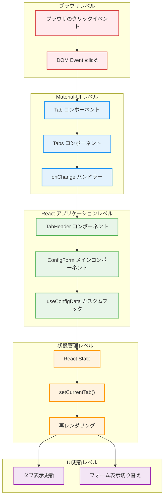

#### 2. 詳細なシーケンス図（リファクタリング版）

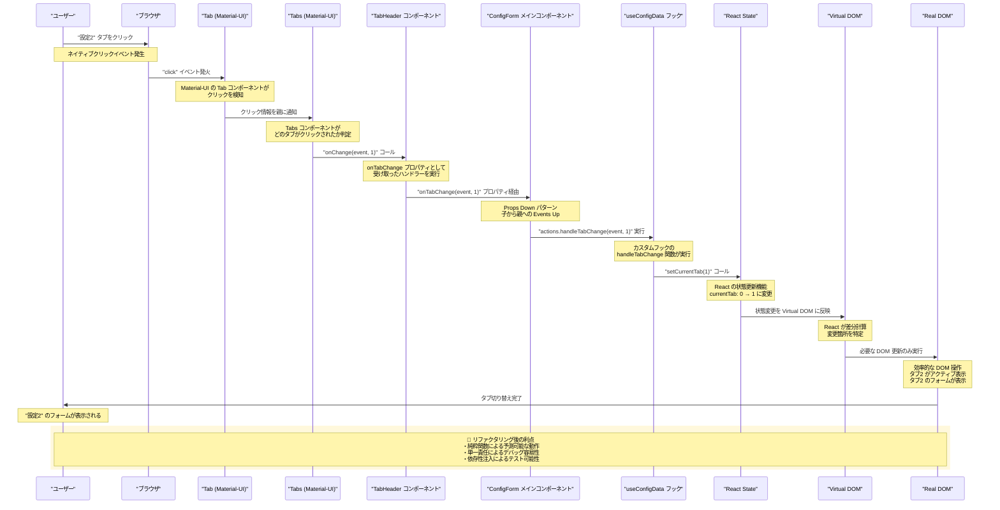

#### 3. コードレベルでの詳細な流れ

##### Step 1: Material-UI Tabsコンポーネントでのイベント検知
```typescript
// TabHeader.tsx
<Tabs value={currentTab} onChange={onTabChange}>
  <Tab key={0} label="設定1" />
  <Tab key={1} label="設定2" />  // ← このタブがクリックされる
</Tabs>
```

##### Step 2: onTabChangeプロパティの実行
```typescript
// ConfigForm.tsx - メインコンポーネント
<TabHeader 
  formData={state.formData}
  currentTab={state.currentTab}  // currentTab: 0 (現在の値)
  onTabChange={actions.handleTabChange}  // ← このハンドラーが実行される
  // ... other props
/>
```

##### Step 3: カスタムフックでの状態更新
```typescript
// useConfigData.ts - カスタムフック
export const useConfigData = (initialData: ConfigSchema) => {
  const [currentTab, setCurrentTab] = useState<number>(0);
  
  const actions: ConfigFormActions = {
    handleTabChange: (_: React.SyntheticEvent, newValue: number) => {
      setCurrentTab(newValue);  // ← setCurrentTab(1) が実行される
    },
    // ... other actions
  };
  
  return {
    state: { formData, currentTab },  // currentTab が 1 に更新される
    actions,
  };
};
```

##### Step 4: React の再レンダリングトリガー
```typescript
// React内部での処理（概念的表現）
// setCurrentTab(1) により状態が変更される
// → useConfigData フックが新しい state を返す
// → ConfigForm コンポーネントが再レンダリングされる
```

##### Step 5: 条件付きレンダリングによる表示切り替え
```typescript
// SettingForm.tsx - 各タブのフォーム
export const SettingForm: React.FC<SettingFormProps> = ({
  currentTab,  // ← 1 に更新された値
  index,       // ← このフォームのインデックス
  // ... other props
}) => (
  <TabPanel value={currentTab} index={index}>
    {/* currentTab === index の場合のみ表示される */}
    <Form /* ... */ />
  </TabPanel>
);
```

#### 4. パフォーマンス最適化のポイント

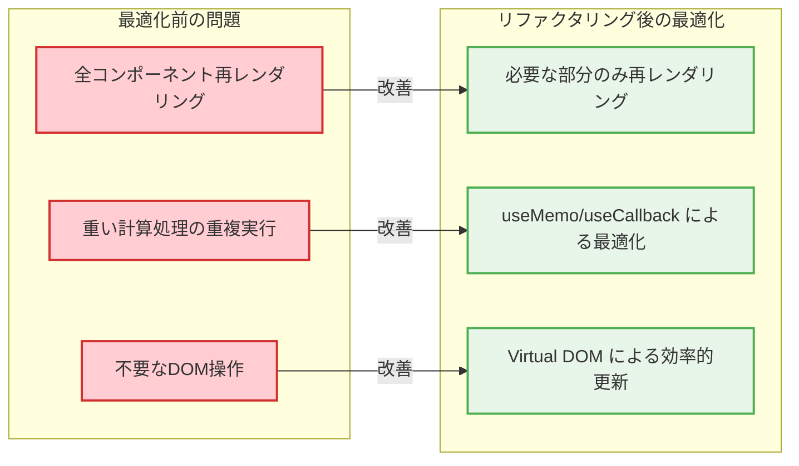

#### 5. デバッグ時の確認ポイント

タブ切り替えで問題が発生した場合の調査手順：

```typescript
// 1. イベントハンドラーが実行されているか確認
const handleTabChange = (_: React.SyntheticEvent, newValue: number) => {
  console.log("Tab change triggered:", newValue);  // ← ログ出力
  setCurrentTab(newValue);
};

// 2. 状態が正しく更新されているか確認
const { state, actions } = useConfigData(initialData);
console.log("Current tab:", state.currentTab);  // ← 状態をログ出力

// 3. コンポーネントが再レンダリングされているか確認
export const SettingForm: React.FC<SettingFormProps> = (props) => {
  console.log("SettingForm render:", props.index, props.currentTab);  // ← レンダリングログ
  return (/* ... */);
};
```

#### 6. リファクタリング後の利点

| 観点 | メリット |
|------|----------|
| **デバッグ容易性** | 各段階でログ出力可能、責任が分離されているため問題箇所を特定しやすい |
| **テスト可能性** | 純粋関数の `handleTabChange` は単体テストが容易 |
| **パフォーマンス** | 不要な再レンダリングを防ぐ最適化が効果的 |
| **保守性** | 各コンポーネントが単一責任のため変更時の影響範囲が限定的 |

この詳細な解説により、タブクリックから表示切り替えまでのイベント伝播の全体像と、リファクタリング後のアーキテクチャがもたらす利点を理解できます。

### Q: "Tabs コンポーネントがどのタブがクリックされたか判定"はどのように実現されてる？

### A: Material-UI Tabsコンポーネントの内部実装とタブ判定メカニズム

Material-UIのTabsコンポーネントがタブの識別を行う仕組みを、React初学者向けに詳しく解説します。

#### 1. Tabsコンポーネントの基本構造

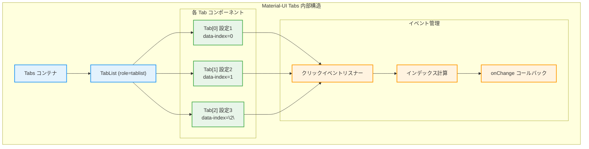

#### 2. タブ判定の詳細メカニズム

##### Step 1: DOM要素への属性設定
```typescript
// Material-UI内部での Tab コンポーネント生成（簡略化）
const Tab = ({ children, index, ...props }) => {
  return (
    <button
      role="tab"
      data-index={index}        // ← 重要: インデックスをDOM属性として保存
      aria-selected={selected}
      onClick={handleClick}     // ← クリックハンドラー
      {...props}
    >
      {children}
    </button>
  );
};
```

##### Step 2: イベントデリゲーションによる判定
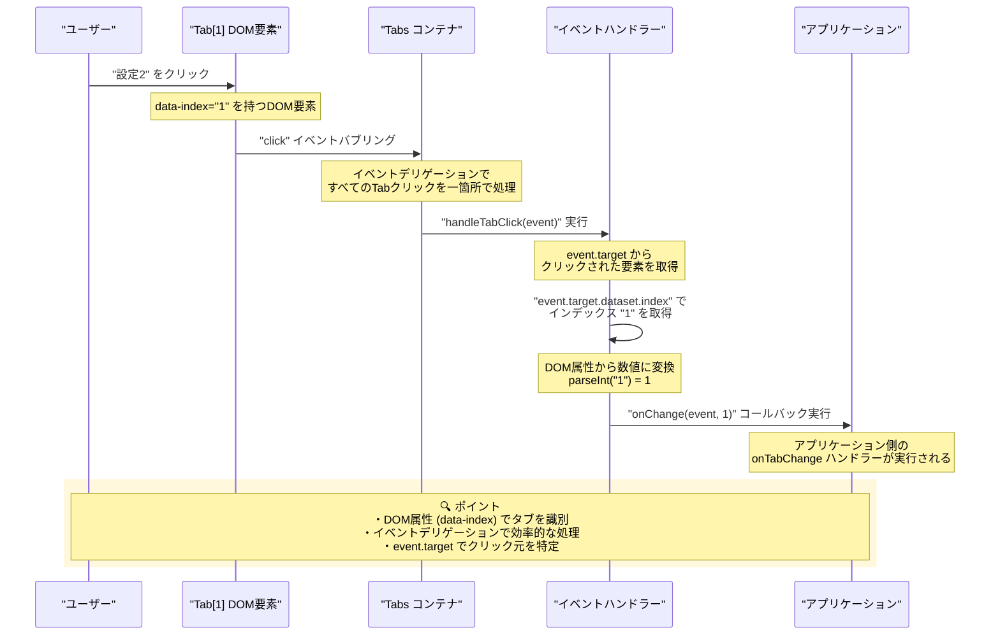

#### 3. 実際のコード実装（Material-UI内部の簡略版）

```typescript
// Material-UI Tabs コンポーネントの内部実装（概念的）
const Tabs = ({ value, onChange, children, ...props }) => {
  // すべてのタブクリックを一箇所で処理（イベントデリゲーション）
  const handleTabClick = (event: React.MouseEvent) => {
    const target = event.target as HTMLElement;
    
    // 1. クリックされた要素からインデックスを取得
    const index = target.dataset.index;
    if (index === undefined) return;
    
    // 2. 文字列から数値に変換
    const numericIndex = parseInt(index, 10);
    
    // 3. 現在の値と異なる場合のみ onChange を実行
    if (numericIndex !== value && onChange) {
      onChange(event, numericIndex);
    }
  };

  return (
    <div role="tablist" onClick={handleTabClick}>
      {React.Children.map(children, (child, index) => {
        // 各 Tab に index を属性として設定
        return React.cloneElement(child, {
          'data-index': index,
          'aria-selected': index === value,
          key: index,
        });
      })}
    </div>
  );
};
```

#### 4. DOM構造での実際の表現

```html
<!-- ブラウザで実際に生成されるDOM構造 -->
<div role="tablist" class="MuiTabs-root">
  <button 
    role="tab" 
    data-index="0"           <!-- ← インデックス識別用 -->
    aria-selected="true"     <!-- ← 現在選択中 -->
    class="MuiTab-root Mui-selected"
  >
    設定1
  </button>
  
  <button 
    role="tab" 
    data-index="1"           <!-- ← インデックス識別用 -->
    aria-selected="false"
    class="MuiTab-root"
  >
    設定2  <!-- ← このタブがクリックされる -->
  </button>
  
  <button 
    role="tab" 
    data-index="2"           <!-- ← インデックス識別用 -->
    aria-selected="false"
    class="MuiTab-root"
  >
    設定3
  </button>
</div>
```

#### 5. イベントデリゲーションの利点

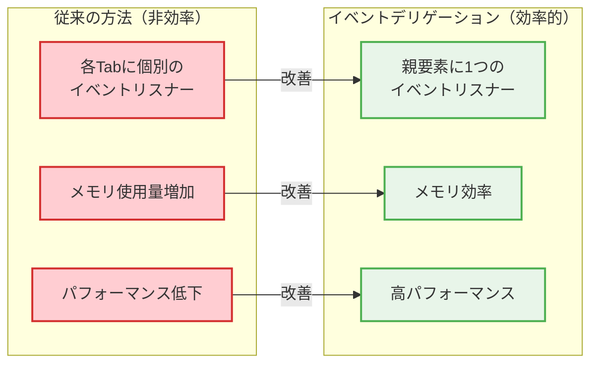

#### 6. デバッグ時の確認方法

タブ判定で問題が発生した場合の調査手順：

```typescript
// 1. DOM属性を確認
const inspectTabAttributes = () => {
  const tabs = document.querySelectorAll('[role="tab"]');
  tabs.forEach((tab, index) => {
    console.log(`Tab ${index}:`, {
      dataIndex: tab.dataset.index,
      ariaSelected: tab.getAttribute('aria-selected'),
      textContent: tab.textContent,
    });
  });
};

// 2. クリックイベントの詳細を確認
const handleTabClick = (event: React.MouseEvent) => {
  const target = event.target as HTMLElement;
  console.log("Clicked element:", {
    tagName: target.tagName,
    dataIndex: target.dataset.index,
    className: target.className,
    textContent: target.textContent,
  });
};

// 3. Material-UI の onChange が正しく呼ばれているか確認
<Tabs 
  value={currentTab} 
  onChange={(event, newValue) => {
    console.log("Tabs onChange triggered:", {
      event: event.type,
      newValue,
      currentValue: currentTab,
    });
    handleTabChange(event, newValue);
  }}
>
```

#### 7. React DevTools での確認

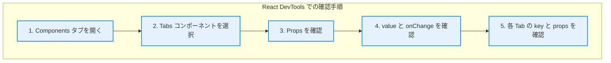

#### 8. よくある問題と解決方法

| 問題 | 原因 | 解決方法 |
|------|------|----------|
| **タブクリックが反応しない** | `onClick` が正しく設定されていない | `onChange` プロパティを確認 |
| **間違ったタブが選択される** | `data-index` の値が不正 | DOM属性を DevTools で確認 |
| **onChange が呼ばれない** | イベントの伝播が止められている | `e.stopPropagation()` の使用箇所を確認 |
| **選択状態が反映されない** | `value` プロパティが更新されていない | 状態管理を確認 |

この解説により、Material-UIのTabsコンポーネントがDOM属性とイベントデリゲーションを使ってタブを識別する仕組みと、その効率性やデバッグ方法を理解できます。

### Q: handleTabChange: (_: React.SyntheticEvent, newValue: number) => { setCurrentTab(newValue); } は何してる？

### A: handleTabChangeイベントハンドラーの詳細解説

このコードは、タブ切り替え時のイベントハンドラー関数で、React初学者が理解すべき重要な概念が詰まっています。

#### 1. 関数の構造と引数の意味

```typescript
handleTabChange: (_: React.SyntheticEvent, newValue: number) => {
  setCurrentTab(newValue);
}
```

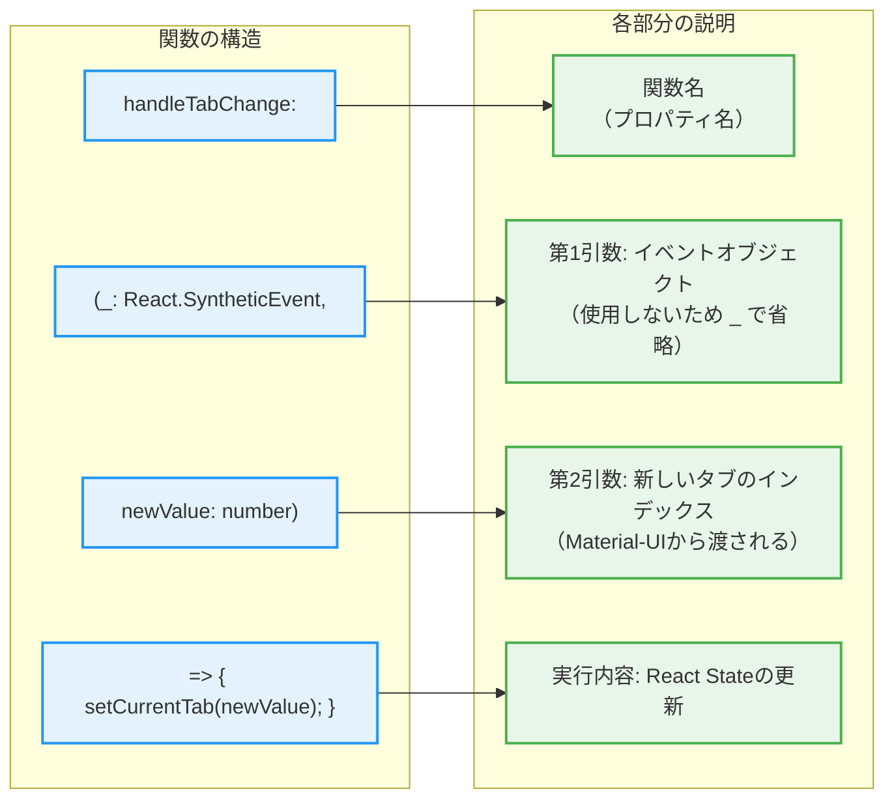

#### 2. 引数の詳細解説

##### 第1引数: `_: React.SyntheticEvent`
```typescript
// アンダースコア（_）は「使用しない引数」を表すTypeScriptの慣例
// 実際には以下のようなイベントオブジェクトが渡される

// 使用しない場合の書き方
(_: React.SyntheticEvent, newValue: number) => { /* ... */ }

// 使用する場合の書き方例
(event: React.SyntheticEvent, newValue: number) => {
  console.log("Event type:", event.type);           // "click"
  console.log("Target element:", event.target);     // クリックされたDOM要素
  console.log("Current target:", event.currentTarget); // イベントリスナーがある要素
  setCurrentTab(newValue);
}
```

##### 第2引数: `newValue: number`
```typescript
// Material-UIのTabsコンポーネントから自動的に渡される値
// 例: "設定2"をクリック → newValue = 1 が渡される

const handleTabChange = (_: React.SyntheticEvent, newValue: number) => {
  // newValue の例:
  // - "設定1" がクリック → newValue = 0
  // - "設定2" がクリック → newValue = 1  
  // - "設定3" がクリック → newValue = 2
  
  setCurrentTab(newValue);
};
```

#### 3. setCurrentTab(newValue) の動作

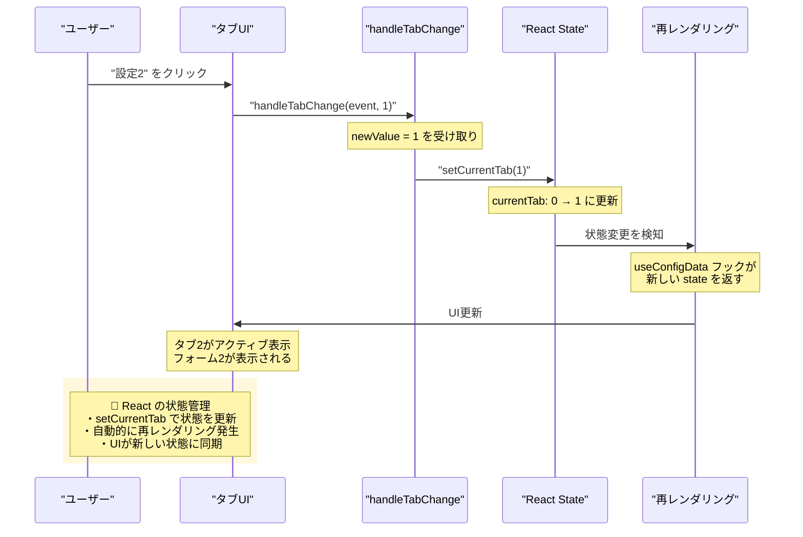

#### 4. なぜアンダースコア（_）を使うのか？

```typescript
// ❌ 悪い例: 使わない引数に意味のある名前をつける
handleTabChange: (event: React.SyntheticEvent, newValue: number) => {
  // event を使わないのに名前をつけている → 混乱の元
  setCurrentTab(newValue);
}

// ✅ 良い例: 使わない引数はアンダースコアで明示
handleTabChange: (_: React.SyntheticEvent, newValue: number) => {
  // _ で「この引数は使わない」ことを明確に示す
  setCurrentTab(newValue);
}

// 🔧 実際に使う場合の例
handleTabChange: (event: React.SyntheticEvent, newValue: number) => {
  // イベントオブジェクトも使用する場合
  console.log("Tab changed from", event.target, "to index", newValue);
  setCurrentTab(newValue);
}
```

#### 5. TypeScriptでの型安全性

```typescript
// Material-UI の Tabs コンポーネントの onChange の型定義
interface TabsProps {
  onChange?: (event: React.SyntheticEvent, newValue: any) => void;
}

// 我々の実装では number に限定
handleTabChange: (_: React.SyntheticEvent, newValue: number) => {
  // newValue は必ず number型 → 型安全
  setCurrentTab(newValue);  // TypeScriptがsetCurrentTabの引数型をチェック
}
```

#### 6. Arrow Function（アロー関数）の特徴

```typescript
// Arrow Function（ES6の記法）
handleTabChange: (_: React.SyntheticEvent, newValue: number) => {
  setCurrentTab(newValue);
}

// 従来の function 記法と同等
handleTabChange: function(_: React.SyntheticEvent, newValue: number) {
  setCurrentTab(newValue);
}

// Arrow Function の利点:
// 1. 簡潔な記法
// 2. this のバインディングが不要（関数コンポーネントでは関係ないが）
// 3. 暗黙的な return（1行の場合）
```

#### 7. カスタムフック内での配置

```typescript
// useConfigData.ts - カスタムフック内での全体像
export const useConfigData = (initialData: ConfigSchema) => {
  const [currentTab, setCurrentTab] = useState<number>(0);
  
  const actions: ConfigFormActions = {
    // この handleTabChange が定義される場所
    handleTabChange: (_: React.SyntheticEvent, newValue: number) => {
      setCurrentTab(newValue);  // useState で作成した setter を使用
    },
    
    handleAddTab: () => { /* ... */ },
    handleDeleteTab: (index: number) => { /* ... */ },
    // 他のアクション...
  };
  
  return {
    state: { formData, currentTab },  // currentTab の現在値を返す
    actions,  // handleTabChange を含むアクションオブジェクトを返す
  };
};
```

#### 8. 実際の使用例とデータフロー

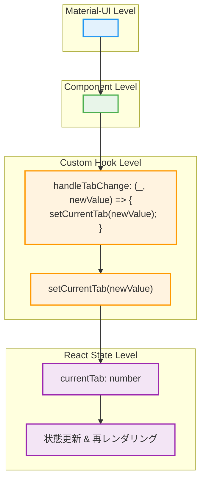

#### 9. デバッグ時の拡張例

```typescript
// デバッグ情報を追加した版
handleTabChange: (event: React.SyntheticEvent, newValue: number) => {
  console.log("=== Tab Change Debug ===");
  console.log("Previous tab:", currentTab);
  console.log("New tab:", newValue);
  console.log("Event type:", event.type);
  console.log("Timestamp:", new Date().toISOString());
  
  setCurrentTab(newValue);
  
  console.log("State update triggered");
}
```

この解説により、`handleTabChange`が単純に見えて実は多くのReactの概念（イベントハンドリング、状態管理、型安全性、関数型プログラミング）を含んでいることを理解できます。

### Q: Reactを使わない場合、同等のタブUIはどのように実装される？

### A: Vanilla JavaScript vs React の実装比較

Reactを使わないVanilla JavaScriptでのタブUI実装を通して、Reactがどれだけ開発を簡素化しているかを理解できます。

#### 1. 実装方法の全体比較

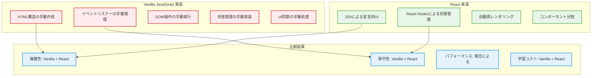

#### 2. Vanilla JavaScript実装の詳細

##### HTML構造
```html
<!-- Vanilla JavaScript版のHTML -->
<div class="tab-container">
  <!-- タブヘッダー -->
  <div class="tab-headers">
    <button class="tab-header active" data-tab="0">設定1</button>
    <button class="tab-header" data-tab="1">設定2</button>
    <button class="tab-header" data-tab="2">設定3</button>
    <button class="add-tab-btn">+</button>
  </div>
  
  <!-- タブコンテンツ -->
  <div class="tab-contents">
    <div class="tab-content active" data-tab="0">
      <form class="setting-form">
        <input type="text" name="name" placeholder="設定名">
        <select name="appId"><option>アプリを選択</option></select>
        <select name="targetField"><option>フィールドを選択</option></select>
        <textarea name="prefix" placeholder="プレフィックス"></textarea>
      </form>
    </div>
    <div class="tab-content" data-tab="1"><!-- 設定2のフォーム --></div>
    <div class="tab-content" data-tab="2"><!-- 設定3のフォーム --></div>
  </div>
</div>
```

##### CSS実装
```css
/* Vanilla JavaScript版のCSS */
.tab-container {
  width: 100%;
  max-width: 800px;
}

.tab-headers {
  display: flex;
  border-bottom: 2px solid #e0e0e0;
}

.tab-header {
  padding: 12px 24px;
  border: none;
  background: #f5f5f5;
  cursor: pointer;
  border-top-left-radius: 4px;
  border-top-right-radius: 4px;
}

.tab-header.active {
  background: #1976d2;
  color: white;
}

.tab-content {
  display: none;  /* 非アクティブなタブは非表示 */
  padding: 24px;
}

.tab-content.active {
  display: block;  /* アクティブなタブのみ表示 */
}
```

##### JavaScript実装（状態管理）
```javascript
// Vanilla JavaScript版の実装
class TabManager {
  constructor(container) {
    this.container = container;
    this.currentTab = 0;  // 手動での状態管理
    this.settings = [     // 手動でのデータ管理
      { name: '設定1', appId: '', targetField: '', prefix: '' },
      { name: '設定2', appId: '', targetField: '', prefix: '' }
    ];
    
    this.init();
  }
  
  init() {
    // イベントリスナーの手動設定
    this.setupEventListeners();
    this.render();  // 初期レンダリング
  }
  
  setupEventListeners() {
    // タブクリックイベント（イベントデリゲーション）
    this.container.addEventListener('click', (event) => {
      if (event.target.classList.contains('tab-header')) {
        const tabIndex = parseInt(event.target.dataset.tab);
        this.switchTab(tabIndex);
      }
      
      if (event.target.classList.contains('add-tab-btn')) {
        this.addTab();
      }
      
      if (event.target.classList.contains('delete-tab-btn')) {
        const tabIndex = parseInt(event.target.dataset.tab);
        this.deleteTab(tabIndex);
      }
    });
    
    // フォーム変更イベント
    this.container.addEventListener('input', (event) => {
      if (event.target.closest('.setting-form')) {
        this.handleFormChange(event);
      }
    });
  }
  
  // タブ切り替え（手動でのDOM操作）
  switchTab(newTab) {
    // 1. 状態を手動で更新
    this.currentTab = newTab;
    
    // 2. タブヘッダーのアクティブ状態を手動で更新
    const headers = this.container.querySelectorAll('.tab-header');
    headers.forEach((header, index) => {
      header.classList.toggle('active', index === newTab);
    });
    
    // 3. タブコンテンツの表示状態を手動で更新
    const contents = this.container.querySelectorAll('.tab-content');
    contents.forEach((content, index) => {
      content.classList.toggle('active', index === newTab);
    });
  }
  
  // タブ追加（手動でのDOM生成）
  addTab() {
    const newIndex = this.settings.length;
    
    // 1. データに新しい設定を追加
    this.settings.push({
      name: `設定 ${newIndex + 1}`,
      appId: '',
      targetField: '',
      prefix: ''
    });
    
    // 2. DOM要素を手動で生成・追加
    this.addTabHeader(newIndex);
    this.addTabContent(newIndex);
    
    // 3. 新しいタブに切り替え
    this.switchTab(newIndex);
  }
  
  addTabHeader(index) {
    const headersContainer = this.container.querySelector('.tab-headers');
    const addButton = headersContainer.querySelector('.add-tab-btn');
    
    // 新しいタブヘッダーを生成
    const newHeader = document.createElement('button');
    newHeader.className = 'tab-header';
    newHeader.dataset.tab = index;
    newHeader.textContent = this.settings[index].name;
    
    // 削除ボタンを追加
    if (this.settings.length > 1) {
      const deleteBtn = document.createElement('span');
      deleteBtn.className = 'delete-tab-btn';
      deleteBtn.dataset.tab = index;
      deleteBtn.textContent = '×';
      newHeader.appendChild(deleteBtn);
    }
    
    // DOM に挿入
    headersContainer.insertBefore(newHeader, addButton);
  }
  
  addTabContent(index) {
    const contentsContainer = this.container.querySelector('.tab-contents');
    
    // 新しいタブコンテンツを生成
    const newContent = document.createElement('div');
    newContent.className = 'tab-content';
    newContent.dataset.tab = index;
    newContent.innerHTML = this.createFormHTML(index);
    
    contentsContainer.appendChild(newContent);
  }
  
  createFormHTML(index) {
    return `
      <form class="setting-form">
        <input type="text" name="name" value="${this.settings[index].name}" 
               data-setting="${index}" placeholder="設定名">
        <select name="appId" data-setting="${index}">
          <option value="">アプリを選択</option>
          <!-- アプリ一覧を動的に生成する必要がある -->
        </select>
        <select name="targetField" data-setting="${index}">
          <option value="">フィールドを選択</option>
          <!-- フィールド一覧を動的に生成する必要がある -->
        </select>
        <textarea name="prefix" data-setting="${index}" 
                  placeholder="プレフィックス">${this.settings[index].prefix}</textarea>
      </form>
    `;
  }
  
  // フォーム変更処理（手動での状態同期）
  handleFormChange(event) {
    const settingIndex = parseInt(event.target.dataset.setting);
    const fieldName = event.target.name;
    const value = event.target.value;
    
    // データを手動で更新
    this.settings[settingIndex][fieldName] = value;
    
    // タブ名が変更された場合、ヘッダーも更新
    if (fieldName === 'name') {
      const header = this.container.querySelector(`[data-tab="${settingIndex}"]`);
      header.textContent = value || `設定 ${settingIndex + 1}`;
    }
  }
  
  // 完全な再レンダリング（非効率）
  render() {
    // 全体のHTMLを再生成して置換
    this.container.innerHTML = this.generateFullHTML();
    this.setupEventListeners();  // イベントリスナーも再設定が必要
  }
}

// 使用方法
const tabContainer = document.getElementById('tab-container');
const tabManager = new TabManager(tabContainer);
```

#### 3. 実装の複雑さ比較

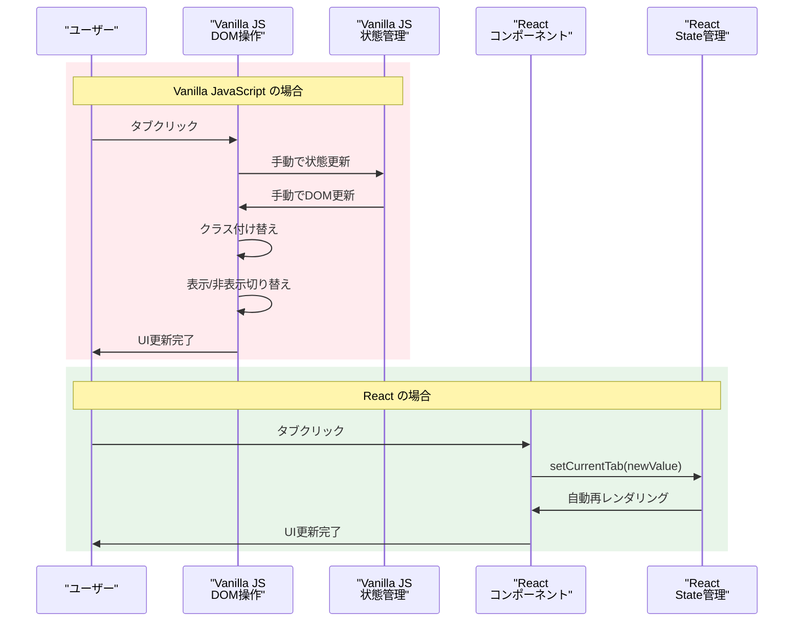

#### 4. コード量の比較

| 要素 | Vanilla JavaScript | React |
|------|-------------------|-------|
| **HTML構造** | 手動で全て記述（50-100行） | JSX で宣言的（10-20行） |
| **状態管理** | 手動実装（100-200行） | useState（1行） |
| **イベント処理** | 手動リスナー設定（50-100行） | onClick props（1行） |
| **DOM更新** | 手動操作（100-300行） | 自動（0行） |
| **データ同期** | 手動同期（50-100行） | 自動（0行） |
| **合計概算** | **350-800行** | **50-100行** |

#### 5. Vanilla JavaScript の課題

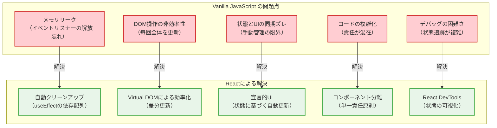

#### 6. パフォーマンス比較

```typescript
// Vanilla JavaScript - 非効率なDOM操作例
switchTab(newTab) {
  // 毎回全てのDOMを検索・更新（非効率）
  document.querySelectorAll('.tab-header').forEach(header => {
    header.classList.remove('active');
  });
  document.querySelectorAll('.tab-content').forEach(content => {
    content.style.display = 'none';
  });
  
  // 新しいタブをアクティブに
  document.querySelector(`[data-tab="${newTab}"]`).classList.add('active');
  document.querySelector(`.tab-content[data-tab="${newTab}"]`).style.display = 'block';
}

// React - 効率的な更新
const TabHeader = ({ currentTab, onTabChange }) => (
  <Tabs value={currentTab} onChange={onTabChange}>
    {/* Reactが差分のみ更新 */}
  </Tabs>
);
```

#### 7. 学習コストと開発効率

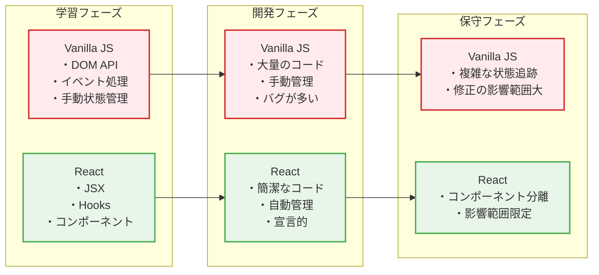

#### 8. まとめ：なぜReactが選ばれるのか

| 観点 | Vanilla JavaScript | React |
|------|-------------------|-------|
| **初期学習コスト** | 低い（DOM APIの知識） | 中程度（React概念の理解） |
| **開発速度** | 遅い（大量の手動実装） | 速い（宣言的UI・自動管理） |
| **コード量** | 多い（手動管理が必要） | 少ない（フレームワークが担当） |
| **バグの発生率** | 高い（手動同期のミス） | 低い（自動同期・型安全） |
| **保守性** | 低い（複雑な依存関係） | 高い（コンポーネント分離） |
| **パフォーマンス** | 低い（非効率なDOM操作） | 高い（Virtual DOM・差分更新） |
| **チーム開発** | 困難（統一されたパターンなし） | 容易（統一されたパターン） |

この比較により、Reactがなぜ現代のフロントエンド開発で選ばれるのか、そしてReactがどれだけ開発者の負担を軽減しているのかを理解できます。

