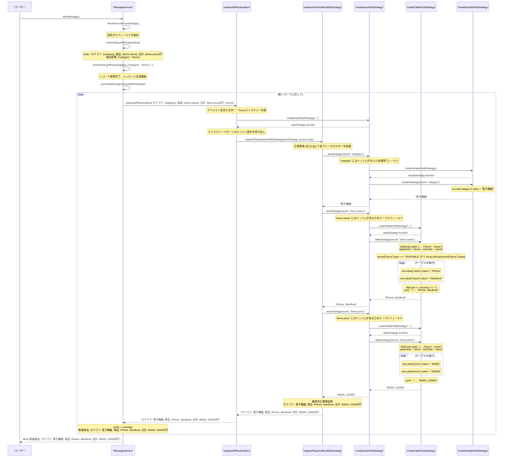
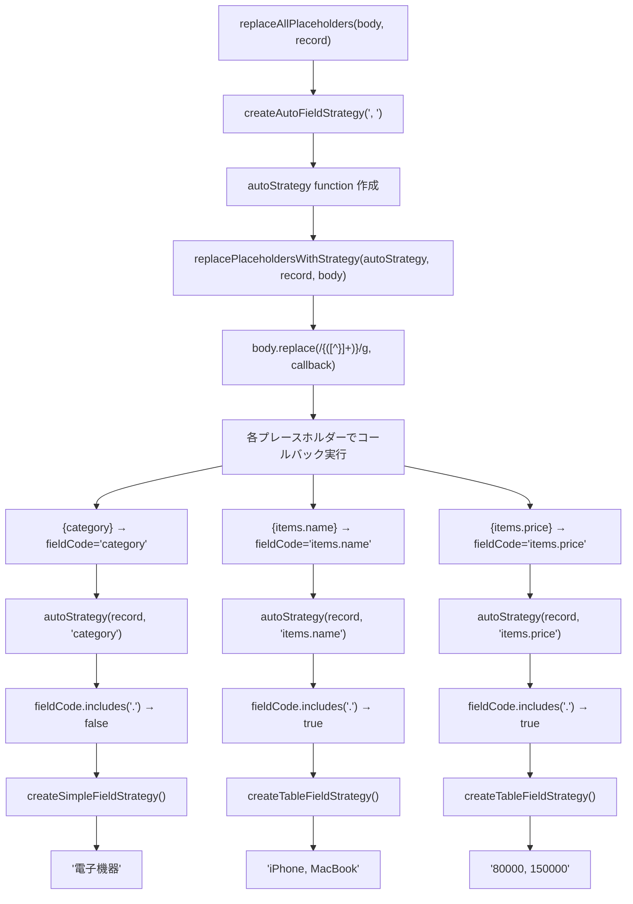

# テーブルフィールド処理の関数呼び出しフロー

## 概要

kintoneプラグインでテーブルフィールド（SUBTABLE）のプレースホルダー `{items.name}` を処理する際の関数呼び出しの流れを、具体的な設定例とともに解説します。

## 前提条件

### 設定例
```json
{
  "name": "商品通知設定",
  "appId": "123",
  "prefix": "新着商品: ",
  "body": "カテゴリ: {category}, 商品: {items.name}, 合計: {items.price}円"
}
```

### レコードデータ例
```json
{
  "category": {
    "type": "SINGLE_LINE_TEXT",
    "value": "電子機器"
  },
  "items": {
    "type": "SUBTABLE", 
    "value": [
      {
        "id": "1",
        "value": {
          "name": { "type": "SINGLE_LINE_TEXT", "value": "iPhone" },
          "price": { "type": "NUMBER", "value": "80000" }
        }
      },
      {
        "id": "2", 
        "value": {
          "name": { "type": "SINGLE_LINE_TEXT", "value": "MacBook" },
          "price": { "type": "NUMBER", "value": "150000" }
        }
      }
    ]
  }
}
```

## 関数呼び出しフロー



## 処理の詳細解説

### 1. フィールド抽出フェーズ
```typescript
// MessageService.extractRequiredFields()
const placeholders = setting.body.match(/{([^}]+)}/g);
// 結果: ["{category}", "{items.name}", "{items.price}"]

for (const placeholder of placeholders) {
  const fieldCode = placeholder.slice(1, -1).trim();
  const [tableField] = fieldCode.split('.');
  fields.add(tableField);
}
// 結果: Set(["category", "items"])
```

### 2. プレースホルダー置換フェーズ
```typescript
// createAutoFieldStrategy での分岐判定
(record, fieldCode) => {
  if (fieldCode.includes(".")) {
    // "items.name" → テーブルフィールド処理
    return createTableFieldStrategy(separator)(record, fieldCode);
  } else {
    // "category" → 通常フィールド処理  
    return createSimpleFieldStrategy()(record, fieldCode);
  }
}
```

### 3. テーブルフィールド処理の詳細
```typescript
// createTableFieldStrategy での処理
const [tableField, subField] = fieldCode.split("."); 
// "items.name" → tableField="items", subField="name"

const table = record[tableField]; // SUBTABLEフィールド取得

return table.value
  .map(row => row.value[subField]?.value?.toString() || "")
  .filter(val => val.trim() !== "")
  .join(separator);
// ["iPhone", "MacBook"] → "iPhone, MacBook"
```

## 最適化ポイント

### ストラテジーパターンの効果
- **createAutoFieldStrategy**: ドット記法の有無で自動判定
- **createTableFieldStrategy**: テーブル行の反復処理を効率化
- **createSimpleFieldStrategy**: 通常フィールドの高速処理

### フィールド抽出の効率化
- API呼び出し前にプレースホルダーから必要フィールドを抽出
- `["category", "items"]` のみ取得（`items.name`, `items.price` → `items` に集約）
- 不要なフィールドの取得を回避

## エラーハンドリング

### 安全な処理
```typescript
// 存在しないテーブルフィールド
if (!table || table.type !== "SUBTABLE" || !Array.isArray(table.value)) {
  return "";
}

// 存在しないサブフィールド
row.value[subField]?.value?.toString() || ""

// 空値の自動除外
.filter(val => val.trim() !== "")
```

## `replacePlaceholdersWithStrategy`の役割

### ストラテジーパターンのエンジン部分
`replacePlaceholdersWithStrategy`は、ストラテジーパターンの中核となる**汎用的な置換エンジン**です。

### 関数の階層構造
```typescript
// 1. 実際に使用される関数（ラッパー）
replaceAllPlaceholders(body, record, separator)
  ↓
// 2. ストラテジーパターンのエンジン（内部実装）
replacePlaceholdersWithStrategy(autoStrategy, record, body)
  ↓ 
// 3. 各プレースホルダーごとにストラテジーを実行
autoStrategy(record, fieldCode) → simpleStrategy | tableStrategy
```

### 使用箇所の詳細

#### 1. `replaceAllPlaceholders`からの呼び出し（メイン）
```typescript
export const replaceAllPlaceholders = (body, record, separator = ", ") => {
  const strategy = createAutoFieldStrategy(separator);  // 自動選択
  return replacePlaceholdersWithStrategy(strategy, record, body);
}
```

#### 2. `replacePlaceholders`からの呼び出し（後方互換性）
```typescript
export const replacePlaceholders = (body, record) => {
  const strategy = createSimpleFieldStrategy();  // 通常フィールドのみ
  return replacePlaceholdersWithStrategy(strategy, record, body);
}
```

#### 3. テストでの直接使用（カスタムストラテジー）
```typescript
const customStrategy = (record, fieldCode) => {
  const field = record[fieldCode];
  if (!field?.value) return "[未設定]";
  return `[${field.value}]`;
};

// 直接テスト可能
replacePlaceholdersWithStrategy(customStrategy, record, "Hello {name}")
```

### 設計上のメリット

1. **汎用性**: どんなストラテジーでも使用可能
2. **テスタビリティ**: カスタムストラテジーでのテストが容易
3. **拡張性**: 新しいフィールドタイプへの対応が簡単
4. **責任分離**: 置換ロジックとストラテジー作成を分離

### 実際のコールチェーン（MessageService視点）
```
MessageService.generateMessage()
├── replaceAllPlaceholders(setting.body, record)
│   ├── createAutoFieldStrategy(", ")
│   └── replacePlaceholdersWithStrategy(autoStrategy, record, body)
│       ├── autoStrategy(record, "category") → simpleFieldStrategy
│       ├── autoStrategy(record, "items.name") → tableFieldStrategy  
│       └── autoStrategy(record, "items.price") → tableFieldStrategy
```

### なぜ直接呼ばれないのか？

- **実用性**: `replaceAllPlaceholders`が自動判定で便利
- **抽象化**: ユーザーはストラテジーを意識する必要なし  
- **保守性**: 内部実装の変更が外部APIに影響しない

`replacePlaceholdersWithStrategy`は**エンジン部分**として、ストラテジーパターンの柔軟性を提供しながら、実際のアプリケーションでは`replaceAllPlaceholders`がシンプルなAPIとして機能しています。

## Q&A: ストラテジー切り替えの仕組み

### Q: `replacePlaceholdersWithStrategy`のreplaceコールバック内でテーブルかどうかはどのように切り替えられている？

```typescript
export const replacePlaceholdersWithStrategy = (
  strategy: FieldValueStrategy,
  record: Record,
  body: string,
): string => {
  return body.replace(/{([^}]+)}/g, (_, fieldCode) => {
    return strategy(record, fieldCode.trim());
  });
};
```

**A: ストラテジー関数内のドット記法判定により切り替えられています。**

### 詳細解説

#### 1. ストラテジー関数の事前作成と切り替えロジック

`replacePlaceholdersWithStrategy`が呼ばれる前に、`createAutoFieldStrategy`で**切り替えロジックを含むstrategy関数**が作成されます：

```typescript
export const createAutoFieldStrategy = (separator = ", "): FieldValueStrategy =>
  (record, fieldCode) => {
    if (fieldCode.includes(".")) {
      // ドット記法検出 → テーブルフィールド処理
      return createTableFieldStrategy(separator)(record, fieldCode);
    } else {
      // ドット記法なし → 通常フィールド処理
      return createSimpleFieldStrategy()(record, fieldCode);
    }
  };
```

#### 2. 実行時の動的切り替え

`replace`のコールバックが実行されるたびに、**strategy関数内で判定**が行われます：

```typescript
// body: "カテゴリ: {category}, 商品: {items.name}, 合計: {items.price}円"

// 1回目: {category} → fieldCode = "category"
strategy(record, "category")
└── fieldCode.includes(".") → false
    └── createSimpleFieldStrategy()(...) → "電子機器"

// 2回目: {items.name} → fieldCode = "items.name"  
strategy(record, "items.name")
└── fieldCode.includes(".") → true
    └── createTableFieldStrategy()(...) → "iPhone, MacBook"

// 3回目: {items.price} → fieldCode = "items.price"
strategy(record, "items.price")
└── fieldCode.includes(".") → true
    └── createTableFieldStrategy()(...) → "80000, 150000"
```

#### 3. 実行フローの詳細



#### 4. キーポイント

1. **事前判定**: `createAutoFieldStrategy`で切り替えロジックを含むstrategy関数を作成
2. **動的実行**: `replace`コールバックのたびに`fieldCode`を検査して適切な処理を選択
3. **ドット記法判定**: `fieldCode.includes(".")` でテーブルフィールドを識別
4. **遅延評価**: 実際に必要になった時点で`createTableFieldStrategy`または`createSimpleFieldStrategy`を実行

#### 5. 具体例での実行順序

```typescript
// body: "カテゴリ: {category}, 商品: {items.name}"

replace(/{([^}]+)}/g, (_, fieldCode) => {
  // 1回目: fieldCode = "category"
  if ("category".includes(".")) { // false
    return createSimpleFieldStrategy()(record, "category"); // "電子機器"
  }
  
  // 2回目: fieldCode = "items.name"  
  if ("items.name".includes(".")) { // true
    return createTableFieldStrategy(separator)(record, "items.name"); // "iPhone, MacBook"
  }
})
```

**つまり、`replacePlaceholdersWithStrategy`自体は汎用エンジンで、渡された`strategy`関数内で`fieldCode`の形式に基づいて動的に処理を切り替えています。**

このフローにより、複雑なテーブルフィールドでも安全かつ効率的にプレースホルダー置換が実現されています。