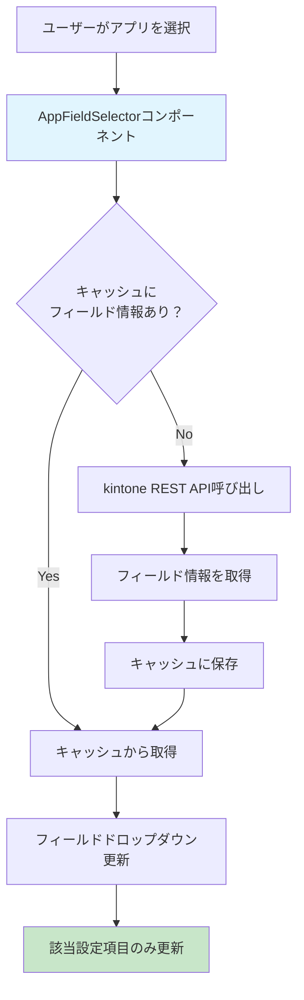

# kintoneプラグイン設定画面の実装まとめ

## 概要
本プロジェクトでは、kintoneプラグインの設定画面において、アプリを選択した際に動的にフィールドのドロップダウンが更新される機能を実装しました。複数の設定項目があっても、他の設定に影響を与えずに独立して更新される仕組みを構築しています。

## 使用技術

### react-jsonschema-form
- JSONスキーマベースのフォーム生成ライブラリ
- 設定項目の構造を宣言的に定義可能
- カスタムウィジェットによる独自UI実装が可能
- uiSchemaによるレイアウト制御

### React
- コンポーネントベースのUI構築
- useState, useEffectを活用した状態管理
- カスタムhooksによるロジックの分離

## 動的フィールド更新の仕組み

### 処理の流れ



### 具体的な設定例での処理

#### 例：2つの設定項目がある場合

**設定1**: アプリA → フィールドX選択
**設定2**: アプリB → フィールドY選択

1. **設定1でアプリAを選択**
   ```typescript
   // AppFieldSelectorコンポーネント内
   const handleAppChange = (appId: string) => {
     // 設定1のみに影響
     updateFieldOptions(settingIndex: 0, appId);
   };
   ```

2. **フィールド情報の取得**
   ```mermaid
   sequenceDiagram
       participant U as User
       participant C as Component
       participant Cache as FieldCache
       participant API as kintone API
       
       U->>C: アプリA選択
       C->>Cache: getFieldsByAppId("appA")
       alt キャッシュヒット
           Cache-->>C: フィールド情報
       else キャッシュミス
           C->>API: getFormFields("appA")
           API-->>C: フィールド情報
           C->>Cache: 保存
       end
       C->>C: 設定1のフィールド選択肢更新
       Note over C: 設定2には影響なし
   ```

3. **独立性の確保**
   - 各設定項目は独自のstateを持つ
   - settingIndexによる識別で他の設定に影響しない
   - キャッシュは全設定で共有してパフォーマンス向上

### コア実装

#### formContextの活用

**SettingForm.tsx での formContext 設定:**
```typescript
<Form
  schema={schema}
  uiSchema={uiSchema}
  formData={setting}
  formContext={{
    formData: formData,           // 全設定データ
    currentSetting: setting,      // 現在の設定項目
    currentIndex: index,          // 現在の設定項目のインデックス
    handleUpdateSetting: onUpdateSetting, // 設定更新関数
  }}
  onChange={(e) => onUpdateSetting(index, e.formData)}
  widgets={customWidgets}
>
```

**カスタムウィジェットでの formContext 使用例:**
```typescript
const QueryConditionsWidget: React.FC<WidgetProps> = (props) => {
  const { value, onChange, formContext } = props;

  // formContextから必要な情報を取得
  const {
    formData,           // 全設定データにアクセス
    currentSetting,     // 現在の設定項目の情報
    currentIndex,       // 現在の設定項目のインデックス
    handleUpdateSetting // 親の更新関数
  } = formContext;

  // 他の設定項目の値を参照可能
  const otherSettings = formData.settings.filter((_, i) => i !== currentIndex);

  // 親コンポーネントの関数を直接呼び出し可能
  const updateCurrentSetting = (updates) => {
    handleUpdateSetting(currentIndex, { ...currentSetting, ...updates });
  };

  return (/* UI実装 */);
};
```

**formContextがない場合の問題:**
1. **設定項目間の連携不可**: 他の設定項目の値を参照できない
2. **インデックス不明**: 自分が何番目の設定項目か分からない
3. **親関数呼び出し不可**: 親コンポーネントの関数にアクセスできない
4. **全体データアクセス不可**: formDataの他の部分（commonSettingなど）にアクセスできない

**formContextの利点:**
- 標準のprops（value、onChange、schema）では不足する情報を補完
- カスタムウィジェットの柔軟性と機能性を大幅に向上
- 複雑な設定画面での高度な機能実装を可能にする

#### キャッシュ機能
```typescript
class FieldCache {
  private cache = new Map<string, FieldInfo[]>();
  
  async getFieldsByAppId(appId: string): Promise<FieldInfo[]> {
    if (this.cache.has(appId)) {
      return this.cache.get(appId)!;
    }
    
    const fields = await fetchFieldsFromAPI(appId);
    this.cache.set(appId, fields);
    return fields;
  }
}
```

#### カスタムウィジェット
```typescript
const AppFieldSelector: React.FC<WidgetProps> = ({ 
  value, 
  onChange, 
  schema 
}) => {
  const [fieldOptions, setFieldOptions] = useState<FieldInfo[]>([]);
  
  const handleAppChange = async (appId: string) => {
    const fields = await fieldCache.getFieldsByAppId(appId);
    setFieldOptions(fields);
    // この設定項目のみ更新
    onChange({ ...value, appId, fieldId: '' });
  };
  
  return (
    <div>
      <AppSelector onChange={handleAppChange} />
      <FieldSelector options={fieldOptions} />
    </div>
  );
};
```

## 前提知識フラッシュカード

### React基礎

**Q: useStateとは何か？**
A: Reactコンポーネントで状態を管理するためのHook。状態値と更新関数のペアを返す。

**Q: useEffectの用途は？**
A: 副作用（API呼び出し、DOM操作など）を実行するためのHook。依存配列で実行タイミングを制御。

**Q: カスタムHookとは？**
A: 複数のコンポーネント間でロジックを共有するためのカスタム関数。useで始まる命名規則。

### react-jsonschema-form

**Q: JSONスキーマの役割は？**
A: フォームの構造、バリデーションルール、データ型を定義する仕様。UIの自動生成に使用。

**Q: uiSchemaとは？**
A: JSONスキーマで定義されたフォームの見た目やレイアウトを制御する設定オブジェクト。

**Q: カスタムウィジェットとは？**
A: 標準のフォーム要素では実現できない独自UIを実装するためのReactコンポーネント。

**Q: WidgetPropsの主要プロパティは？**
A: value（現在の値）、onChange（値変更時のコールバック）、schema（スキーマ情報）など。

**Q: formContextとは何か？**
A: react-jsonschema-formのFormコンポーネントからカスタムウィジェットに任意のデータを渡すための仕組み。WidgetPropsのformContextプロパティでアクセス可能。

**Q: formContextが必要な理由は？**
A: カスタムウィジェットが親フォームの状態や他の設定項目の情報にアクセスする必要があるため。標準のpropsだけでは不十分な場合に使用。

**Q: formContextがないと困ることは？**
A:
- 複数設定項目間での連携ができない
- 現在の設定項目のインデックスが分からない
- 親コンポーネントの関数を呼び出せない
- 全体の設定データにアクセスできない

### kintone API

**Q: @kintone/rest-api-clientとは？**
A: kintone REST APIを簡単に呼び出すためのJavaScriptライブラリ。認証やエラーハンドリングを自動化。

**Q: getFormFieldsメソッドの用途は？**
A: 指定したアプリのフィールド情報（フィールドコード、表示名、型など）を取得する。

**Q: kintoneプラグインでのAPI認証は？**
A: プラグイン実行時は自動的にログインユーザーの権限でAPI呼び出しが可能。追加認証不要。

### 設計パターン

**Q: キャッシュパターンの利点は？**
A: 同じデータの重複取得を避け、パフォーマンス向上とAPI呼び出し回数削減を実現。

**Q: 関心の分離とは？**
A: 異なる責務を持つコードを独立したモジュールに分割する設計原則。保守性と再利用性が向上。

**Q: 状態の局所化とは？**
A: 状態を必要最小限のスコープに限定し、不要な依存関係を避ける設計手法。

## AppFieldSelectorの現状と用途

### 現在の状況
`AppFieldSelector` は **現在使用されていない未使用コンポーネント** です。

**事実確認:**
- `src/config/widgets/AppFieldSelector.tsx` で定義
- `src/config/widgets/index.ts` でエクスポートのみ
- プロジェクト内で実際にインポート・使用している箇所は存在しない
- `CustomWidgets.tsx` 内で個別に定義された `AppSelector` と `FieldSelector` が実際に使用されている

### 開発履歴から見る背景

**Git履歴からの分析:**
```bash
commit a4c840a: refactor: Cache.tsをクロージャベース実装に置き換え
```

この時期に `AppFieldSelector` が作成されたが、実際の設定画面では：
- `AppSelector` (アプリ選択)
- `FieldSelector` (フィールド選択)
- `TimestampFieldSelector` (タイムスタンプフィールド選択)

という**個別コンポーネント**が `CustomWidgets.tsx` 内で使用されています。

### 設計思想の違い

#### AppFieldSelector (未使用)
```typescript
// 単一コンポーネントでアプリとフィールドを同時管理
interface AppFieldValue {
  appId: string;
  targetField: string;
}
```

#### 現在の実装 (使用中)
```typescript
// 個別コンポーネントで責務を分離
const customWidgets = {
  appSelector: AppSelector,           // アプリ選択のみ
  fieldSelector: FieldSelector,       // フィールド選択のみ
  timestampFieldSelector: TimestampFieldSelector, // タイムスタンプフィールドのみ
};
```

### なぜ個別コンポーネントが採用されたか

1. **JSONスキーマとの親和性**: 各プロパティ（appId、targetField、timestampField）を個別のウィジェットで管理
2. **責務の分離**: 各コンポーネントが単一の責務を持つ
3. **formContextとの連携**: 設定項目間での動的な連携が容易
4. **再利用性**: 個別コンポーネントは他の場面でも再利用可能

### 今後の対応

**オプション1: 削除**
- 未使用コードの除去でコードベースをクリーンに保つ

**オプション2: 保持**
- 将来的な拡張性のため、別の用途での活用可能性を残す

**オプション3: 改良**
- 現在の個別コンポーネントアプローチに合わせてリファクタリング

### 学習ポイント

**Q: AppFieldSelectorは何のために作られたか？**
A: アプリとフィールドを一体管理する統合コンポーネントとして設計されたが、実際の要件では個別管理の方が適していた。

**Q: なぜ使用されていないのか？**
A: JSONスキーマベースのフォーム設計では、プロパティごとに個別ウィジェットを割り当てる方が自然で柔軟性があるため。

**Q: 現在使用されているのは？**
A: `CustomWidgets.tsx` 内の `AppSelector`、`FieldSelector`、`TimestampFieldSelector` の個別コンポーネント群。

## まとめ

本実装では、react-jsonschema-formのカスタムウィジェット機能を活用し、kintone REST APIと組み合わせることで、直感的で効率的な設定画面を実現しました。キャッシュ機能による高速化と、設定項目間の独立性確保により、優れたユーザー体験を提供しています。

開発過程で作成された `AppFieldSelector` は現在未使用ですが、コンポーネント設計の進化過程を示す興味深い事例として、責務分離とJSONスキーマとの親和性の重要性を教えてくれます。