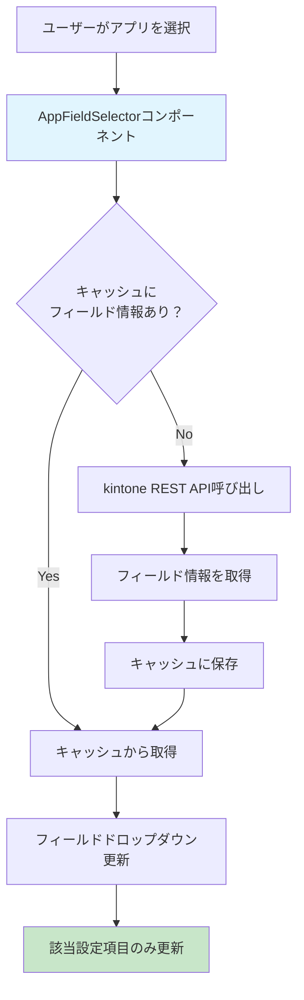

# kintoneプラグイン設定画面の実装まとめ

## 概要
本プロジェクトでは、kintoneプラグインの設定画面において、アプリを選択した際に動的にフィールドのドロップダウンが更新される機能を実装しました。複数の設定項目があっても、他の設定に影響を与えずに独立して更新される仕組みを構築しています。

## 使用技術

### react-jsonschema-form
- JSONスキーマベースのフォーム生成ライブラリ
- 設定項目の構造を宣言的に定義可能
- カスタムウィジェットによる独自UI実装が可能
- uiSchemaによるレイアウト制御

### React
- コンポーネントベースのUI構築
- useState, useEffectを活用した状態管理
- カスタムhooksによるロジックの分離

## 動的フィールド更新の仕組み

### 処理の流れ



### 具体的な設定例での処理

#### 例：2つの設定項目がある場合

**設定1**: アプリA → フィールドX選択
**設定2**: アプリB → フィールドY選択

1. **設定1でアプリAを選択**
   ```typescript
   // AppFieldSelectorコンポーネント内
   const handleAppChange = (appId: string) => {
     // 設定1のみに影響
     updateFieldOptions(settingIndex: 0, appId);
   };
   ```

2. **フィールド情報の取得**
   ```mermaid
   sequenceDiagram
       participant U as User
       participant C as Component
       participant Cache as FieldCache
       participant API as kintone API
       
       U->>C: アプリA選択
       C->>Cache: getFieldsByAppId("appA")
       alt キャッシュヒット
           Cache-->>C: フィールド情報
       else キャッシュミス
           C->>API: getFormFields("appA")
           API-->>C: フィールド情報
           C->>Cache: 保存
       end
       C->>C: 設定1のフィールド選択肢更新
       Note over C: 設定2には影響なし
   ```

3. **独立性の確保**
   - 各設定項目は独自のstateを持つ
   - settingIndexによる識別で他の設定に影響しない
   - キャッシュは全設定で共有してパフォーマンス向上

### コア実装

#### キャッシュ機能
```typescript
class FieldCache {
  private cache = new Map<string, FieldInfo[]>();
  
  async getFieldsByAppId(appId: string): Promise<FieldInfo[]> {
    if (this.cache.has(appId)) {
      return this.cache.get(appId)!;
    }
    
    const fields = await fetchFieldsFromAPI(appId);
    this.cache.set(appId, fields);
    return fields;
  }
}
```

#### カスタムウィジェット
```typescript
const AppFieldSelector: React.FC<WidgetProps> = ({ 
  value, 
  onChange, 
  schema 
}) => {
  const [fieldOptions, setFieldOptions] = useState<FieldInfo[]>([]);
  
  const handleAppChange = async (appId: string) => {
    const fields = await fieldCache.getFieldsByAppId(appId);
    setFieldOptions(fields);
    // この設定項目のみ更新
    onChange({ ...value, appId, fieldId: '' });
  };
  
  return (
    <div>
      <AppSelector onChange={handleAppChange} />
      <FieldSelector options={fieldOptions} />
    </div>
  );
};
```

## 前提知識フラッシュカード

### React基礎

**Q: useStateとは何か？**
A: Reactコンポーネントで状態を管理するためのHook。状態値と更新関数のペアを返す。

**Q: useEffectの用途は？**
A: 副作用（API呼び出し、DOM操作など）を実行するためのHook。依存配列で実行タイミングを制御。

**Q: カスタムHookとは？**
A: 複数のコンポーネント間でロジックを共有するためのカスタム関数。useで始まる命名規則。

### react-jsonschema-form

**Q: JSONスキーマの役割は？**
A: フォームの構造、バリデーションルール、データ型を定義する仕様。UIの自動生成に使用。

**Q: uiSchemaとは？**
A: JSONスキーマで定義されたフォームの見た目やレイアウトを制御する設定オブジェクト。

**Q: カスタムウィジェットとは？**
A: 標準のフォーム要素では実現できない独自UIを実装するためのReactコンポーネント。

**Q: WidgetPropsの主要プロパティは？**
A: value（現在の値）、onChange（値変更時のコールバック）、schema（スキーマ情報）など。

### kintone API

**Q: @kintone/rest-api-clientとは？**
A: kintone REST APIを簡単に呼び出すためのJavaScriptライブラリ。認証やエラーハンドリングを自動化。

**Q: getFormFieldsメソッドの用途は？**
A: 指定したアプリのフィールド情報（フィールドコード、表示名、型など）を取得する。

**Q: kintoneプラグインでのAPI認証は？**
A: プラグイン実行時は自動的にログインユーザーの権限でAPI呼び出しが可能。追加認証不要。

### 設計パターン

**Q: キャッシュパターンの利点は？**
A: 同じデータの重複取得を避け、パフォーマンス向上とAPI呼び出し回数削減を実現。

**Q: 関心の分離とは？**
A: 異なる責務を持つコードを独立したモジュールに分割する設計原則。保守性と再利用性が向上。

**Q: 状態の局所化とは？**
A: 状態を必要最小限のスコープに限定し、不要な依存関係を避ける設計手法。

## まとめ

本実装では、react-jsonschema-formのカスタムウィジェット機能を活用し、kintone REST APIと組み合わせることで、直感的で効率的な設定画面を実現しました。キャッシュ機能による高速化と、設定項目間の独立性確保により、優れたユーザー体験を提供しています。